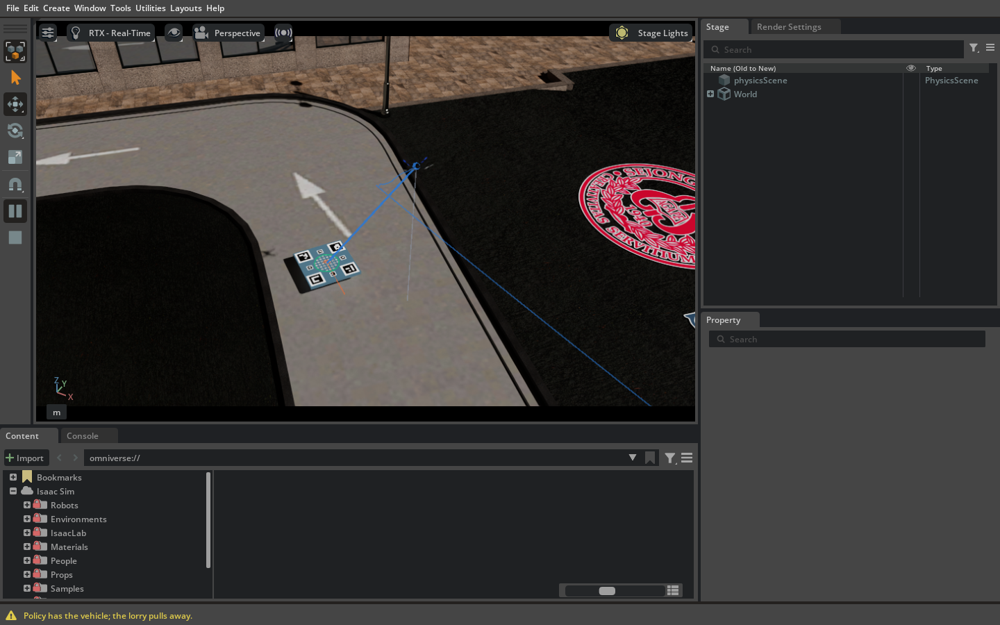
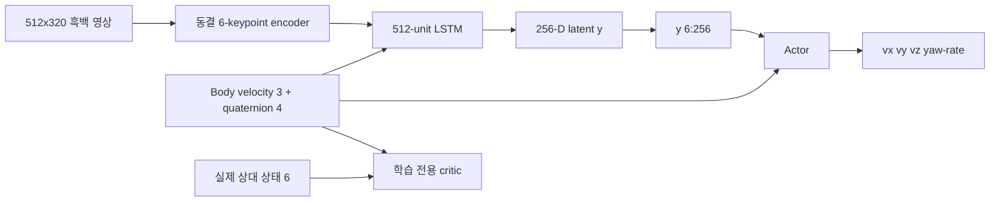
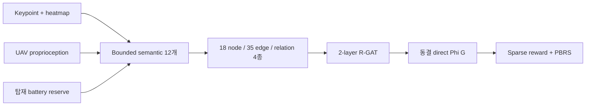

# Ontology-RGAT UAV 착륙: Isaac Sim + PX4

이 디렉터리는 vision 기반 자율 착륙 benchmark의 활성 구현이다. PX4가 제어하는
multicopter가 Meta-Sejong S5 map의 도로를 따라 움직이는 AGILEX RANGER MINI 3.0
위에 착륙한다. 실험은 Shin et al. (2026)에 기반한 state-estimation 방식,
estimator-free baseline, estimator-free ontology/R-GAT reward 방식을 비교한다.

[문서 안내](docs/README.md) ·
[통제 비교](docs/THREE_PIPELINE_COMPARISON.md) ·
[상태 적응형 보상 가중치](docs/ONTOLOGY_RGAT_ADAPTIVE_REWARD_WEIGHTING.md) ·
[운영](docs/OPERATIONS.md) ·
[아키텍처](docs/ARCHITECTURE.md) ·
[실제 기체 안전](docs/HARDWARE_SAFETY.md)




> 2026-09-12 실제 실행 중 capture다. Simulator와 dashboard를 문서화한 자료이며
> success rate를 주장하는 결과가 아니다.

## 빠른 시작

기준 명령은 이 디렉터리의 한 단계 위인 Git 저장소 루트에서 실행한다.

```bash
../run.sh
```

시간 제한이 큰 세미나용 핵심 3-arm 예비 비교는 다음 한 줄로 실행한다.

```bash
../run.sh --seminar-fast
```

별도 `results/seminar_fast/core3` 폴더에서 실제 visual-servo 성공 착륙 6회를
공통 behavior-cloning 자료로 만든 뒤 `shin_se_fixed`, `no_se_fixed`,
`onto_rgat_adaptive_weight_no_se`를 PPO 24회씩 학습한다. 최종 평가는 교사 없이
쉬운 조건의 scenario 3종 × paired seed 2개로 수행한다. 기존 full checkpoint는
변경하지 않는다. 이 결과는 경향 확인용이며 publication-scale 결과가 아니다.

DDS, Isaac Sim, Pegasus, PX4 SITL, ROS 2 gateway, RViz 2, MATLAB 스타일 web
dashboard를 시작하거나 기존 호환 process를 인수한다. 이어 세 pipeline을 재개/학습하고,
실제 semantic trajectory를 수집해 R-GAT을 학습·동결하며, paired evaluation과 report를
생성한다.

인수 없는 명령은 seminar 마감용 full-fidelity budget과 같다.

| 작업 | 기본 횟수 |
|---|---:|
| `shin_se` estimator warm-up | 8회 비행 |
| Pipeline별 PPO | 264회 비행 |
| 세 pipeline PPO 합계 | 792회 비행 |
| Warm-up 포함 학습 합계 | 800회 비행 |
| R-GAT behavior data | 최소 40회, hard cap 120회 |
| Paired evaluation | scenario 7종 × seed 5개 × pipeline 3개 = 105회 |

Reward-design과 evaluation 비행은 PPO interaction cost와 따로 보고한다. 이 budget은
seminar demonstration에는 유용하지만 publication-scale 통계 근거는 아니다.

```bash
../run.sh --mode quick --headless
../run.sh --mode full --pipelines shin_se no_se onto_no_se
../run.sh --mode full --training-replicate 1 \
  --train-episodes 40960 --rgat-data-episodes 400
../run.sh --help
```

`run.sh`는 OS-level flight lock을 가진다. 동시 실행은 shared simulator, vehicle,
dashboard, result file을 건드리기 전에 실패한다.

## 통제 실험

| ID | 명시적 state estimator | Auxiliary loss | Active reward | Training reward |
|---|---:|---:|---:|---|
| `shin_se` | 있음 | 6-state MSE | 있음 | Shin Table III + active perception |
| `no_se` | 없음 | 없음 | 없음 | Active term을 뺀 Shin Table III |
| `onto_no_se` | 없음 | 없음 | 없음 | Sparse task reward + direct R-GAT PBRS |

### 상태 적응형 reward-weight 실험

기존 3개 pipeline과 PBRS 결과를 보존하면서 다음 5개 명시 모드를 별도
[`adaptive_reward_weight_comparison.yaml`](config/experiments/adaptive_reward_weight_comparison.yaml)로
추가했다.

| ID | Estimator | Table-III 가중치 | Active | PBRS |
|---|---:|---|---:|---:|
| `shin_se_fixed` | 있음 | `[1,1,0.5,1,2]` 고정 | 있음 | 없음 |
| `shin_se_rgat_weight` | 있음 | 동결 `w(G)` | 있음 | 없음 |
| `no_se_fixed` | 없음 | `[1,1,0.5,1,2]` 고정 | 없음 | 없음 |
| `onto_rgat_adaptive_weight_no_se` | 없음 | 동결 `w(G)` | 없음 | 없음 |
| `onto_rgat_potential_pbrs_no_se` | 없음 | 해당 없음 | 없음 | 기존 `Phi(G)` PBRS |

```bash
../run.sh --mode quick \
  --config config/experiments/adaptive_reward_weight_comparison.yaml \
  --experiment adaptive_reward_weight_comparison
```

R-GAT 가중치의 양수/합 5.5 제약, 23-node 전용 graph, episode/scenario split,
trajectory BCE/ranking/prior/smoothness/ontology loss와 PPO 동결 검사는
[전용 문서](docs/ONTOLOGY_RGAT_ADAPTIVE_REWARD_WEIGHTING.md)에 정의한다.

Camera, 동결 keypoint weight, temporal backbone, actor/critic capacity, action mapping,
controller limit, PPO hyperparameter, curriculum, initial-condition distribution,
simulator와 paired PPO/evaluation seed는 공통으로 유지한다.

### 보상함수 비교

다음 표는 정성적 요약이 아니라 실행 코드의 reward 계약이다.
`C(x)=clip(x,-1,1)`, `d_t=||(Delta x_t,Delta y_t)||_2`로 두며
`Delta z_t>0`은 vertical undershoot를 뜻한다. `v_z,t`는 UAV body-frame vertical
velocity, `omega_z,t`는 commanded yaw rate, `L_est,t+1`은 normalized six-state
estimator loss다. `Phi(G_t)`는 estimator-free semantic graph를 읽는 동결 R-GAT
potential이다.

| Reward 항 | `shin_se` 논문 baseline | `no_se` 제거 대조군 | `onto_no_se` 제안 pipeline |
|---|---|---|---|
| 성공한 물리 접촉 | `+10`, 모든 shaping 항을 대체 | `+10`, 모든 shaping 항을 대체 | Sparse task `+10`, absorbing `Phi(G_t+1)=0` |
| Crash, excessive drift 또는 battery depletion | `-10`, 모든 shaping 항을 대체 | `-10`, 모든 shaping 항을 대체 | Sparse task `-10`, absorbing `Phi(G_t+1)=0` |
| Lateral progress | `C(d_t-d_{t+1})` | `shin_se`와 동일 | 명시 항 없음 |
| Vertical progress | `C(|Delta z_t|-|Delta z_{t+1}|) / max(d_{t+1},1)` | `shin_se`와 동일 | 명시 항 없음 |
| Vertical-speed penalty | `-0.5 max(v_z,t+0.5,0)` | `shin_se`와 동일 | 명시 항 없음 |
| Undershoot penalty | `Delta z_{t+1}>0`이면 `-Delta z_{t+1}`, 아니면 `0` | `shin_se`와 동일 | 명시 항 없음 |
| Yaw-rate penalty | `-2 |omega_z,t|` | `shin_se`와 동일 | 명시 항 없음 |
| Active-perception | `-0.1 clip(L_est,t+1-0.01,0,1)` | 제거 | 제거, estimator loss 자체를 계산하지 않음 |
| Ontology/R-GAT shaping | 없음 | 없음 | `lambda [gamma Phi(G_t+1)-Phi(G_t)]` |
| Non-terminal 합 | Table-III motion 항 5개 + active-perception | Table-III motion 항 5개 | `r_sparse + lambda [gamma Phi(G_t+1)-Phi(G_t)]` |
| 고정 상수 | active `alpha=0.1`, `beta=1`, `tau=0.01` | active 상수 없음 | `lambda=1`, `gamma=0.99`, PPO `gamma`와 같음 |
| Reward-side 정보 | 실제 상대 상태, command, UAV vertical velocity, privileged estimator target/loss | 실제 상대 상태, command, UAV vertical velocity | 18-node semantic graph + terminal event. `Phi`에는 relative-state estimate, GNSS, deck state, simulator truth가 없음 |

`no_se`는 제안 reward가 아니라 ablation control이다. Estimator와 active-perception
loss를 제거하지만 baseline의 나머지 Table-III shaping은 유지한다. `onto_no_se`의
sparse task term은 일반 non-terminal transition에서 0이다. R-GAT은 PPO 전에 학습하고
동결하므로 PPO가 policy는 update하지만 reward potential은 바꿀 수 없다.

### 행위자(Actor)와 가치망(Critic) 경계



`shin_se`만 `y[0:6]`에 auxiliary head를 만든다. Actor는 추정값 6개를 받지 않고 세
pipeline 모두 `y[6:256]`과 같은 7-D UAV proprioception을 받는다. Critic은 asymmetric이며
학습 중에만 존재한다.

### 상태 추정기가 없는 ontology/R-GAT 경로

`onto_no_se`는 keypoint heatmap, 명시적으로 supervised한 keypoint별 visibility score,
짧은 visual history와 UAV 탑재 state에서 bounded observation 12개를 만든다.

1. keypoint confidence
2. visible-keypoint fraction
3. image alignment
4. apparent target scale
5. image-plane motion safety
6. scale-rate safety
7. decayed visibility memory
8. reacquisition trend
9. vertical-motion safety
10. attitude stability
11. battery risk
12. visual-loss-duration risk

Graph는 node 18개, semantic edge 17개, self-loop 18개, relation 4종, node당 feature
24개다. 폭 24 relational-attention layer 2개가 `SafeLanding`을 읽어 `[-1,1]`의
`Phi(G)`를 만든다.



Graph API는 relative-state estimate, platform/deck state, GNSS, critic input,
simulator truth를 중첩 field까지 거부한다. R-GAT은 학습된 `no_se` policy와
deterministic image-plane servo, 명시적 loss-recovery climb, bounded noise/exploration으로
만든 실제 estimator-free rollout에서 학습한다. 합성 terminal outcome은 금지하고,
dataset에는 success, failure, 성공한 loss→reacquisition→landing episode가 모두 필요하다.
Train/validation은 adjacent frame이 아니라 전체 episode 단위로 나눈다.

Terminal outcome `S_i ∈ {+1,-1}`에 대해:

```text
y_i,t = gamma^(T_i - t - 1) * S_i
r_t   = r_sparse + lambda * (gamma * Phi(G_t+1) - Phi(G_t))
```

R-GAT target, PBRS, PPO는 같은 `gamma=0.99`를 쓴다. Terminal next-state potential은
0이고 PPO는 R-GAT을 update할 수 없다. Perception, recovery, battery를 불리하게 만든
counterfactual도 학습하며 monotonic compliance threshold 미만 artifact는 거부한다.
유한 history potential은 belief-state potential의 engineering approximation이며 정확한
POMDP policy invariance를 주장하지 않는다.

## 시뮬레이션 환경

기본 설정은 [`config/shin2026-system.yaml`](config/shin2026-system.yaml)이며
`config/system.yaml`을 확장한다.

- Meta-Sejong `gwanggaeto` / S5 asset
- 37-point, 길이 99.70 m 폐곡선 도로 route
- UGV 속도 0.25–0.60 m/s 추출, carrier hard limit 1.0 m/s
- RANGER MINI visual 위 1.5×1.5 m landing deck
- 512×320, HFOV 90°, forward/down 60°, mono camera 30 Hz
- Far tag 0.32 m 4개, transition tag 0.12 m 4개, touchdown tag 0.04 m 37개
- 실제 용량 3S 3500 mAh model과 seeded 9–55 hover-second reserve

UAV와 UGV는 제어된 airborne/parked staging에서 시작한다. PX4가 UAV를 camera-centred
pad-relative entry hover로 비행시키고 position/speed/visibility gate를 만족해야 policy에
handover한다. 공중 teleport는 PX4 estimator를 무효화하므로 사용하지 않는다.


Route figure는 licensed USD road mesh와 현재 YAML에서 직접 생성한다.

```bash
python3 tools/check_metasejong_route.py \
  --config config/shin2026-system.yaml \
  --plot docs/images/metasejong_gwanggaeto_ugv_route.png
```

0.10 m raster resolution에서 pavement-edge clearance 2.06 m, deck half-diagonal 1.06 m,
보수적 여유 1.00 m, waypoint 최대 elevation error 0.001 m로 audit를 통과한다.

## 설치

검증한 integration baseline:

- Ubuntu 22.04, ROS 2 Humble
- NVIDIA Isaac Sim 5.1.0
- Pegasus Simulator v5.1.0
- PX4-Autopilot v1.14.3
- `px4_msgs` branch `release/1.14`
- Micro XRCE-DDS Agent v2.4.2

Isaac Sim을 별도로 설치한 뒤 Pegasus와 PX4/ROS를 bootstrap한다.

```bash
python3 -m pip install --user -r requirements.txt
ISAACSIM_PATH=/absolute/path/to/isaacsim ./scripts/bootstrap_pegasus.sh
./scripts/bootstrap_px4_ros2.sh
./scripts/import_metasejong_map.sh       # licensed Docker image 필요
./scripts/import_ranger_mini_v3.sh       # 선택 사항, primitive fallback 있음
```

ROS 2 bootstrap은 기본적으로 package를 ASCII-only workspace
`/home/$USER/.local/share/ontology_rgat_uav_rl/ros2_ws`로 복사한다. 저장소 path의
한글 때문에 생기는 ROS 2 Humble 오류를 피하기 위한 것이다. Gateway source 변경 후:

```bash
./scripts/sync_gateway.sh
```

모든 `/fmu/*` consumer는 Fast DDS를 써야 한다. Launcher는
`RMW_IMPLEMENTATION=rmw_fastrtps_cpp`를 설정하고 `CYCLONEDDS_URI`를 제거한다.

## 모니터링 및 복구

Dashboard 주소는 <http://127.0.0.1:8770/>이다. Graphical mode에서 RViz 2가 자동으로
열리며 `/landing_rl` topic을 쓴다. Dashboard는 다음을 구분해 표시한다.

- Committed episode total
- 현재 active episode와 live control step
- Pipeline, estimator 상태, curriculum, command envelope
- Target visibility, UAV/UGV 속도, battery reserve
- Training success와 diagnostic return
- 이후 R-GAT dataset/training 및 paired evaluation 상태

Runtime log는 `/tmp/ontology_rgat_stack/`에 있다.

```bash
./scripts/stack_status.sh
curl -fsS http://127.0.0.1:8770/api/state
```

호환 checkpoint는 중단 후 재개한다. Recoverable gateway timeout, simulated-clock
stall, gateway가 분류한 순수 Offboard heartbeat loss는 불완전 trajectory를 버리고
runner-owned stack을 재시작한 뒤 같은 seed를 재시도한다. Vehicle, estimator, marker,
geometry, policy fault는 숨기지 않고 그대로 표시한다.

## 출력

기본 output은 `results/three_pipeline/<mode>/` 아래에 있다.

| Path | 내용 |
|---|---|
| `manifest.json` | resolved contract, hash, budget, seed, 상태 |
| `models/shared/keypoint_encoder.pt` | 동결 pretrained keypoint model |
| `models/<pipeline>/<pipeline>.pt` | Recurrent PPO checkpoint |
| `models/<pipeline>/<pipeline>_training.csv` | Checkpoint와 함께 commit되는 episode별 metric |
| `rgat/semantic_rollouts.npz` | Versioned estimator-free graph data |
| `rgat/semantic_rollout_episodes.csv` | Reward-design 비행 outcome |
| `rgat/rgat_model.pt` | 동결 direct R-GAT artifact |
| `rgat/adaptive_reward_rollouts.npz` | 적응 5성분 실제 전이 dataset(별도 설정) |
| `rgat/adaptive_reward_weights.pt` | PPO 전에 학습·동결한 5-weight R-GAT |
| `models/<pipeline>/*_reward_steps.jsonl` | raw/normalized 성분, weight, 기여도, 최종 reward |
| `evaluation/paired_plan.csv` | 공통 scenario/seed plan |
| `evaluation/per_episode.csv` | Reward-independent physical metric |
| `evaluation/`, `tables/`, `figures/` | Confidence interval, 비교, publication table, plot |

R-GAT/model subtree의 정확한 filename도 `manifest.json`에 기록한다. 이 manifest를
run provenance의 기준으로 사용한다. Reward function이 다르므로 episode return으로
pipeline 순위를 정하지 않는다.

## 검증

실행 중인 flight stack이 필요 없는 검사:

```bash
./scripts/check_workspace.sh
./scripts/check_learner_protocol.sh
```

PX4/ROS bootstrap 후:

```bash
./scripts/check_ros2_loopback.sh
```

상태를 바꾸지 않는 live 검사:

```bash
./scripts/stack_status.sh
RMW_IMPLEMENTATION=rmw_fastrtps_cpp ros2 topic hz /fmu/out/vehicle_odometry
python3 tools/protocol_probe.py state
```

## 범위와 한계

- Shin et al. (2026)의 방법론적 interface 구현이며 bit-exact 재현이 아니다.
  PACMAN weight와 논문의 정확한 geometric controller가 공개되지 않아 합성 초기화,
  held-out Isaac 검증 6-keypoint encoder와 PX4 velocity control을 쓴다.
- Estimator/reward/curriculum/runtime 개선과 전후 근거는
  [`docs/LEARNING_REMEDIATION_AUDIT.md`](docs/LEARNING_REMEDIATION_AUDIT.md)에 있다.
- Campus run에서 논문의 platform 0–8 m/s 범위를 주장하지 않는다. 기본 곡선 도로 UGV는
  의도적으로 0.25–0.60 m/s다.
- 논문이 정확한 trajectory 식을 모두 공개하지 않아 이름이 같은 evaluation maneuver는
  실행 가능한 근사다.
- Smoke test와 dashboard screenshot은 benchmark 근거가 아니다. 완료된 실제
  Isaac/Pegasus/PX4 record만 result table에 넣는다.
- Meta-Sejong asset은 외부 license를 유지하며 저장소에서 재배포하지 않는다.

## 이전 호환 경로

이전 cooperative urban 실험은 23-channel actor observation, 14-node/38-edge ontology,
R-GAT에서 증류한 고정 reward weight 8개를 쓴다. `scripts/run_metasejong_pipeline.sh`로
실행하며 `--methods` 또는 `--reward`가 있는 legacy reward-arm CLI는 루트 `run.sh`가
이전 runner로 전달한다. Output과 checkpoint는 기본 18-node history-aware direct-R-GAT
실험과 호환되지 않는다.

[`legacy_matlab/`](legacy_matlab/)의 사용 종료 MATLAB source는 참고 전용이며
runtime dependency가 되면 `scripts/check_workspace.sh`가 거부한다.
