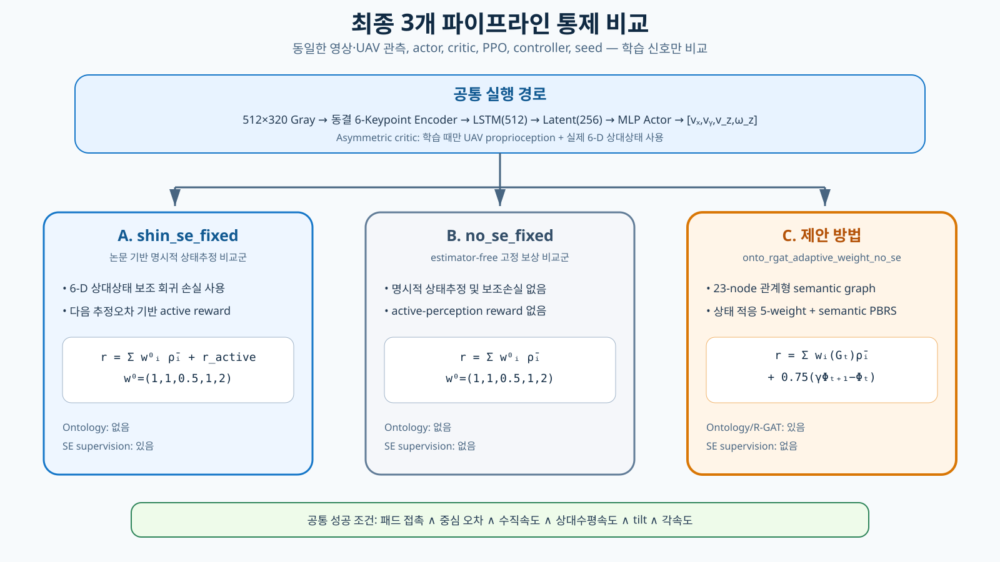
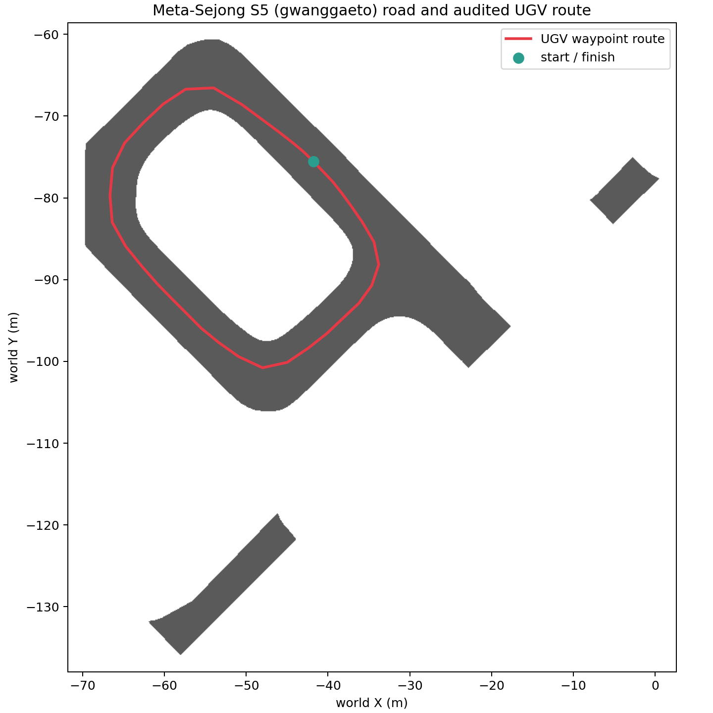
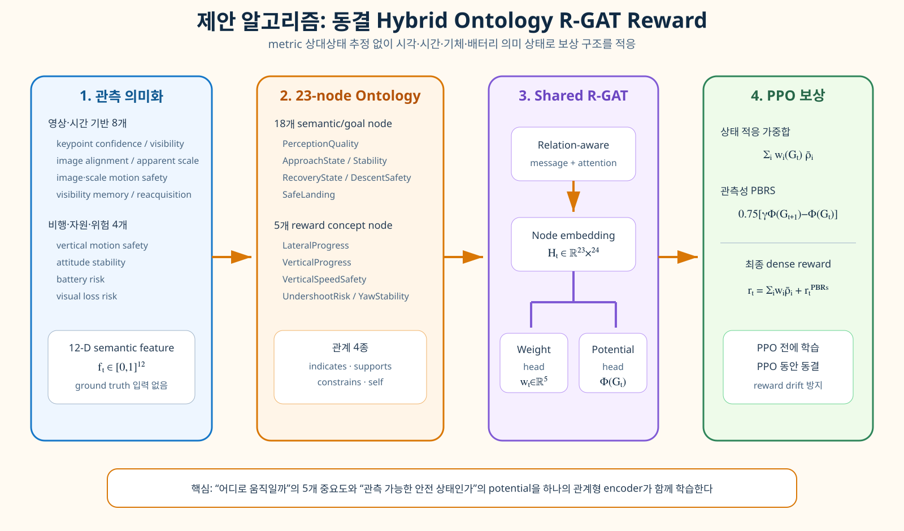
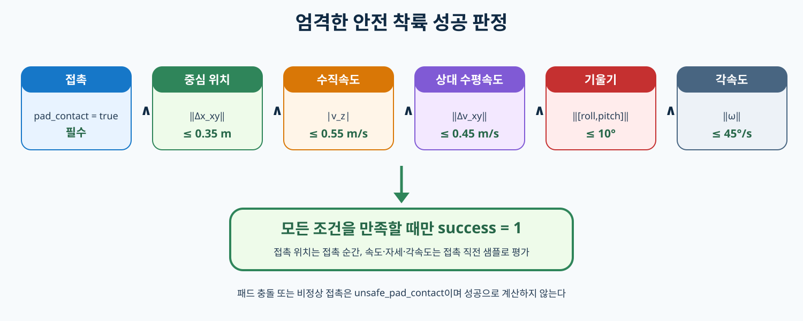

# Ontology–R-GAT–RL 구현

이 디렉터리는 Isaac Sim·Pegasus·PX4 기반 이동식 착륙 연구의 활성 구현이다.
연구 정의와 전체 수식은 [저장소 README](../README.md)에 있으며, 여기서는 실행 코드와
설치·출력 계약을 설명한다.

## 강화학습 구성

| 요소 | 구현 |
|---|---|
| Environment | Meta-Sejong S5, PX4 multicopter, 도로 waypoint UGV, 이동 패드, 접촉·배터리·외란 |
| Agent | 6-keypoint encoder → LSTM → recurrent PPO actor; 학습 전용 asymmetric critic |
| State | simulator가 보유한 UAV/패드 동역학과 episode 상태 |
| Actor observation | 흑백 영상 $I_t$ + body 속도/자세 $u_t\in\mathbb{R}^7$ |
| Action | $[v_x,v_y,v_z,\omega_z]$ velocity/yaw-rate setpoint |
| Reward | 고정 Shin 5성분 또는 제안 hybrid Ontology R-GAT reward |



핵심 3개 arm은 `shin_se_fixed`, `no_se_fixed`,
`onto_rgat_adaptive_weight_no_se`다. 세 arm의 actor 입력과 네트워크 용량은 같고,
명시적 상태추정 supervision과 reward 구성만 다르다.

## 실행

저장소 루트에서 실행한다.

```bash
./run.sh
```

인자 없는 기본값은 아래의 핵심 3-arm 병렬 비교와 동일하다.

```bash
./run.sh --seminar-fast --parallel-pairs 3 --stay-open
```

R-GAT이 필요한 경우 실제 reward-design trajectory와 동결 artifact를 먼저 준비하고,
그 다음 `shin_se_fixed`, `no_se_fixed`, `onto_rgat_adaptive_weight_no_se`의 독립 PPO
optimizer가 동시에 진행된다. 단일 쌍 실행의 기존 port/topic 계약은 그대로 유지된다.
세 UGV는 도로를 평행 이동한 복제 경로가 아니라, 동일한 campus waypoint 폐곡선의
0%, 8%, 16% 지점에서 앞뒤 간격을 두고 출발해 열차처럼 같은 경로를 따른다.

`run.sh`는 설정 검증, simulator/PX4/ROS/RViz/dashboard 기동, keypoint 준비, PPO,
실제 R-GAT 자료 수집, R-GAT 학습·동결, 제안법 PPO, paired evaluation과 보고서 생성을
순서대로 수행한다. 동일 명령을 다시 실행하면 호환되는 checkpoint와 완료 episode부터
재개한다.

## 시뮬레이션 환경

- Ubuntu 22.04, ROS 2 Humble
- NVIDIA Isaac Sim 5.1.0
- Pegasus Simulator 5.1.0
- PX4-Autopilot 1.14.3
- `px4_msgs` `release/1.14`
- Micro XRCE-DDS Agent 2.4.2
- 512×320 grayscale landing camera, HFOV 90°, 30 Hz
- 실제 용량 3S 3500 mAh discharge model
- Meta-Sejong 도로 위 RANGER MINI와 다중 크기 touchdown marker

UGV는 도로 중심 waypoint를 따라 주행한다. UAV와 UGV는 episode 시작 전에 제어된
hover/park 상태로 배치되고, PX4가 entry position·speed·visibility gate를 만족한 뒤
policy가 제어권을 받는다.



## 설치

Isaac Sim 설치 후 Python dependency와 외부 구성요소를 준비한다.

```bash
python3 -m pip install --user -r requirements.txt
ISAACSIM_PATH=/absolute/path/to/isaacsim ./scripts/bootstrap_pegasus.sh
./scripts/bootstrap_px4_ros2.sh
./scripts/import_metasejong_map.sh
./scripts/import_ranger_mini_v3.sh
```

ROS 2 workspace는 한글 경로로 인한 Humble build 문제를 피하기 위해 기본적으로
`~/.local/share/ontology_rgat_uav_rl/ros2_ws`에 구성한다. Gateway source를 변경한
경우 다음 명령으로 동기화한다.

```bash
./scripts/sync_gateway.sh
```

## 코드 구조

| 경로 | 역할 |
|---|---|
| `python/run_three_pipeline.py` | 전체 비교 실험 orchestration |
| `python/ontology_rgat/ppo/` | recurrent actor/critic, PPO, BC warm start와 학습 안정화 |
| `python/ontology_rgat/perception/` | 6-keypoint encoder와 estimator-free semantic feature |
| `python/ontology_rgat/rgat/` | ontology topology, R-GAT, dataset과 동결 artifact |
| `python/ontology_rgat/reward_modes/` | 고정·adaptive·PBRS reward의 단일 구현 |
| `python/ontology_rgat/benchmarks/` | 공통 live environment와 엄격한 landing gate |
| `isaac_sim/landing_world.py` | Meta-Sejong, UAV/UGV, marker, contact와 sensor simulation |
| `ros2_ws/` | PX4 uORB/ROS 2 gateway |
| `config/` | system·experiment·세미나 profile |
| `tests/` | 수식, 정보경계, protocol, 재개와 결과 schema 회귀검사 |

## 제안 R-GAT 경로



R-GAT 입력에는 metric 패드 위치·속도, simulator truth, critic input이 들어가지 않는다.
그래프는 keypoint/heatmap, UAV proprioception, 배터리와 유한 visual history만 사용한다.
실제 trajectory dataset은 성공·실패·위험 실패를 episode/scenario 단위로 분리한다.
Validation-best artifact는 다음 조건을 통과해야 PPO에 로드된다.

- validation outcome accuracy
- 상태별 weight 변동성
- visual loss/reacquisition에 대한 potential monotonic compliance
- artifact/config/dataset hash와 정보경계 provenance

PPO optimizer는 동결 R-GAT parameter를 소유하지 않는다.

## 공통 학습 안정화

- 모든 arm에 동일한 tanh-squashed Gaussian actor와 action envelope 적용
- 짧은 세미나 profile에서는 동일한 성공 시연 BC warm start 사용
- 초기 exploration $\sigma=\exp(-2.5)\approx0.082$
- PPO 1–16회에서만 모든 arm에 동일한 감쇠형 imitation anchor 적용
- epoch KL 초과 시 해당 update rollback, learning rate 감소
- 탐색 variance bound와 gradient clipping
- reward와 독립적인 안전성 점수로 `<pipeline>.best.pt` 선택
- 인프라 중단 trajectory는 PPO 자료에서 제외하고 같은 seed 재시도

## 착륙 성공 조건



`pad_contact`만으로 성공 처리하지 않는다. 중심 오차, 접촉 직전 수직속도, 패드 상대
수평속도, roll/pitch tilt와 각속도 조건을 함께 적용한다. 접촉 후 deck 반동은 touchdown
속도에 포함하지 않는다.

## 모니터링

- Dashboard: <http://127.0.0.1:8770/>
- RViz namespace: `/landing_rl/pair_0..2`
- Runtime log: `/tmp/ontology_rgat_stack/`

```bash
./scripts/stack_status.sh
curl -fsS http://127.0.0.1:8770/api/state
```

Dashboard의 episode 수는 checkpoint/history에 commit된 episode를 나타낸다. 현재
비행의 live step은 별도로 표시한다. 세 pair 카드에서 marker, 상대 XYZ, UAV/UGV 속도,
battery, PX4 namespace, UDP endpoint와 camera topic을 동시에 확인할 수 있다. RViz는
세 camera dock 및 독립 `landing_pad_0..2` TF를 표시하고, Isaac viewport는 전체 편대를
자동 framing한다.

## 결과 구조

| 경로 | 내용 |
|---|---|
| `manifest.json` | resolved config, hash, seed, budget, artifact provenance |
| `models/shared/keypoint_encoder.pt` | 검증 후 동결한 keypoint encoder |
| `models/<pipeline>/<pipeline>.pt` | 재개용 최신 PPO checkpoint |
| `models/<pipeline>/<pipeline>.best.pt` | reward-independent 안전성 기준 배포 후보 |
| `models/<pipeline>/*_training.csv` | episode별 training metric |
| `rgat/adaptive_reward_rollouts.npz` | 실제 adaptive reward transition dataset |
| `rgat/adaptive_reward_weights.pt` | 검증 후 동결한 hybrid R-GAT artifact |
| `evaluation/per_episode.csv` | paired seed의 물리 성능 metric |
| `tables/`, `figures/` | 비교표와 MATLAB 스타일 그래프 |

Reward 정의가 서로 다르므로 arm 간 순위는 episode return이 아니라 안전 착륙률,
접촉 품질, FOV loss, 상대오차와 paired evaluation으로 결정한다.

## 검증

실행 중인 flight stack을 변경하지 않는 정적 검사:

```bash
./scripts/check_workspace.sh
```

Fake gateway를 사용하는 protocol 검사는 flight pipeline을 종료한 뒤 실행한다.

```bash
./scripts/check_learner_protocol.sh
```

상태를 변경하지 않는 runtime 검사:

```bash
./scripts/stack_status.sh
RMW_IMPLEMENTATION=rmw_fastrtps_cpp ros2 topic hz /fmu/out/vehicle_odometry
python3 tools/protocol_probe.py state
```

## 상세 문서

- [문서 안내](docs/README.md)
- [시스템 개요](docs/SYSTEM_OVERVIEW.md)
- [제안 알고리즘](docs/ONTOLOGY_RGAT_ADAPTIVE_REWARD_WEIGHTING.md)
- [비교 실험](docs/THREE_PIPELINE_COMPARISON.md)
- [논문 baseline 대응](docs/SHIN2026_BASELINE.md)
- [아키텍처](docs/ARCHITECTURE.md)
- [운영](docs/OPERATIONS.md)
- [실제 기체 안전](docs/HARDWARE_SAFETY.md)
- [참고문헌](docs/REFERENCES.md)
