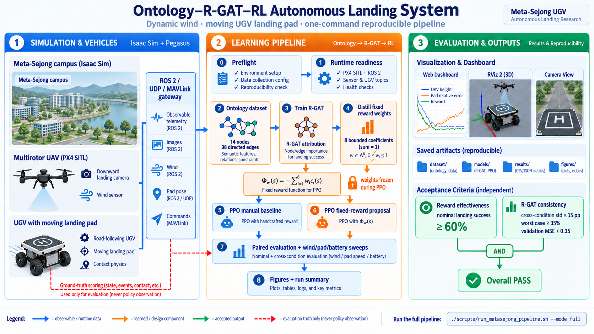
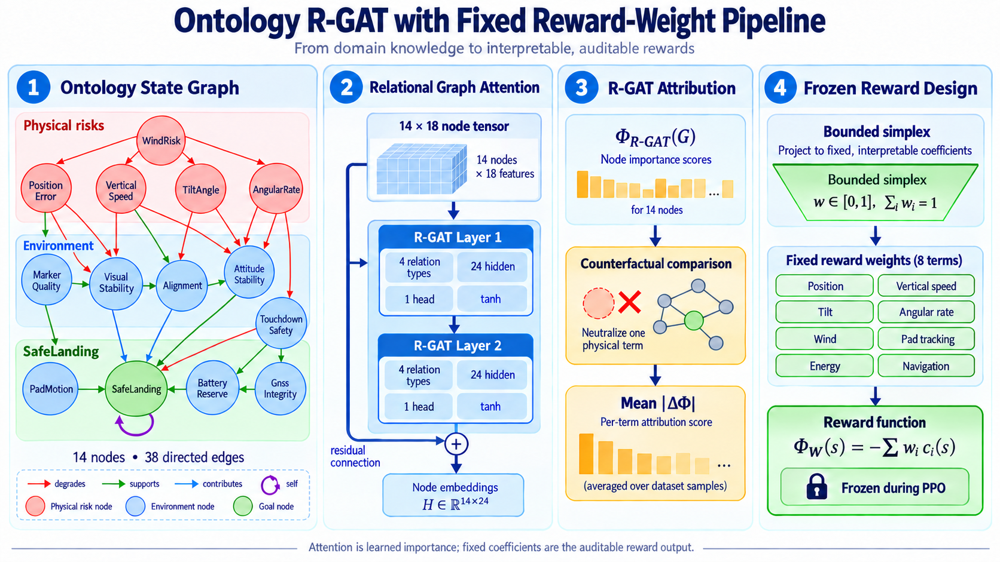
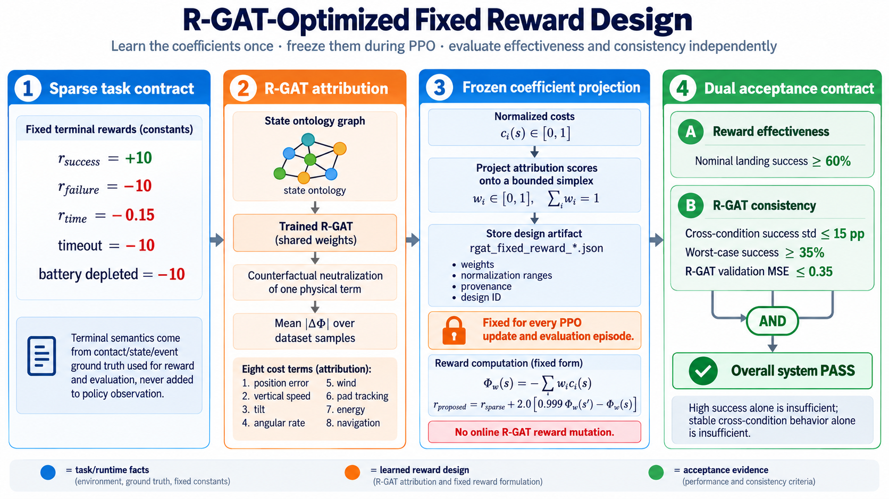
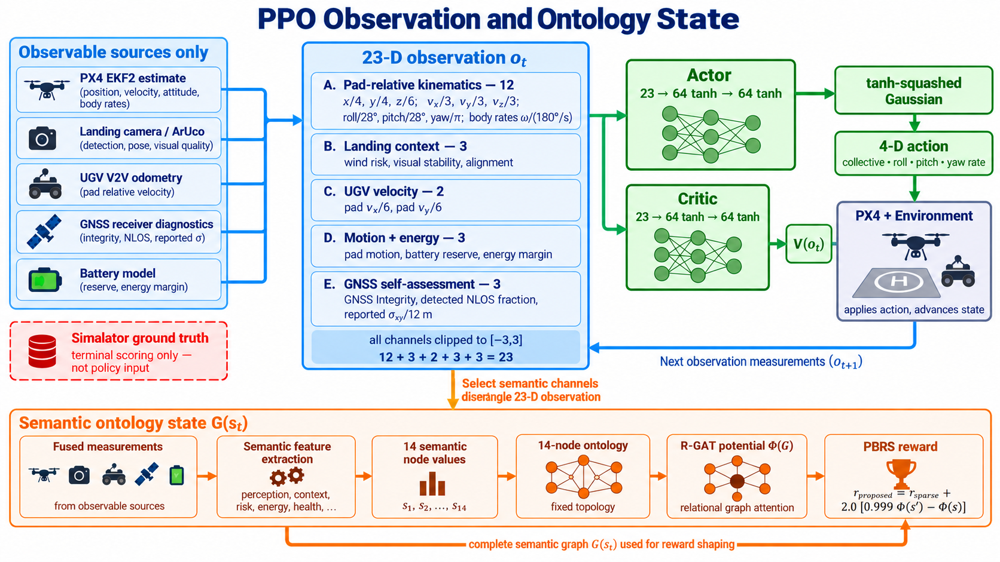

# Ontology-RGAT UAV landing: Isaac Sim + PX4

**Documentation:** [system overview](docs/SYSTEM_OVERVIEW.md) ·
[architecture](docs/ARCHITECTURE.md) · [operations](docs/OPERATIONS.md) ·
[hardware safety](docs/HARDWARE_SAFETY.md) · [references](docs/REFERENCES.md) ·
[three-pipeline comparison](docs/THREE_PIPELINE_COMPARISON.md) ·
[legacy Shin-2026 benchmark](docs/SHIN2026_BASELINE.md)

This workspace replaces the in-process MATLAB rigid-body simulator in
`../Ontology_RGAT_UAV_RL_MATLAB/Ontology_RGAT_UAV_RL_MATLAB` with an external,
flight-stack-in-the-loop system. The original directory is not modified.

## Primary controlled three-pipeline experiment

The default experiment compares three explicit pipelines rather than attaching
different reward strings to one estimator-enabled model:

- `shin_se`: Shin-style state-estimation-supervised latent representation,
  Table-III shaping and active perception;
- `no_se`: the same encoder, temporal LSTM, actor/critic and Table-III physical
  shaping, without estimator head/loss/warm-up or active perception;
- `onto_no_se`: the same estimator-free actor with sparse task reward plus PBRS
  from the frozen direct output of a semantic R-GAT.

The proposed graph uses only keypoints/heatmaps, UAV proprioception and onboard
battery reserve. Estimated relative state and platform truth are rejected at
the graph and dataset boundaries. Exact diagrams, equations and ontology are in
[the comparison protocol](docs/THREE_PIPELINE_COMPARISON.md).

```bash
# Final command: stack, three PPO pipelines, estimator-free reward-design data,
# direct R-GAT, MATLAB-style dashboard/RViz, paired evaluation and reports.
../run.sh                         # 264 x 3 PPO + 8 Shin warm-up = 800 flights
../run.sh --mode quick --headless # smaller real integration run
pytest -q                         # contracts; not flight results
```

The bare command is a seminar preview with equal 264-episode PPO budgets, 40
estimator-free reward-design flights and five paired seeds per scenario. It is
not publication-scale evidence. Explicit budget options override these values.
Legacy `--methods` and `--reward` invocations are still routed to the prior
reward-arm runner.

The live run checkpoints every episode. One-class semantic datasets, privileged
graph fields, mutable/non-finite R-GAT artifacts and synthetic outcomes are
rejected. The dashboard at `http://127.0.0.1:8770/` identifies the current
pipeline, hides estimator panels for estimator-free methods, and displays
semantic values plus direct `Phi(G)`/PBRS for `onto_no_se`. The UAV envelope
starts at 50%; the UGV starts at 35% of sampled road speed. Shared acceleration
slew limits remain active.

The older cooperative urban ontology and five reward-arm Shin runner remain as
legacy/secondary experiments. Their estimate-based distilled potential is not
the primary `onto_no_se` method.

## Data path

```text
Python ontology/R-GAT/PPO
  <--- versioned UDP/JSON --->  ROS 2 gateway
                                  |  PX4 uXRCE-DDS (/fmu/in, /fmu/out)
                                  v
                              PX4 SITL or PX4 hardware
                                  |  Simulator MAVLink (SITL only)
                                  v
                         Isaac Sim 5.1 + Pegasus 5.1
                    physics, sensors, contact, city, wind, GNSS
```

The controller sees PX4 estimator data and, where the pad is in view, the pose
its own camera recovers from the markers. Isaac ground truth is used only for
experiment telemetry and reset acknowledgement. ENU/FLU is the workspace
convention; conversion to PX4 NED/FRD happens only in the gateway.

## Visual system guide

These are implementation-aligned explanatory schematics; the configuration
and Python modules remain the authoritative source for exact topology and
runtime values.

### End-to-end system



The control loop runs through Isaac Sim/Pegasus, PX4 SITL, the ROS 2 gateway
and the Python learner. Policy input is restricted to observable sensor and
estimator data; simulator truth crosses the boundary only for reset and
terminal scoring. RViz 2 receives the annotated landing-camera image, fused
navigation telemetry and the visual touchdown outcome.

### Ontology R-GAT



Each state populates a fixed 14-node, 38-edge semantic graph. Every node has an
18-D feature (`value`, `1-value`, risk flag, bias and a 14-D node identity).
Two 24-wide relational attention layers, with a residual around the second,
read the `SafeLanding` goal node into a bounded training-time potential
`Phi_R-GAT(G) in [-1, 1]`. Counterfactual output sensitivities are averaged over
the dataset and projected into eight fixed reward coefficients. R-GAT therefore
learns the reward design, but its live attention does not mutate the PPO reward.
The graph drawing shows a representative subset of edges for readability; the
implementation uses all four relation types and all 38 edges.

### Reward-function comparison



The experiment compares the hand-weighted dense baseline, the sparse task
reward and the proposed fixed-weight potential-based reward shaping (PBRS).
After R-GAT training, counterfactual node sensitivities over the accumulated
dataset are projected to bounded coefficients `w_i` that sum to one. Those
coefficients are written to disk and frozen before PPO starts:

```text
Phi_w(s)    = -sum_i w_i * normalized_physical_cost_i(s)
r_proposed = r_sparse + 2.0 * (0.999 * Phi_w(s') - Phi_w(s))
```

The eight fixed terms are position error, vertical speed, tilt, angular rate,
wind risk, pad tracking, energy risk and navigation risk. Their normalization
ranges are tied to the landing criteria or a fixed `[0,1]` semantic range. At
an absorbing terminal state `Phi_w(s') = 0`. The shaping discount is kept equal
to PPO's `gamma = 0.999`, so the fixed learned design supplies denser credit
without changing the sparse task's optimal policy.

### PPO observation and semantic state



The PPO policy receives 23 normalized, measurable channels: 12 pad-relative
kinematic channels, three landing-context channels, two UGV-velocity
channels, three motion/energy channels and three GNSS self-assessment channels.
Its actor and critic are separate `23 -> 64 -> 64` networks; the actor emits
collective, roll, pitch and yaw-rate commands. Selected semantic values appear
in the policy observation, while the complete 14-node ontology is the parallel
state representation used for R-GAT training and for calculating the frozen
eight-term `Phi_w(s)` reward input.

The landing context includes `WindRisk`, computed from the UAV's simulated
three-axis anemometer rather than simulator truth. The sensor has seeded bias,
white noise and first-order response. Its measured speed, acceleration and
direction change drive the `WindRisk` ontology node; that node reaches PPO,
the manual reward, R-GAT attribution, and the fixed PBRS wind term. The
MetaSejong research
pipeline enables this wind sensor, turbulence and seeded gusts together with
the moving UGV. The simpler visual demo deliberately leaves wind disabled.

## The environment: a lorry on a city street

The pad is painted on the roof of a box lorry driving a lap of a city block, in
lane, through stop-and-go traffic at 1-3 m/s in the baseline configuration.
The block is built into the
Isaac stage procedurally (`isaac_sim/urban_scene.py`) rather than loaded as a
canned environment, because the *same* geometry has to serve two consumers: the
camera that renders it and the GNSS model that occludes satellites with it. A
skyline drawn from one set of boxes and a satellite mask computed from another
would give an urban-canyon experiment whose outages have nothing to do with the
visible city.

The route (`isaac_sim/pad_motion.py`, mode `road`) is a rounded rectangle
parameterised by arc length, so position, tangent and curvature are closed form
all the way round and the deck twist the policy feeds forward is differentiated
analytically rather than sampled. Traffic is a Gaussian dip in the speed at each
light -- deep enough to be a full stop when the draw says so -- whose integral is
an error function, so the distance covered is closed form too. `pad.motion:
static` is unchanged and remains the fixed-pad control condition.

Driving the lap takes the deck through four street canyons at two orientations
and four open intersections, which is what makes satellite visibility, wind
direction and marker visibility all change *during* an episode instead of being
one number per run.

## GNSS in a street canyon

`isaac_sim/gnss.py` models what the facades do to the fix:

- a satellite whose line of sight crosses a building is not received directly;
- most blocked satellites are still tracked, through a reflection off the
  facade opposite, whose path is longer -- so the pseudorange carries a strictly
  positive excess delay of about `2 d cos(el)`. Positive-only bias is what makes
  urban GNSS error a *bias* rather than noise, and why it points across the
  street;
- the survivors are strung out along the street, so the geometry degrades as
  well as the count;
- the position is then solved by weighted least squares from those per-satellite
  errors, exactly as a receiver solves it, and its own covariance is inflated by
  the post-fit residuals.

Typical synthetic mid-block numbers over the deterministic test seeds with the
shipped configuration are about 19 tracked signals (12 LOS and 7 NLOS), 1.7 m
reported horizontal sigma and 0.8 m horizontal error.  Open sky is about 1.0 m
reported sigma and 0.6 m error.  More deeply shadowed parts of the loaded OSM
city still cross the low-integrity threshold and exercise the DR path.

Both the drone and the lorry carry a multi-constellation receiver and share the
same satellite sky. Each uses the 3-D building map and C/N0 to suppress NLOS
ranges; their differential fix consequently stays metre-scale in the nominal
canyon instead of inheriting a tens-of-metres common bias. The markers remain
the precise landing anchor on a roof only 2.45 m wide.

What the policy is shown is only what a receiver publishes: satellite count,
DOP, its own inflated covariance, mean C/N0 and the fraction of signals its
C/N0 test flags as probably reflected. The true error, the true NLOS count and
the true sky view are the simulator's and never cross into the learner --
`tests/test_urban_gnss.py` enforces that boundary. The C/N0 detector matters:
when every satellite is reflected off a facade the same distance away their
biases agree with one another, so no consistency check sees anything wrong, and
signal strength is the only evidence left. It is not an oracle either, because
a few reflections come in nearly as strong as the direct path.

The receiver first downweights reflections detected by C/N0 or the loaded 3-D
building shadow map in its range solution,
then replaces Pegasus' generic GPS on MAVLink `HIL_GPS`, including its reported
EPH/EPV. PX4 EKF2 therefore performs the real GNSS/IMU fusion: uncertain but
valid fixes become weak drift-bounding observations, a true loss of fix falls
back to inertial dead reckoning, and consistently good fixes regain full weight.
The receiver profile is a u-blox ZED-F9P-05B at its 5 Hz multi-constellation
rate. Ten continuous good-quality seconds promote MAVLink to RTK-fixed
(`fix_type=6`, 1 cm horizontal/vertical accuracy); blockage or poor integrity
immediately drops it back to an ordinary 3-D fix rather than granting RTK truth.
The gateway observes that estimate and does not add a second synthetic offset.
`docs/ARCHITECTURE.md`, "GNSS", details the path and its diagnostic topics.

## Marker-based landing

The pad carries printed ArUco tags, a downward camera on the vehicle sees them,
and the pose is solved with OpenCV. While the pad is visible it anchors the
pad-relative estimate. When it is not, the gateway propagates that anchor with
PX4/deck relative velocity and applies the two GNSS positions only as a
covariance-weighted drift correction. It also reports `marker_quality` 0, which
lets the ontology reason about degraded perception without receiving truth.

The simulated imager is the left eye of a ZED 2i used strictly as a monocular
camera: 1280 x 720 at 60 Hz with its 2.1 mm, 110-degree horizontal-FOV lens.
Stereo depth is not passed to the policy. The inertial sensor is a VectorNav
VN-100 profile (±2000 deg/s, ±16 g and manufacturer noise densities). Its
hardware capability remains documented as 800 Hz IMU/400 Hz attitude, while
the actual SITL injection is correctly capped by Isaac's 250 Hz physics loop.

The pad uses two marker scales because one cannot cover a landing: a tag big
enough to resolve from the entry altitude overflows the frame near touchdown,
and a tag small enough to survive touchdown is a few pixels from altitude.
`config/system.yaml` therefore spreads four 0.62 m tags along the carrier deck
around one 0.18 m tag, and the solver uses whichever are visible.

In the canyon this is not a redundancy but the primary absolute anchor. During
a marker outage the inertial propagation stays continuous, while GNSS integrity
controls how quickly the drift correction is trusted. The `GnssIntegrity`
ontology node tells the policy which regime it is in; the pose alone cannot.

RViz shows the live downward-camera stream on
`/landing_uav0/perception/landing_camera/annotated`. Known pad markers are
outlined and labelled by ID, while detection status, confidence, reprojection
error, marker pixel scale and the solved pad-relative position are printed on
the frame. Missed detections are published too, with a red status banner.

```bash
# Dump annotated camera frames while the simulator runs.
ONTOLOGY_RGAT_VISION_DEBUG_DIR=/tmp/frames ./scripts/run_isaac.sh
```

Set `vision.mode: pose_proxy` to switch the camera off and fall back to the
analytic marker-quality stand-in; rendering the camera costs simulation speed
even headless, because PX4 is lockstepped to the simulator.

## Sensor and ground-truth boundary

The policy, ontology, rewards, R-GAT dataset and PPO training consume the
gateway's sensor/estimator contract: PX4 odometry, camera marker quality, the
lorry's own V2V broadcast, the receiver's own report of its fix, and pad
telemetry. The learner never reads the `ground_truth` namespace. This keeps a
simulated experiment from silently turning privileged information into a
control feature.

The episode outcome is the one exception, and it has to be: under a canyon fix
the pad-relative pose the policy flies on can be metres from the truth, so
grading the landing on it would score the receiver's mistake instead of the
landing. The gateway therefore publishes a `truth` block -- the simulator's own
pad-relative geometry -- and `env.truth_state` uses it for the terminal test and
the touchdown metrics, and for nothing else. A link that carries no `truth`
block falls back to the sensor, which is what the fixed-pad experiment always
did.

An episode is successful only after the vehicle has been airborne, physical
contact with the valid landing-pad surface is confirmed, and the touchdown
limits are met. In simulation the roof contact sensor is authoritative because
PX4's world-frame land detector cannot reliably classify a vehicle resting on a
moving lorry; on a static pad or hardware the PX4 land detector remains the
fallback. Contact immediately ends offboard control and requests disarm, and
the landed/disarmed state is confirmed before the next reset is accepted.
Contact with the road or outside the pad is recorded as an unsuccessful
touchdown; battery depletion, attitude/flight-limit violations and timeouts are
separate terminal outcomes. The deck uses a high-friction, zero-restitution
contact material to suppress bounce and inertial sliding after touchdown.

`run_pipeline.py` starts the live dashboard, the Isaac in-window overlay and,
when a graphical ROS 2 session is available, RViz 2. Training progress is
also exported to `results/live/*.csv` and `results/live/*.png`; the dashboard
is served at `http://127.0.0.1:8770/`.

The dashboard's first panel is a rotatable 3D view of the ontology graph the
R-GAT is learning over: nodes placed by their distance from the raw semantic
channels to `SafeLanding`, sized and coloured by their current activation, and
edges weighted by the second layer's attention. It follows the R-GAT through
training epoch by epoch and then follows the live episode step by step, so the
relations the potential leans on -- markers against GNSS as the pad leaves the
frame, for one -- can be read off while the run is still going. Attention is
learned importance, not causal proof.

The reward panel makes the learned reward design operational rather than merely
showing its attention graph. It displays every frozen coefficient and physical
range, the PBRS equation, a `Phi_w(s)`/`Phi_w(s')` shaping surface and the current
transition on that surface.
During PPO it also plots `r_sparse`, the R-GAT shaping term, final reward and
both potentials step by step. Manual PPO appears with a zero shaping term;
the proposed arm shows the complete R-GAT reward decomposition.

Evaluation has two separate acceptance gates. Nominal deterministic landing
success measures the optimized reward's effectiveness. The standard deviation
and worst-case success over wind, moving-pad, GNSS and energy strata measure
R-GAT-derived reward consistency; the R-GAT validation MSE must also pass. The
system passes only when both gates pass. Thresholds live under
`cfg.eval.acceptance`, and the complete decision is saved in
`results/optimization_acceptance.json`.

Each episode starts in the air. Isaac draws the entry pose from the same
distribution as the original simulator but does **not** teleport the vehicle:
PX4 flies there under its own position controller, and the policy takes over
once that point is held. `docs/OPERATIONS.md` explains why teleporting is
unusable here.

## Pinned integration baseline

- Ubuntu 22.04, ROS 2 Humble
- NVIDIA Isaac Sim 5.1.0
- Pegasus Simulator v5.1.0
- PX4-Autopilot v1.14.3 (the version tested by Pegasus 5.1)
- `px4_msgs` branch `release/1.14`, matching the PX4 firmware definitions

Newer PX4 releases can be used, but `PX4_VERSION` and the `px4_msgs` branch must
match exactly. Do not mix generated message definitions between releases.

## Install external dependencies

Isaac Sim is intentionally not downloaded automatically. It is a large licensed
runtime. Install Isaac Sim 5.1, then install Pegasus and the PX4/ROS dependencies:

```bash
cd Ontology_RGAT_UAV_RL_ISAAC_PX4
ISAACSIM_PATH=/absolute/path/to/isaacsim ./scripts/bootstrap_pegasus.sh
./scripts/bootstrap_px4_ros2.sh
```

The script clones dependencies into `external/` and builds `ros2_ws/`. Override
paths/versions with environment variables shown by `--help`. It also applies
`patches/px4-v1.14-publish-land-detected.patch`, which is required: stock PX4
v1.14 does not publish `vehicle_land_detected`, `vehicle_command_ack` or
`vehicle_thrust_setpoint` over uXRCE-DDS. The physical pad contact signal covers
moving-deck touchdown in simulation, but the PX4 land detector remains required
for static-pad and hardware fallback and for complete flight-state telemetry.

Every consumer of `/fmu/*` must use Fast DDS, because that is what the agent
speaks. The run scripts export `RMW_IMPLEMENTATION=rmw_fastrtps_cpp` and clear
`CYCLONEDDS_URI`; an interactive shell with a different default sees the topics
but reads nothing from them.

## Run everything with one command

Run the launcher from this active project directory. It finds the verified
Isaac Sim installation on this PC automatically; another installation can be
selected with `ISAACSIM_PATH` or `--isaac-sim-path`.

```bash
./scripts/run_metasejong_pipeline.sh --mode full
```

The launcher starts or adopts DDS, Isaac/Pegasus/PX4, the gateway, dashboard,
and RViz; waits for each readiness signal; flies a preflight episode; updates
the cumulative ontology dataset and R-GAT; distills the fixed reward weights;
updates both PPO policies; runs paired evaluation and dynamic-condition sweeps;
and exports the figures and run summary. It stops only processes it started.

Useful variants are:

```bash
./scripts/run_metasejong_pipeline.sh --mode quick
./scripts/run_metasejong_pipeline.sh --smoke-test-only
./scripts/run_metasejong_pipeline.sh --use-running-stack
./scripts/run_metasejong_pipeline.sh --keep-stack
./scripts/run_metasejong_pipeline.sh --headless
```

The Isaac Sim window opens by default whenever `DISPLAY` is set. The
Meta-Sejong full-pipeline profile keeps physics and PX4 HIL at 250 Hz but caps
the GUI viewport and rendered camera stream at 20 Hz; before PX4 is ready it
renders a 2 Hz preview so EKF initialization is not starved by the campus
scene. Headless mode retains the configured 60 Hz ZED stream. Rendering still
costs simulation speed because PX4 runs in lockstep; use `--headless` when a
window is not required, or `--isaac-timeout SECONDS` for an unusually slow GUI
host.

PX4 runs in real time: quick mode flies roughly 550 episodes and full mode
roughly 8,500, so budget hours and days respectively. If PX4 stops accepting arm
commands mid-sweep, the learner cycles the simulator and retries according to
`cfg.external.reset_recoveries`. Process logs are under
`/tmp/ontology_rgat_stack/`.

After dataset collection, stage 3 trains R-GAT offline. During that stage the
Isaac/PX4 loop remains live but receives no flight commands, so the disarmed UAV
stays motionless on the pad. This is not a stopped simulation; flight resumes
at stage 5 (manual PPO). Check the live odometry rate and gateway state from a
terminal:

```bash
cd Ontology_RGAT_UAV_RL_ISAAC_PX4
./scripts/stack_status.sh
```

## Run SITL by hand

Open three terminals:

```bash
# 1. DDS agent (PX4 <-> ROS 2)
./scripts/run_dds_agent.sh

# 2. Isaac Sim + Pegasus + PX4 SITL
ISAACSIM_PATH=/absolute/path/to/isaacsim ./scripts/run_isaac.sh

# 3. PX4 gateway
./scripts/run_gateway.sh --target sitl --allow-arm
```

### Meta-Sejong campus map

An optional configuration runs the same PX4 UAV landing system in the 2025
Meta-Sejong competition's Sejong University campus. The map remains subject to
the competition distribution's proprietary licence, so its 1.2 GB asset tree
is extracted from an image already installed on the machine and is ignored by
Git:

```bash
./scripts/import_metasejong_map.sh
# Recommended graphical demo: starts DDS, Isaac/PX4, the gateway and RViz,
# then takes off to a stable 2.5 m hold above the moving UGV.
./scripts/run_metasejong_demo.sh

# Complete learning experiment: adds the ontology dataset, R-GAT outcome model,
# fixed reward-weight distillation, manual/PBRS PPO training, dual-gate
# evaluation, dashboard and figures.
./scripts/run_metasejong_pipeline.sh --mode quick
```

The pipeline command is the full experiment rather than an indefinite hover.
It repeatedly flies and resets the UAV while it collects ontology graphs,
trains R-GAT and PPO, and evaluates the two learned policies. Quick mode still
takes hours because PX4 runs flight episodes in real time; `--mode full` is the
paper-scale run and takes days. Use `--smoke-test-only` to validate one complete
learner-controlled flight before committing to a long run. Live progress is at
`http://127.0.0.1:8770/`, in RViz, and under `results/live/`.

Training is cumulative by default. Every execution appends newly seeded
ontology graphs to `results/data/rgat_dataset_external.npz`, resumes the
compatible R-GAT and PPO checkpoints under `results/models/`, and continues
their epoch/episode histories and Adam optimizer state. Dataset progress is
committed after each flight, R-GAT after each epoch, and PPO after each rollout
update, using atomic replacement so an interrupted long run retains its last
complete update. Evaluation reports the success count and a Wilson 95% interval
alongside the rate; a small evaluation no longer presents 0% or 100% as an
exact probability. If the accumulated R-GAT labels contain only successes or
only failures, training stops before overwriting a model with a one-class fit.

Press Ctrl-C in the demo terminal to request a PX4 landing and stop everything
it started. The lower-level four-terminal equivalent remains available:

```bash
ISAACSIM_PATH=/absolute/path/to/isaacsim \
  ./scripts/run_isaac.sh config/metasejong-demo.yaml
./scripts/run_gateway.sh --config config/metasejong-demo.yaml \
  --target sitl --allow-arm
# 4. Live ROS view (the manual three-process startup does not launch it)
./scripts/run_rviz.sh
```

`metasejong.scenario` selects `demo` (S1), `dongcheon` (S3), `jiphyeon` (S4),
or `gwanggaeto` (S5). `METASEJONG_ASSET_ROOT` can point at a licensed external
`resources/models` tree instead of extracting the Docker image.

The S1 overlay hides its decorative tree group only in the transient Isaac
stage, leaving the licensed USD unchanged, and starts the UGV waypoint shuttle
during an idle manual preview at its normal configured speed. A learner reset
still parks the UGV until policy handover. The visual-demo overlay disables the
short, deliberately depleted research-episode battery budget so an unattended
hover does not time out. `run_rviz.sh` is a separate fourth process for manual
startup; the one-command Python pipeline launches it automatically.

This is an environment adaptation, not a claim of compatibility with the
competition task protocol; this project remains a Pegasus/PX4 UAV landing
system. Its ground carrier is now the AGILEX RANGER MINI 3.0: the visual is
generated from AGILEX's public BSD `ranger_mini_v3` URDF/DAE package, while the
kinematic route remains deterministic for repeatable landing experiments. Run
`./scripts/import_ranger_mini_v3.sh` to regenerate the Isaac USD. The supplied
S1 overlay disables the generated OSM buildings,
canyon GNSS occluder model and route-centred arena clamp. Its moving target is
a 720 x 500 x 345 mm, 75 kg RANGER MINI under a 1.60 x 1.00 m landing deck:
the original 2.45 m lorry is wider than the 2.26 m
of usable pavement at the competition start. The UGV follows 44 terrain-height
waypoints for 165.7 m, stops smoothly at the north end, and reverses down the
same path instead of attempting a U-turn on the narrow branch.

Audit the configured route directly against the licensed S1 USD road meshes
without launching Isaac:

```bash
python tools/check_metasejong_route.py \
  --plot docs/images/metasejong_s1_ugv_route.png
```

At 0.10 m audit resolution, the route has 1.13 m minimum edge clearance. The
UGV deck's conservative swept half-diagonal is 0.94 m, leaving 0.19 m minimum
margin, and every waypoint matches the road elevation. See the generated
[S1 road and UGV route](docs/images/metasejong_s1_ugv_route.png).

The S1 map can use roughly 2.6 GB of GPU memory in headless Isaac 5.1, while the
original competition Docker server peaked near 6.7 GB on this machine. Run only
one Isaac instance at a time on an 8 GB GPU.

Calibrate the collective mapping once per airframe or Isaac version, with the
stack running:

```bash
python3 tools/calibrate_hover_thrust.py
```

It reports the thrust PX4 needs to hover and the `px4.hover_thrust` to put in
`config/system.yaml`. This matters: the policy normalises its collective as
`hover*(1 + span*a)`, so a wrong hover thrust spends the policy's authority
just holding altitude. With the shipped Pegasus Iris the measured value is
0.580, and using the previous 0.500 made the expert controller touch down at
1.9 m/s instead of 0.3 m/s. `px4.collective_span` must equal
`cfg.rl.collectiveSpan` in the original workspace; the adapter refuses to run
if the gateway reports a different mapping.

Then in MATLAB:

```matlab
cd('Ontology_RGAT_UAV_RL_ISAAC_PX4/matlab')
setup_external_path
cfg = defaultExternalConfig('quick');
run_external_smoke_test
```

`run_external_all.m` runs the same stages as `run_pipeline` against a stack you
manage yourself.

`run_external_episode.m` loads an existing policy/R-GAT model from the original
workspace and runs it against PX4/Isaac. Training can use the same external
`sim.*` API, but flight-stack-in-the-loop training is real-time and reset-heavy;
start with evaluation and data collection.

Both entry points perform dataset generation, R-GAT training, both PPO runs,
paired evaluation, dynamic Isaac wind scaling, and plot generation without
calling the MATLAB rigid-body simulator.

## Real vehicle

Run a serial XRCE-DDS agent and the gateway; Isaac and the reset service are absent:

```bash
./scripts/run_dds_agent.sh serial --dev /dev/ttyUSB0 -b 921600
ONTOLOGY_RGAT_HARDWARE_OFFBOARD=I_ACCEPT_FLIGHT_CONTROL \
  ./scripts/run_gateway.sh --target hardware --allow-offboard
```

Hardware mode never auto-arms, never resets, and never flies the entry pose
itself: the pilot does. It refuses arm commands
unless both `--allow-arm` and `ONTOLOGY_RGAT_HARDWARE_ARM=I_ACCEPT_PROPELLER_RISK`
are present. Keep RC/QGroundControl takeover and PX4 offboard-loss failsafes
configured. First tests must be performed without propellers.

For a MAVLink-only companion link, use:

```bash
./scripts/run_mavlink_gateway.sh --target hardware --device /dev/ttyUSB0
```

This alternative sends `SET_ATTITUDE_TARGET`; the MATLAB protocol remains the
same.

Before enabling a hardware policy, publish the UAV pose in the landing-pad ENU
frame on `/landing_uav0/perception/uav_pose_in_pad` and marker confidence on
`/landing_uav0/perception/marker_quality`. See `docs/HARDWARE_SAFETY.md`.
After disarmed/propeller-off checks, arm through the pilot's normal path and run
`matlab/run_hardware_policy.m`. That script never sends an arm command and yields
to the configured PX4 offboard-loss behavior on exit.

## Verification

Tests not requiring Isaac/PX4/ROS:

```bash
python3 -m pytest -q tests
./scripts/check_workspace.sh
./scripts/check_learner_protocol.sh
# after bootstrap/build
./scripts/check_ros2_loopback.sh
```

Live integration checks:

```bash
./scripts/stack_status.sh
RMW_IMPLEMENTATION=rmw_fastrtps_cpp ros2 topic hz /fmu/out/vehicle_odometry
RMW_IMPLEMENTATION=rmw_fastrtps_cpp ros2 topic echo --once /landing_uav0/state/pose
python3 tools/protocol_probe.py state
python3 tools/calibrate_hover_thrust.py
```

## Known limitations

- Seeds are not comparable across backends. Isaac draws the entry pose with
  NumPy's generator and the original simulator uses MATLAB's Mersenne Twister,
  so the same seed gives the same *distribution* but not the same episode.
  Compare distributions, not paired seeds.
- Results are not comparable with the fixed-pad runs, and not only because the
  deck moves: the success radius, the episode length, the arena limits and the
  ontology schema all changed with the environment. A potential trained against
  the 13-node schema will not load, by design.
- Satellites are frozen for the duration of an episode. Over fifteen seconds a
  MEO satellite moves well under a degree, so this is not a meaningful
  approximation at episode scale -- but it does mean an outage never clears by
  itself, only by the vehicle moving.
- `metrics.energyJ` is `NaN`. PX4 reports no shaft power, and the in-process
  rotor model that produced it is gone.
- PX4 SITL stops accepting arm commands after long unattended sessions
  (`Preflight Fail: Battery unhealthy`, from `battery_status` going stale under
  lockstep). The gateway logs the rejection with its PX4 result code; restart
  Isaac to clear it. Budget a restart between long sweeps.
- Upward collective saturates near `a0 = 0.65`, where the gateway's 0.90 thrust
  ceiling is reached. A vehicle hovering at 58% throttle cannot deliver the
  full modelled +85% span in any case.

See the [system overview](docs/SYSTEM_OVERVIEW.md),
[architecture](docs/ARCHITECTURE.md), [operations](docs/OPERATIONS.md), and
[hardware safety](docs/HARDWARE_SAFETY.md) before flight. Protocol/API sources
are collected in [references](docs/REFERENCES.md).
