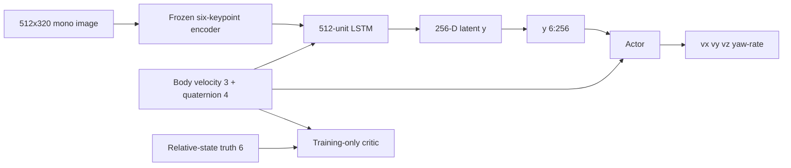
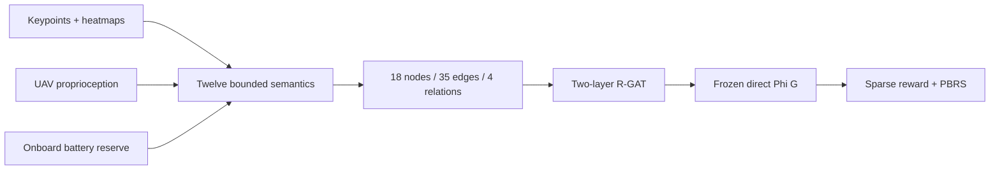

# Ontology-RGAT UAV landing: Isaac Sim + PX4

This directory is the active implementation of a vision-based autonomous
landing benchmark. A PX4-controlled multicopter lands on a road-following
AGILEX RANGER MINI 3.0 in the Meta-Sejong S5 map. The experiment compares the
state-estimation method motivated by Shin et al. (2026) with an estimator-free
baseline and an estimator-free ontology/R-GAT reward method.

[Documentation index](docs/README.md) ·
[Controlled comparison](docs/THREE_PIPELINE_COMPARISON.md) ·
[Operations](docs/OPERATIONS.md) ·
[Architecture](docs/ARCHITECTURE.md) ·
[Hardware safety](docs/HARDWARE_SAFETY.md)


> Actual in-progress runtime captures from 2026-09-12. They document the
> simulator and dashboard; they are not a success-rate claim.

## Quick start

The canonical command is run from the Git repository root, one directory up:

```bash
../run.sh
```

It starts or adopts DDS, Isaac Sim, Pegasus, PX4 SITL, the ROS 2 gateway, RViz
2, and the MATLAB-style web dashboard. It then resumes/trains all three
pipelines, collects real semantic trajectories, trains and freezes R-GAT, runs
paired evaluation, and writes reports.

The bare command is equivalent to full fidelity with a seminar deadline
budget:

| Work | Default count |
|---|---:|
| `shin_se` estimator warm-up | 8 flights |
| PPO per pipeline | 264 flights |
| PPO across three pipelines | 792 flights |
| Total training including warm-up | 800 flights |
| R-GAT behavior data | 40 minimum, 120 hard cap |
| Paired evaluation | 7 scenarios × 5 seeds × 3 pipelines = 105 flights |

Reward-design and evaluation flights are intentionally reported separately
from PPO interaction cost. This budget is useful for a seminar demonstration,
but it is not publication-scale statistical evidence.

```bash
../run.sh --mode quick --headless
../run.sh --mode full --pipelines shin_se no_se onto_no_se
../run.sh --mode full --training-replicate 1 \
  --train-episodes 40960 --rgat-data-episodes 400
../run.sh --help
```

`run.sh` holds an OS-level flight lock. A concurrent invocation fails before
it can touch the shared simulator, vehicle, dashboard, or result files.

## Controlled experiment

| ID | Explicit state estimator | Auxiliary loss | Active reward | Training reward |
|---|---:|---:|---:|---|
| `shin_se` | yes | six-state MSE | yes | Shin Table III + active perception |
| `no_se` | no | no | no | Shin Table III without active term |
| `onto_no_se` | no | no | no | sparse task reward + direct R-GAT PBRS |

The following are held common: camera, frozen keypoint weights, temporal
backbone, actor/critic capacity, action mapping, controller limits, PPO
hyperparameters, curriculum, initial-condition distribution, simulator, and
paired PPO/evaluation seeds.

### Actor and critic boundary



Only `shin_se` creates an auxiliary head on `y[0:6]`. The actor does not
receive those six predicted values; every actor receives `y[6:256]` plus the
same 7-D UAV proprioception. The critic is asymmetric and exists only during
training.

### Estimator-free ontology/R-GAT path

`onto_no_se` derives twelve bounded observations from the keypoint heatmaps,
their explicitly supervised per-keypoint visibility scores,
short visual history and onboard UAV state:

1. keypoint confidence;
2. visible-keypoint fraction;
3. image alignment;
4. apparent target scale;
5. image-plane motion safety;
6. scale-rate safety;
7. decayed visibility memory;
8. reacquisition trend;
9. vertical-motion safety;
10. attitude stability;
11. battery risk;
12. visual-loss-duration risk.

They populate a graph with 18 nodes, 17 semantic edges, 18 self-loops, four
relation types, and 24 features per node. The two 24-wide relational-attention
layers read `SafeLanding` and produce `Phi(G)` in `[-1, 1]`.



The graph API recursively rejects relative-state estimates, platform/deck
state, GNSS, critic inputs, and simulator truth. R-GAT is trained from real
estimator-free rollouts generated by the trained `no_se` policy mixed with a
deterministic image-plane servo, explicit loss-recovery climb, bounded noise,
and bounded exploration. Synthetic terminal outcomes are forbidden. The data
must contain success, failure, and successful loss→reacquisition→landing
episodes. Whole episodes, not adjacent frames, are split between training and
validation.

For terminal outcome `S_i` in `{+1, -1}`:

```text
y_i,t = gamma^(T_i - t - 1) * S_i
r_t   = r_sparse + lambda * (gamma * Phi(G_t+1) - Phi(G_t))
```

The same `gamma=0.99` is used for the R-GAT target, PBRS, and PPO. Terminal
next-state potential is zero. R-GAT is frozen before PPO and PPO cannot update
it. Adverse perception, recovery, and battery counterfactuals are included in
training; the artifact is rejected unless their measured monotonic compliance
meets the configured threshold. Because the environment is partially
observable, this finite-history potential is an engineering approximation to
a belief-state potential, not a claim of exact POMDP policy invariance.

## Simulation environment

The primary configuration is
[`config/shin2026-system.yaml`](config/shin2026-system.yaml), extending
`config/system.yaml`.

- Meta-Sejong `gwanggaeto` / S5 asset;
- 37-point closed road route, 99.70 m long;
- UGV speed draw 0.25–0.60 m/s and 1.0 m/s hard carrier limit;
- 1.5×1.5 m landing deck on the RANGER MINI visual;
- 512×320, 90° HFOV, 60° forward/down mono camera at 30 Hz;
- four 0.32 m far tags, four 0.12 m transition tags, and 37 0.04 m
  touchdown tags;
- a real-capacity 3S 3500 mAh model initialized with a seeded 9–55 hover-second
  reserve so battery state changes during a 30 s episode.

The UAV and UGV begin in controlled airborne/parked staging. PX4 flies the UAV
to a camera-centred pad-relative entry hover and must hold the configured
position/speed/visibility gate before policy handover; the UAV is not
teleported because doing so invalidates the PX4 estimator.


The route figure is generated directly from the licensed USD road meshes and
the active YAML:

```bash
python3 tools/check_metasejong_route.py \
  --config config/shin2026-system.yaml \
  --plot docs/images/metasejong_gwanggaeto_ugv_route.png
```

At 0.10 m raster resolution the audit passes with 2.06 m pavement-edge
clearance, 1.06 m deck half-diagonal, 1.00 m conservative remaining margin,
and 0.001 m maximum waypoint elevation error.

## Installation

Validated integration baseline:

- Ubuntu 22.04 and ROS 2 Humble;
- NVIDIA Isaac Sim 5.1.0;
- Pegasus Simulator v5.1.0;
- PX4-Autopilot v1.14.3;
- `px4_msgs` branch `release/1.14`;
- Micro XRCE-DDS Agent v2.4.2.

Install Isaac Sim separately, then bootstrap Pegasus and PX4/ROS:

```bash
python3 -m pip install --user -r requirements.txt
ISAACSIM_PATH=/absolute/path/to/isaacsim ./scripts/bootstrap_pegasus.sh
./scripts/bootstrap_px4_ros2.sh
./scripts/import_metasejong_map.sh       # requires the licensed Docker image
./scripts/import_ranger_mini_v3.sh       # optional; primitives are fallback
```

The ROS 2 bootstrap mirrors packages into the ASCII-only workspace
`/home/$USER/.local/share/ontology_rgat_uav_rl/ros2_ws` by default. This avoids
ROS 2 Humble failures caused by the Korean characters in the repository path.
After gateway source changes, refresh that copy with:

```bash
./scripts/sync_gateway.sh
```

Every `/fmu/*` consumer must use Fast DDS. The supplied launchers set
`RMW_IMPLEMENTATION=rmw_fastrtps_cpp` and clear `CYCLONEDDS_URI`.

## Monitoring and recovery

The dashboard is served at <http://127.0.0.1:8770/>. RViz 2 opens automatically
in graphical mode and uses `/landing_rl` topics. The dashboard distinguishes:

- the committed-episode total;
- the currently active episode and live control step;
- pipeline, estimator state, curriculum and command envelope;
- target visibility, UAV/UGV speed and battery reserve;
- training success and return (return is diagnostic only);
- later R-GAT dataset/training and paired evaluation state.

Runtime logs are in `/tmp/ontology_rgat_stack/`. Check the stack without
changing it:

```bash
./scripts/stack_status.sh
curl -fsS http://127.0.0.1:8770/api/state
```

Compatible checkpoints resume after interruption. Recoverable gateway timeout,
simulated-clock stall, or a gateway-classified pure Offboard heartbeat loss
causes the incomplete trajectory to be discarded and the same seed retried
after restarting only a stack owned by the pipeline. Nonrecoverable vehicle,
estimator, marker, geometry, and policy failures are surfaced instead of being
silently retried.

## Outputs

Primary outputs are under `results/three_pipeline/<mode>/`:

| Path | Content |
|---|---|
| `manifest.json` | resolved contract, hashes, budgets, seeds, status |
| `models/shared/keypoint_encoder.pt` | frozen pretrained keypoint model |
| `models/<pipeline>/<pipeline>.pt` | recurrent PPO checkpoint |
| `models/<pipeline>/<pipeline>_training.csv` | per-episode training metrics, committed with checkpoints |
| `rgat/semantic_rollouts.npz` | versioned estimator-free graph data |
| `rgat/semantic_rollout_episodes.csv` | reward-design flight outcomes |
| `rgat/rgat_model.pt` | frozen direct R-GAT artifact |
| `evaluation/paired_plan.csv` | common scenario/seed plan |
| `evaluation/per_episode.csv` | reward-independent physical metrics |
| `evaluation/`, `tables/`, and `figures/` | CIs, comparisons, publication table, and plots |

Exact filenames in the R-GAT/model subtree are also recorded in
`manifest.json`; treat that manifest as the run provenance source of truth.
Episode return is never used to rank pipelines because their reward functions
differ.

## Verification

Checks that do not require a running flight stack:

```bash
./scripts/check_workspace.sh
./scripts/check_learner_protocol.sh
```

After PX4/ROS bootstrap:

```bash
./scripts/check_ros2_loopback.sh
```

Live read-only checks:

```bash
./scripts/stack_status.sh
RMW_IMPLEMENTATION=rmw_fastrtps_cpp ros2 topic hz /fmu/out/vehicle_odometry
python3 tools/protocol_probe.py state
```

## Scope and limitations

- This is a methodological-interface implementation of Shin et al. (2026),
  not a bit-exact reproduction. PACMAN weights and the paper's exact geometric
  controller are unavailable; the repository uses a synthetic-initialized,
  held-out-Isaac-validated six-keypoint encoder and PX4 velocity control.
- The estimator/reward/curriculum/runtime remediation and its before/after
  evidence are recorded in
  [`docs/LEARNING_REMEDIATION_AUDIT.md`](docs/LEARNING_REMEDIATION_AUDIT.md).
- The paper's 0–8 m/s platform range is not claimed for the campus run. The
  default curved-road UGV draw is deliberately 0.25–0.60 m/s.
- The six named evaluation maneuvers are executable approximations because the
  paper does not publish their exact trajectory equations.
- Smoke tests and dashboard snapshots are not benchmark evidence. Only
  completed real Isaac/Pegasus/PX4 records may enter result tables.
- Meta-Sejong assets retain their external license and are not redistributed
  by this repository.

## Legacy paths

The older cooperative urban experiment has a 23-channel actor observation,
14-node/38-edge ontology, and R-GAT-distilled fixed reward weights. It remains
available via `scripts/run_metasejong_pipeline.sh`, while legacy reward-arm
CLI (`--methods` or `--reward`) is routed by the root `run.sh` to the former
runner. These outputs and checkpoints are not interchangeable with the primary
18-node history-aware direct-R-GAT experiment.

The retired MATLAB source under [`legacy_matlab/`](legacy_matlab/) is reference
only and is rejected as a runtime dependency by `scripts/check_workspace.sh`.
