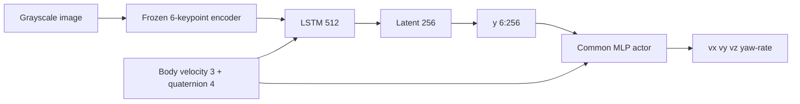
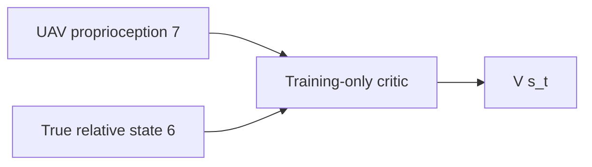

# 아키텍처와 정보경계

[문서 안내](README.md) · [시스템 개요](SYSTEM_OVERVIEW.md) ·
[운영](OPERATIONS.md) · [실제 기체 안전](HARDWARE_SAFETY.md)

## 활성 시스템

```text
run.sh
└── python/run_three_pipeline.py
    ├── Isaac/Pegasus: isaac_sim/landing_world.py
    ├── PX4 SITL: external/PX4-Autopilot
    ├── ROS 2 gateway: ros2_ws/.../ros2_gateway.py
    ├── Live environment: python/ontology_rgat/benchmarks/live_env.py
    ├── Perception: python/ontology_rgat/perception/
    ├── Recurrent PPO: python/ontology_rgat/ppo/
    ├── Ontology/R-GAT: python/ontology_rgat/rgat/
    ├── Reward: python/ontology_rgat/reward_modes/
    └── Evaluation/report/dashboard: python/ontology_rgat/{evaluation,viz}/
```


## Simulator와 vehicle

Isaac Sim은 Meta-Sejong S5 environment, RANGER MINI visual, 이동 deck, marker,
multicopter rigid body, camera, contact와 battery/외란 simulation을 소유한다. Pegasus는
multicopter dynamics와 PX4 backend를 연결한다. PX4 SITL은 estimator와 position,
attitude, body-rate controller를 실행한다.

RL actor는 motor/thrust를 직접 명령하지 않는다.

$$
a_t=[v_x^b,v_y^b,v_z^b,\omega_z]
\xrightarrow{\text{rate/acceleration limit}}
\text{PX4 OFFBOARD setpoint}.
$$

## UGV와 landing deck

UGV는 YAML에 저장된 폐곡선 road-center waypoint를 따라 주행한다. Ramp와 speed bound를
적용해 episode 시작과 corner에서 불연속적인 속도 점프를 방지한다. Landing deck은 UGV
body에 고정하며 contact sensor와 marker cluster를 함께 이동시킨다.

Marker는 원거리 검출용 큰 표식, 접근 전이용 중간 표식, touchdown 근접용 작은 표식을
동시에 사용한다. 가까이 접근해 큰 표식이 FOV를 벗어나도 작은 표식이 남도록 배치한다.


## 좌표계

| 데이터 | Frame/부호 |
|---|---|
| Simulator world | ENU |
| PX4 local | NED; gateway가 ENU와 변환 |
| Actor velocity | UAV body/heading frame |
| Relative state | platform minus UAV, UAV body frame |
| Image keypoint | 정규화 image plane $[-1,1]^2$ |
| Action $v_z$ | controller가 정의한 body/heading vertical convention |

Frame 변환은 gateway와 benchmark adapter에서 한 번만 수행한다. Reward, critic,
touchdown metric은 동일한 relative-state convention을 사용한다.

## Actor observation boundary



Actor observation은 image와 7-D UAV proprioception뿐이다. Platform world pose, relative
truth, contact force, reward label, critic value는 actor에 들어가지 않는다.

## Asymmetric critic boundary



Critic truth는 PPO value target과 auxiliary SE supervision에만 사용한다. Deployment
policy wrapper에는 critic truth를 전달하는 API가 없다.

## Pipeline 차이


- `shin_se_fixed`: 6-D auxiliary estimator와 active-perception reward
- `no_se_fixed`: estimator-free, 고정 reward
- `onto_rgat_adaptive_weight_no_se`: estimator-free, hybrid ontology R-GAT reward

그 외 actor, critic, controller와 simulator는 동일한 class를 재사용한다.

## Ontology boundary

제안 graph builder는 다음 입력만 받는다.

```text
keypoints + heatmaps + keypoint visibility
+ UAV body velocity/quaternion
+ onboard battery reserve
+ previous bounded semantic observation
```

Payload validator는 `truth`, `relative_position`, `relative_velocity`, `platform_pose`,
`critic`, `privileged` 등 metric/privileged field를 중첩 mapping에서도 거부한다.

## Timing과 episode commit

Control period는 기본 0.1 s다. 한 transition은 다음 순서를 따른다.

1. 마지막 동기화 state와 image로 actor forward
2. action 포화·가속도 제한
3. gateway에 velocity/yaw-rate command 전송
4. simulator/PX4 시간이 한 control period 진행될 때까지 대기
5. 새 odometry, image, contact, battery 수신
6. reward와 terminal 판정
7. transition을 현재 trajectory에 추가

Episode metric과 checkpoint를 성공적으로 기록한 뒤 dashboard의 committed episode를
증가시킨다. 부분 trajectory는 PPO에 들어가지 않는다.

## Reset

Reset은 공중 teleport를 사용하지 않는다.

1. UGV를 entry waypoint에서 park
2. PX4 estimator 유효성 확인
3. PX4 position control로 UAV를 entry hover에 배치
4. 위치·속도·marker visibility gate 확인
5. pad motion 시작
6. policy control handover

이 순서가 PX4 EKF와 Isaac rigid-body state의 불일치를 방지한다.

## Contact와 terminal

Isaac contact sensor가 deck 접촉을 authoritative event로 전달한다. 접촉 위치는 해당
state에서 계산하고, 속도·tilt·각속도는 직전 비접촉 state를 사용해 post-impact bounce를
배제한다.

Terminal class:

- strict safe landing
- unsafe pad contact
- off-pad ground contact/crash
- excessive relative drift
- battery depletion
- horizon timeout

## Artifact 경계

| Artifact | 변경 가능 시점 | PPO 중 상태 |
|---|---|---|
| Keypoint encoder | pretraining/calibration | 동결 |
| R-GAT reward model | reward-design stage | 동결 |
| Actor/LSTM/critic | PPO stage | 학습 |
| Latest checkpoint | episode commit | 재개용 갱신 |
| Best checkpoint | 안전성 score 개선 | pre-update policy snapshot |

Artifact는 config/dataset/encoder hash와 architecture version을 저장하며 불일치하면 재사용하지
않는다.
