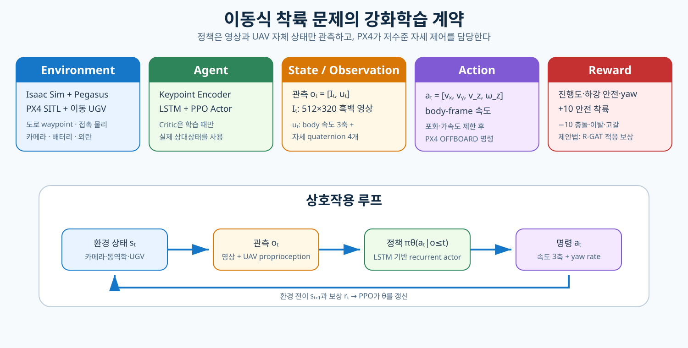
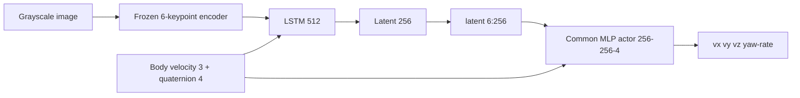
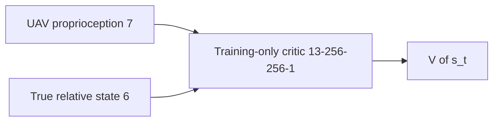

# 아키텍처와 정보경계

[문서 안내](README.md) · [시스템 개요](SYSTEM_OVERVIEW.md) ·
[제안 알고리즘](ONTOLOGY_RGAT_FOV_RISK.md) · [운영](OPERATIONS.md)

## 1. 구성

```text
run.sh
└── python/run_two_pipeline.py        (primary_only=True)
    ├── Isaac/Pegasus: isaac_sim/landing_world.py
    ├── 패드 기하 단일 정의: isaac_sim/keypoint_geometry.py
    ├── PX4 SITL: external/PX4-Autopilot
    ├── ROS 2 gateway: ros2_ws/.../ros2_gateway.py
    ├── Live environment: python/ontology_rgat/benchmarks/live_env.py
    ├── Perception: python/ontology_rgat/perception/
    ├── Recurrent PPO: python/ontology_rgat/ppo/
    ├── Ontology/R-GAT: python/ontology_rgat/rgat/
    ├── Reward: python/ontology_rgat/reward_modes/
    └── Evaluation/report/dashboard: python/ontology_rgat/{evaluation,viz}/
```



## 2. Simulator와 vehicle

Isaac Sim은 Meta-Sejong S5 environment, RANGER MINI visual, 이동 deck, landmark,
multicopter rigid body, camera, contact와 battery/외란 simulation을 소유한다.
Pegasus는 multicopter dynamics와 PX4 backend를 연결한다. PX4 SITL은 estimator와
position, attitude, body-rate controller를 실행한다.

RL actor는 모터/추력을 직접 명령하지 않는다.

$$
a_t=[v_x^b,\,v_y^b,\,v_z^b,\,\omega_z]
\;\xrightarrow{\text{rate/acceleration limit}}\;
\text{PX4 OFFBOARD setpoint}
$$

| 제한 | 값 |
|---|---|
| 최대 속도 | `[2.0, 2.0, 1.0]` m/s |
| 최대 가속도 | `[1.5, 1.5, 1.0]` m/s² |
| 최대 yaw rate / 가속도 | 60°/s · 90°/s² |
| Control period | 0.1 s (**공칭**, 강제되지 않음 — 아래 참조) |
| Episode horizon | 300 step |
| Camera | 512×320 grayscale, 수평 FOV 90°, 60° 하향, 30 Hz |
| 물리 / 렌더 | 250 Hz / 30 Hz (headless), 20 Hz (GUI) |

렌더 주기는 카메라 주기와 같다. `sensor_profiles`가 카메라를
`min(rate_hz, render rate)`로 묶으므로 그보다 자주 렌더해도 읽는 곳이 없다.

## 3. 한 stage의 2쌍 병렬 실행

```text
Isaac Sim physics/render stage
├─ pair 0: UAV 0 + UGV 0 + PX4 0 + gateway 0 → method A
└─ pair 1: UAV 1 + UGV 1 + PX4 1 + gateway 1 → method B
```

두 쌍은 하나의 물리 clock에서 진행하지만 prim, camera, contact sensor, landmark,
ROS topic, UDP endpoint, episode state를 공유하지 않는다. 동일 route를 서로 다른
진행률에서 시작하므로 UGV들이 같은 도로를 같은 방향으로 따라간다. 쌍별 충분한
경로 간격이 다른 패드의 오검출과 기체 간 접촉을 막는다.

학습 방법과 pair의 대응은 `training_replicate`마다 cyclic Latin square로 바꾸어
경로 위상 편향을 분리한다. 최종 평가에서는 각 방법이 모든 pair를 순환한다.
각 worker는 독립적인 model, rollout buffer, optimizer를 소유하고 GPU update만
lock으로 직렬화한다. 제안 방법의 R-GAT은 PPO 전에 학습·검증 후 동결하므로 병렬
구간에서 갱신되는 것은 각 방법의 PPO actor/critic/optimizer뿐이다.


## 4. UGV와 landing deck

UGV는 YAML에 저장된 폐곡선 road-center waypoint를 따라 주행한다. Ramp와 speed
bound를 적용해 episode 시작과 corner에서 불연속적인 속도 점프를 방지한다. Landing
deck은 UGV body에 고정하며 contact sensor와 landmark cluster를 함께 이동시킨다.

착륙 표적은 패드 중심 정육각형의 6개 꼭짓점(반지름 0.52 m, 첫 꼭짓점 30°)에
놓인 landmark다. 첫 꼭짓점을 30°에 두어 어떤 landmark도 패드 자체의 +X/+Y 축 위에
놓이지 않게 하고, 90° deck 대칭에서도 layout이 모호해지지 않게 한다. 원거리 검출용
큰 표식과 touchdown 근접용 작은 표식을 함께 배치해 가까이 접근해 큰 표식이 FOV를
벗어나도 작은 표식이 남게 한다.

## 5. 좌표계

| 데이터 | Frame/부호 |
|---|---|
| Simulator world | ENU |
| PX4 local | NED; gateway가 ENU와 변환 |
| Actor velocity | UAV body/heading frame |
| Relative state | platform − UAV, UAV body frame |
| Image keypoint | 정규화 image plane `[-1,1]^2` |
| Action `v_z` | controller가 정의한 body/heading vertical convention |
| Camera optical | OpenCV/ROS: +X 우, +Y 하, +Z 시선 |

Frame 변환은 gateway와 benchmark adapter에서 한 번만 수행한다. Reward, critic,
touchdown metric은 동일한 relative-state convention을 사용한다.

## 6. Actor observation 경계



Actor observation은 image와 7-D UAV proprioception뿐이다. Platform world pose,
relative truth, contact force, reward label, critic value는 actor에 들어가지 않는다.

## 7. Asymmetric critic 경계



Critic truth는 PPO value target과 보조 상태추정 지도학습에만 사용한다. 배포 policy
wrapper에는 critic truth를 전달하는 API가 없다.

## 8. Ontology 경계

제안 graph builder는 다음만 받는다.

```text
keypoint 위치 + heatmap + keypoint 가시성
+ 그 이력에서 파생된 측정 유효성과 경과시간
```

Keypoint 채널 k는 패드 좌표계 landmark k가 아니라 image plane 정규 순서의 k번째
꼭짓점이다(`docs/TWO_PIPELINE_COMPARISON.md` §5.1). 육각형의 60° 대칭 때문에 landmark
identity는 고도 2 m 위에서 관측 불가능하고, graph 입력(centroid, apparent scale,
가시성)은 어차피 identity에 의존하지 않는다.

`build_fov_graph`의 유일한 인자는 `FOVSemanticObservation`이며 그 10개 필드는 모두
`[0,1]`로 검증된다. Payload validator는 `truth`, `relative_position`,
`relative_velocity`, `platform_pose`, `critic`, `privileged` 등 metric/privileged
field를 중첩 mapping 안에서도 이름 기반으로 거부한다. 기하 패드 중심 가시성
(`in_fov`, `pad_center`, `geometric_fov` 계열)도 학습 label이므로 함께 거부된다.

## 9. Pipeline 차이

- `shin_se_fixed`: 6-D 보조 추정기 + active-perception reward + 고정 5성분 shaping
- `shin_se_onto_rgat_recovery`: 위와 동일 + `-λ_fov q_θ(G_t)`

그 외 actor, critic, controller, simulator는 동일한 class를 재사용한다. Legacy
estimator-free/adaptive-weight/PBRS 구성은 `ALL_PIPELINES`에만 남아 있고 주 실행
경로에 나타나지 않는다.

## 10. Timing과 episode commit

> **⚠ 제어 주기는 보장값이 아니다.** 학습기는 Isaac과 lockstep이 아니므로
> (`isaac.lockstep`은 Isaac↔PX4 전용), 한 제어 스텝 안에서 실제로 흐르는 시뮬
> 시간은 0.104 s(정상)에서 0.7–0.95 s(열화) 사이를 오간다 — 실효 제어율 9.6 Hz
> ↔ 1.2 Hz. 이 표의 0.1 s는 학습기가 *믿는* 값이고, `steps × dt`로 계산되는 모든
> 시간 지표는 열화 상태에서 7–9배 과소 기록된다. 기전과 완화책은
> [3-arm 비교](THREE_ARM_BURST_COMPARISON.md) §5.

한 transition은 다음 순서를 따른다.

1. 마지막 동기화 state와 image로 actor forward
2. action 포화·가속도 제한
3. gateway에 velocity/yaw-rate command 전송
4. simulator/PX4 시간이 한 control period 진행될 때까지 대기
5. 새 odometry, image, contact, battery 수신
6. reward와 terminal 판정
7. transition을 현재 trajectory에 추가

Episode metric과 checkpoint를 성공적으로 기록한 뒤에 dashboard의 committed episode를
증가시킨다. 부분 trajectory는 PPO에 들어가지 않는다.

Episode 종료 후 그 episode의 graph timeline에 종료 후속 상태를 덧붙여 미래 FOV
라벨을 만든다. 마지막 `H` step은 관측된 미래가 없으므로 `None`으로 남고 `0.0`이
되지 않는다.

## 11. Reset

Reset은 공중 teleport를 사용하지 않는다.

1. UGV를 entry waypoint에서 park
2. PX4 estimator 유효성 확인
3. PX4 position control로 UAV를 entry hover에 배치
4. 위치·속도·기하 가시성 gate 확인
5. pad motion 시작
6. policy control handover

이 순서가 PX4 EKF와 Isaac rigid-body state의 불일치를 방지한다. Entry gate는 설정
전용이며 policy·보상·로그는 이 gate를 보지 않는다.

Gate의 예산은 **시뮬레이션 시간**(`external.entry_sim_budget`, 기본 60 s)이다.
정착 조건(`entry_settle` 1.0 s)도 같은 시계이므로, 렌더 부하가 늘어 stage가
느려져도 gate가 요구하는 기동의 크기는 변하지 않는다. 벽시계
(`external.entry_timeout`)는 시각을 더 이상 발행하지 않는 시뮬레이터를 막는
멈춤 방지 상한으로만 남는다. 실패 메시지는 어느 시계가 소진되었는지 밝힌다 —
"simulated"는 수렴하지 못한 기체, "wall"은 멈춘 stage다.

## 12. Contact와 terminal

Isaac contact sensor가 deck 접촉을 authoritative event로 전달한다. 접촉 위치는 해당
state에서 계산하고, 속도·tilt·각속도는 직전 비접촉 state를 사용해 post-impact
bounce를 배제한다.

Terminal class: 엄격 안전착륙 / 불안전 패드 접촉 / off-pad 지면 접촉·충돌 /
과도 상대 이탈 / 배터리 고갈 / horizon timeout.

## 13. Artifact 경계

| Artifact | 변경 가능 시점 | PPO 중 상태 |
|---|---|---|
| Keypoint encoder | pretraining/calibration | 동결 |
| R-GAT 보상 모델 | reward-design stage | 동결 (checksum 검증) |
| Actor/LSTM/critic | PPO stage | 학습 |
| Latest checkpoint | episode commit | 재개용 갱신 |
| Best checkpoint | 안전성 score 개선 | pre-update policy snapshot |
| Selected checkpoint | held-out 결정론 검증 후 | 최종 평가·배포용 동결 |

Artifact는 config/dataset/encoder hash와 architecture version을 저장하며 불일치하면
재사용하지 않는다.
