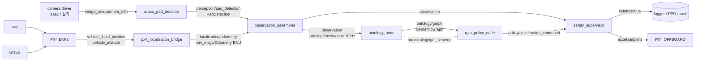

# 최소 관측 기반 Ontology → R-GAT ROS 2 파이프라인 설계

상태: r9 남은 결함 수정 + `./run.sh` 전체 시스템 (2026-10-08). §16 이 최신, 그다음 §15 … §11. 현재 계약 `minimal-landing-ontology/6`. 아래 §3–§5 의 수치 중
§11–§12 와 다른 것은 뒤 절이 우선한다. 현재 계약: 온톨로지 `minimal-landing-ontology/5`.
r3 구현 (2026-10-07). 순수 모듈 `python/ontology_rgat/minimal/`, 인터페이스
`ros2_ws/src/ontology_rgat_interfaces`, 노드 `ros2_ws/src/ontology_rgat_landing`,
가드 `tests/test_minimal_observation_pipeline.py`. 합성 입력으로 ROS 토픽 전 구간을
돌려 확인했고 (§10), **Isaac 비행·학습은 아직 하지 않았다.**
계약 ID: 관측 `minimal-landing-obs/2`, 온톨로지 `minimal-landing-ontology/2`.
`spatial-reference/12` 를 대체하지 않는 **별도 계약**이며 기존 체크포인트와 섞지 않는다.

r1 → r2 사용자 결정 (2026-10-07):

1. 기체 **위치와 속도 모두** IMU + GNSS 를 EKF 로 융합해 얻는다 (차분하지 않음).
2. 안전 감독기 입력은 **최소 관측에 맞춘다** (`LandingObservation` 과 그 이력만).
3. 마커를 놓쳤을 때, 이전 패드 관측을 근거로 온톨로지가 **착륙 종말 단계인지,
   그냥 사라진 것인지** 구분한다.

## 0. 목적

현재 기준선의 인지 절차(17-마커 코너 P_t, 추적기 std, 예측 bearing, FOV margin,
descent permission 등 44-필드 패킷)를 버리고 관측을 두 가지로만 제한한다.

1. **패드 인지** — 카메라 → ArUco → PnP → 패드 위치
2. **자기 측위** — IMU + GNSS → EKF → 기체 위치·속도

이 관측 벡터를 토픽으로 발행하고, 온톨로지 노드가 구독해 의미 노드/간선/관계를
구성해 그래프 토픽으로 발행하며, R-GAT 노드가 그 그래프를 구독해 그래프 신경망
입력을 만든다.

## 1. 노드·토픽 그래프

네임스페이스 `<ns>` = `/landing_uav0` (기존 Isaac 토픽과 동일).



| 노드 | 구독 | 발행 / 서비스 | 역할 |
|---|---|---|---|
| `aruco_pad_detector` | `<ns>/perception/landing_camera/image_raw`, `.../camera_info` | `<ns>/perception/pad_detection` (`PadDetection`) | ArUco 보드 검출 + PnP. `header.stamp` = 촬영 시각, 출력은 **body FLU 의 보드 원점** (장착 오프셋 보정 완료). 기존 `isaac_sim/marker_vision.py: MarkerPoseEstimator` 재사용 |
| `px4_localization_bridge` | `/fmu/out/vehicle_local_position`, `/fmu/out/vehicle_attitude` | `<ns>/localization/odometry` (`nav_msgs/Odometry`, ENU) | IMU+GNSS 융합은 PX4 EKF2. 위치·속도·자세를 NED→ENU 변환만 (`ontology_rgat_px4/frames.py`) |
| `observation_assembler` | `pad_detection`, `localization/odometry` | `<ns>/observation` (`LandingObservation`) | 10 Hz 타이머(policy_dt 0.1 s). 패드 위치를 촬영 시각의 자세로 ENU 회전, age 계산 |
| `ontology_node` | `<ns>/observation` | `<ns>/ontology/graph` (`SemanticGraph`), srv `<ns>/ontology/get_schema` (`GetGraphSchema`) | TBox 보유, 관측마다 ABox 인스턴스 생성, 패드 상실 분류 |
| `rgat_policy_node` | `<ns>/ontology/graph` | `<ns>/policy/acceleration_command` (`Vector3Stamped` ENU), `<ns>/policy/relational_health` | 스키마 조회 → `schema_hash` 검증 → R-GAT forward |
| `safety_supervisor_node` | `<ns>/observation`, `<ns>/policy/acceleration_command` | `<ns>/safety/acceleration_setpoint` (`Vector3Stamped`), `<ns>/safety/status` (`SafetyStatus`) | **최소 관측만으로** 정의된 감독 법칙 (§5). 명령은 **같은 결정 시각의 관측과 짝지어** 판정, 0.25 s 안에 명령이 없으면 0 요청으로 판정. PX4 로 직접 보내지 않는다 (기존 gateway 연결은 별도 작업) |

QoS: 영상은 `sensor_data`(best effort, depth 1). `pad_detection`, `observation`,
`ontology/graph`, `acceleration_command` 는 reliable, keep-last depth 1 — 결정
루프는 최신 하나만 의미가 있고 밀린 메시지를 재생하면 안 된다.

## 2. 관측 벡터 o_t (`LandingObservation`, 13 차원)

```
[own_x, own_y, own_z, own_vx, own_vy, own_vz,  rel_x, rel_y, rel_z,  own_valid, own_age_s,  pad_detected, pad_age_s]
 └──────── EKF 위치·속도 (ENU) ────────┘        └ 패드−기체 (ENU) ┘   └ 측위 유효성 ┘        └ 인지 유효성 ┘
```

- `own_*` 는 PX4 EKF2 의 위치·속도 상태다 (결정 1). 원시 GNSS fix 도, 위치 차분도 아니다.
- `rel` 은 검출기가 낸 body FLU 의 보드 원점(장착 오프셋 0.16 m 보정 완료)을
  *촬영 시각*의 EKF 자세로 ENU 축에 회전한 값이다. 자세는 좌표
  변환에만 쓰이고 벡터에는 들어가지 않는다.
- 검출이 끊기면 `rel` 은 **마지막 검출값을 유지**하고 `pad_detected=0`,
  `pad_age_s` 가 증가한다 (상한 5 s). 0 으로 채우면 "패드 바로 위"와 "패드 놓침"이
  구분되지 않는다. 한 번도 검출되지 않았으면 rel=0, age=상한.
- 단위는 물리 단위 그대로. 정규화는 온톨로지 노드의 책임.

## 3. 온톨로지 (`minimal-landing-ontology/2`)

### 3.1 원칙

- 관측에는 측정된 것만 있다. **판단(패드 속도, 가시성, 상실 원인, 하강 준비,
  금지)은 전부 온톨로지에서 만든다.**
- 기체 속도는 EKF 값을 그대로 쓴다. 차분이 필요한 것은 **패드 속도** 하나뿐이다:
  `v_rel = Δrel / Δt_capture` 를 **연속된 두 검출의 촬영 시각** 사이에서만 계산하고
  `v_pad = v_own + v_rel`. 패드 절대 위치(`p_own + rel`)는 GNSS 오차가 섞이므로
  차분하지 않는다.
- 온톨로지 노드의 메모리는 `PadMemory` 하나로 한정한다: 마지막 검출 시점의
  `rel`, `v_pad`, 기체 높이, bearing, 그리고 그 이후 EKF 속도의 적분.
- TBox 상수(관측이 아니라 도메인 지식): 카메라 화각 90° × 73.7°, 카메라 장착
  0.16 m, 접지 높이 0.12 m, 착지 한계 |v_xy| 0.35 / |v_z| 0.30 m/s, 패드 반폭 0.5 m.

### 3.2 노드 (12개, 4 클래스)

| id | 노드 | 클래스 | 무엇을 표현하나 |
|---|---|---|---|
| 0 | `UAV` | Entity | 기체 운동 (EKF v_own) |
| 1 | `LandingPad` | Entity | 패드 운동 (v_pad) |
| 2 | `CameraObservation` | Observation | 이번 프레임 검출 여부, 신선도, bearing |
| 3 | `Localization` | Observation | EKF 해의 유효성, 신선도 |
| 4 | `PadMemory` | Observation | 마지막 검출 상태 + 그 이후 추측항법 상대 위치 `rel_pred` |
| 5 | `RelativePosition` | Situation | 수평 오프셋, 패드 위 높이 (검출 중엔 `rel`, 상실 중엔 `rel_pred`) |
| 6 | `RelativeVelocity` | Situation | 접근/이탈 속도 |
| 7 | `Visibility` | Situation | 현재·예측 FOV 여유 |
| 8 | `TerminalOcclusion` | Situation | 패드 **위에 있어서** 안 보인다는 가설 (§4) |
| 9 | `TargetLost` | Situation | 패드가 **사라졌다**는 가설 (§4) |
| 10 | `DescentReadiness` | Decision | 하강을 허용할 근거 |
| 11 | `LandingInhibit` | Decision | 하강을 막을 근거 |

절대 위치 `own_x, own_y` 는 어떤 노드 특징에도 들어가지 않는다 (착륙은 평행이동
불변). `PadMemory` 의 추측항법과 패드 절대 위치 표시에만 쓰인다.

### 3.3 관계 (6종)

| relation | 의미 | 간선 |
|---|---|---|
| `observes` | 센서가 개체에 대한 증거를 준다 | Camera→LandingPad, Localization→UAV |
| `relative_to` | 두 개체가 상황을 구성한다 | UAV→RelPos, LandingPad→RelPos, UAV→RelVel, LandingPad→RelVel |
| `informs` | 정보를 준다 | Camera→PadMemory, Localization→PadMemory, PadMemory→RelPos, RelPos→Visibility, RelVel→Visibility, Camera→Visibility, PadMemory→TerminalOcclusion, PadMemory→TargetLost, RelPos→TerminalOcclusion, RelVel→TerminalOcclusion, Visibility→TargetLost, RelPos→Readiness, RelVel→Readiness, Camera→Inhibit, Localization→Inhibit, TargetLost→Inhibit |
| `supports` | 하강을 지지한다 | Visibility→Readiness, TerminalOcclusion→Readiness |
| `inhibits` | 하강을 막는다 | Inhibit→Readiness, TargetLost→Readiness, TerminalOcclusion→TargetLost |
| `self` | 자기 루프 | 12개 전부 |

간선 집합은 **정적**(TBox)이고, 조건부 관계는 `edge_weight ∈ [0,1]` 로 표현한다.

- `Camera –observes→ LandingPad`, `LandingPad –relative_to→ *` : 검출 신선도 `exp(-pad_age / 0.5 s)`
- `PadMemory –informs→ RelPos` : `1 − 검출 신선도` (보일 땐 측정, 안 보일 땐 기억이 위치를 공급)
- `TerminalOcclusion –supports→ Readiness`, `–inhibits→ TargetLost` : 종말 점수 `T`
- `TargetLost –inhibits→ Readiness`, `–informs→ Inhibit` : 상실 점수 `L`

패드를 놓치면 관계가 사라지는 대신 약해진다 — 텐서 모양이 변하지 않아 배치 학습이 가능하다.

### 3.4 노드 특징 (F = 8, 균일 채널)

`[c0, c1, c2, magnitude, validity, freshness, urgency, typeId]`, 모두 [-1, 1] 클리핑.
`f_pad = exp(-pad_age/0.5)`, `f_own = exp(-own_age/0.2)`, `h` = 패드 위 기체 높이(`-rel_z`).

| 노드 | c0, c1, c2 | magnitude | validity | freshness | urgency |
|---|---|---|---|---|---|
| UAV | v_own / 3 | ‖v_own‖/3 | own_valid | f_own | max(0, −v_z)/0.3 (착지 한계 대비 하강) |
| LandingPad | v_pad / 3 | ‖v_pad‖/3 | v_rel 유효 | f_pad | 0 |
| CameraObservation | bearing_x, bearing_y (÷반화각), 0 | ‖bearing‖ | pad_detected | f_pad | 0 |
| Localization | 0, 0, 0 | 0 | own_valid | f_own | 1−own_valid |
| PadMemory | rel_pred_x/3, rel_pred_y/3, h_last/8 | 마지막 FOV 여유 | 한 번 이상 검출 | f_pad | min(age/3, 1) |
| RelativePosition | x/3, y/3, h/8 | d_xy/3 | 한 번 이상 검출 | f_pad | d_xy / footprint(h) |
| RelativeVelocity | v_rel / 3 | ‖v_rel,xy‖/3 | v_rel 유효 | f_pad | ‖v_rel,xy‖/0.35 |
| Visibility | margin_x, margin_y, 예측 margin | min margin | pad_detected | f_pad | max(0, −예측 margin) |
| TerminalOcclusion | 근접, 중심 이탈 아님, 저속 | T | own_valid | 1 − age/3 | 1 − T |
| TargetLost | 가장자리 이탈, 고고도 상실, 표류 | L | 1 | 1 | L |
| DescentReadiness | 정렬, 수평 저속, 하강 저속 | 곱 | 위 셋 모두 유효 | min(f_pad, f_own) | 1−곱 |
| LandingInhibit | stale, 측위 무효, L | max | 1 | 1 | max |

정확한 스케일·시간상수는 구현 단계에서 학습 시 채널 분산을 측정한 뒤 확정한다
(`/5` 교훈: 학습 중 상수인 채널은 학습되지 않은 방향이다).

### 3.5 스키마 해시

`sha256({schema_id, observation_schema_id, nodes, classes, relations, edges,
feature_channels, 정규화 상수, 상실 분류 임계값})`. `rgat_policy_node` 는 시작 시
`get_schema` 로 받은 해시, 체크포인트에 저장된 해시, 매 메시지의 해시를 모두
대조하고 불일치면 명령을 내지 않는다.

## 4. 패드 상실 분류: 종말 단계 vs 사라짐 (결정 3)

### 4.1 근거가 되는 기하

카메라는 body 아래 0.16 m, 다리 없는 접지 높이는 0.12 m 이므로 접지 순간 카메라는
패드 평면보다 0.04 m **아래**다. 카메라 높이 `h_c = h − 0.16` 에서 화면이 덮는 패드
반폭은 x 방향 `h_c·tan45° = h_c`, y 방향 `0.75·h_c`. body 0.25 m 에서 ±0.09 / ±0.07 m
밖에 안 되어 가장 작은 태그(0.05 m)도 온전히 들어가지 못한다. Isaac 기록에서 트랙은
body 0.20–0.25 m 에서 끊겼다 (`/8`–`/10`). 즉 **패드 바로 위에서 마커를 놓치는 것은
정상 착륙의 필연적 결과**이고, 높은 곳에서 또는 화면 가장자리로 놓치는 것은 이상이다.

### 4.2 추측항법

마지막 검출 시각 `t₀` 이후:

```
rel_pred(t) = rel(t₀) + ∫_{t₀}^{t} (v_pad(t₀) − v_own(τ)) dτ
```

`v_own` 은 EKF 속도 (결정 1 덕분에 짧은 구간 적분이 매끄럽다), `v_pad(t₀)` 는 마지막
두 검출에서 얻은 패드 속도를 상수로 유지. 3 s 이내에서만 신뢰한다.

### 4.3 분류 (4 클래스, `SafetyStatus.pad_loss_class` 와 동일)

| 클래스 | 조건 |
|---|---|
| `VISIBLE` | `pad_detected` |
| `TRANSIENT_DROPOUT` | 미검출, `age ≤ 0.3 s` (프레임 누락, 고도 무관) |
| `TERMINAL_OCCLUSION` | 미검출, `age > 0.3 s`, 아래 (a)–(f) 모두 만족 |
| `LOST` | 그 외 미검출 |

종말 조건 (마지막 검출 시점 기준 + 현재 추측항법):

- (a) **근접**: 마지막 검출 때 body 높이 `h₀ ≤ 0.35 m` (끊김 관측 0.20–0.25 m + 여유)
- (b) ~~안쪽에서 사라짐~~ — r3 에서 **삭제**. 패드 근처에서는 화면이 ±0.09 m 뿐이라
  2–3 cm 오프셋도 bearing 이 반화각의 70 % 를 넘는다. 즉 근접 상실은 언제나 "가장자리"
  처럼 보이므로 종말 조건이 될 수 없다. 가장자리 이탈은 (a) 를 넘는 높이에서의 상실
  원인 진단(`EDGE_EXIT`)으로만 남긴다.
- (c) **정렬**: 마지막 수평 오프셋 `d_xy(t₀) ≤ 0.2 m` (`/10` gate floor)
- (d) **진행 중 하강**: 마지막 `v_own,z ≤ 0`, `‖v_rel,xy‖ ≤ 0.35 m/s`
- (e) **여전히 위에 있음**: 지금 `‖rel_pred,xy‖ ≤ 0.2 m`
- (f) **시간 창**: `age ≤ 3.0 s` (`/10` commit window) 그리고 `own_valid`

`LOST` 의 원인은 비트마스크 `pad_lost_reason` 으로 기록한다:
`1 EDGE_EXIT` (고고도 상실이면서 마지막/예측 bearing 이 FOV 밖), `2 HIGH_ALTITUDE` (a 위반),
`4 DRIFT` (c/e 위반), `8 TIMEOUT` (f 시간 초과), `16 LOC_INVALID`, `32 FAST_APPROACH` (d 위반).

**래치**: 한 번 `TERMINAL_OCCLUSION` 이 되면 (e)·(f) 가 깨지거나 접지할 때까지
유지한다. 매 스텝 재판정으로 종말↔상실이 깜빡이면 감독기 모드가 흔들린다.
재검출되면 즉시 `VISIBLE`.

온톨로지에는 이산 클래스가 아니라 **연속 점수**로 들어간다 — `T` 는 (a)–(f) 각
조건의 소프트 버전(시그모이드)의 곱, `L = (1 − T)·(1 − f_pad)`. 이산 클래스는 같은
함수의 임계 처리로 감독기와 로그가 쓴다.

### 4.4 한 함수, 두 소비자

`classify_pad_loss(memory, obs) -> (T, L, class, reason)` 는 순수 함수 하나로 두고
온톨로지와 감독기가 **같은 것을** 호출한다. 감독기는 R-GAT 출력도 그래프도 읽지
않는다 — 세 arm 모두에게 같은 감독기여야 하기 때문이다. 그래프 arm 은 이 판단을
명시적 노드로 받고, 벡터 arm 은 원시 관측에서 스스로 배워야 한다. 이것이 이
설계가 검증하려는 "온톨로지의 이득"이며, 정당한 표현 차이다.

## 5. 안전 감독기 (최소 관측 전용, 결정 2)

입력: `LandingObservation` 과 그 짧은 이력(위 `PadMemory` 와 동일한 상태).
기존 감독기의 추적기 std, detection confidence, track_initialized 는 **쓰지 않는다**.

| 법칙 | 입력 | 동작 | 기존 대응 |
|---|---|---|---|
| S1 포화 | 명령 | `|a_xy| ≤ 2.5`, `|a_z| ≤ 2.0`, 유도 자세 ≤ 20° | 동일 |
| S2 핸드오버 | 경과 시간 | 첫 2 s: 수평 2.0 m/s² 캡, 1.5 m/s² 슬루, `a_z ≥ 0` (종말 구간 제외) | `/11`, `/12` |
| S3 하강 게이트 | `pad_age`, `rel`, `own_valid` | `VISIBLE`/`TRANSIENT` 이고 `d_xy ≤ max(0.2, footprint(h))` 일 때만 하강 허용, 아니면 수직 속도 **대칭 유지** | `/2` 대칭 유지, `/10` gate floor |
| S4 하강 속도 제동 | `h`, `own_vz` | `−v_z ≤ max(0.8·0.30, √(0.30² + 2·0.7·(h−0.12)))` 초과분을 한 스텝에 제거 | `/9` |
| S5 종말 커밋 | 분류 = `TERMINAL_OCCLUSION` | 최대 3 s 동안 수직은 0.24 m/s 하강으로 덮어쓰고, 수평은 정책 명령을 0.5 m/s² 로 캡 | `/10` commit window |
| S6 중단 | 분류 = `LOST` 이고 `age > 3 s`, 한 번도 못 봤는데 핸드오버 후 3 s, 또는 `own_valid` 상실 1 s 이상 | own-EKF 위치 유지 + 0.3 m/s 상승, 모든 축 override. 패드가 다시 `VISIBLE` 이면 해제 (bounded recovery, 종료 아님) | 기존 abort hold |

`SafetyStatus` 를 매 스텝 발행한다: 모드, 상실 클래스·원인, 요청/적용 가속,
**축별** `intervened[3]` — PPO 마스크는 이진이 아니라 축별이어야 한다 (AGENTS.md).

## 6. R-GAT 노드

1. 시작: `get_schema` 호출 → `edge_index`, `edge_type` 텐서를 한 번 만든다. 체크포인트 해시와 대조.
2. 매 그래프: `node_features (12×8)`, `edge_weight` 만 갱신해 forward. 기존
   `rgat/layers.py: RelationalGraphAttention` 에 간선 가중치 반영 추가
   (attention logit 에 `log w` 더하기).
3. 출력: 그룹 readout → actor → `policy/acceleration_command` (ENU). readout 그룹:
   {관측: 2,3,4,7}, {개체: 0,1}, {상황: 5,6,8,9}, {판단: 10,11}.
4. `relational_health` 를 같이 발행해 관계 경로가 실제로 활성인지 항상 보이게 한다.

## 7. 구현 원칙: 학습과 배포가 같은 함수

ROS 노드는 얇은 래퍼로만 둔다. 로직은 rclpy 를 import 하지 않는 순수 Python 모듈:

```
python/ontology_rgat/minimal/
  observation.py   # assemble(pad_detection, odometry_buffer, t) -> 관측 13
  pad_loss.py      # PadMemory 갱신, rel_pred, classify_pad_loss  (온톨로지·감독기 공용)
  ontology.py      # TBox + build_graph(obs, memory) -> (features, edge_weight)
  supervisor.py    # S1–S6
  graph_policy.py  # R-GAT forward
ros2_ws/src/ontology_rgat_landing/   # 각 노드 = 위 함수를 콜백에서 호출
```

로컬 PPO 학습은 같은 함수를 직접 호출하고 Isaac 배포는 ROS 노드를 통해 호출한다.

## 8. 남은 위험

1. **벡터 arm 의 메모리.** 그래프 arm 은 `PadMemory` 로 과거 검출을 본다. 벡터 arm
   에는 같은 K=3 관측 스택을 주어 "기억 유무"가 아니라 "표현"을 비교하게 한다.
2. **임계값은 측정 전 값.** (a) 0.35 m, (b) 30 %, 0.3 s 등은 `/8`–`/10` 기록에서
   온 출발점이다. 로컬 plant 에서 teacher 비행의 실제 상실 높이 분포와, 분류기의
   혼동행렬(종말인데 LOST / 상실인데 TERMINAL)을 먼저 측정하고 확정한다.
   특히 **상실인데 TERMINAL 로 판정**하는 오류는 감독기가 보이지 않는 패드로 하강을
   커밋하게 하므로 비용이 비대칭이다.
3. **기존 결과와 비교 불가.** 새 계약이므로 로컬 plant 에서 teacher ceiling 부터 다시 측정한다.

## 9. 다음 단계

1. ~~순수 모듈 + 단위 테스트~~ (r3 완료).
2. 로컬 backend 어댑터 → teacher ceiling + 상실 분류 혼동행렬 측정.
3. ~~ROS 노드 6개 + launch~~ (r3 완료). Isaac 에서 토픽 흐름 확인
   (`perception/landing_camera/camera_info` 발행 여부 먼저 확인), 그 뒤 기존 gateway 가
   `safety/acceleration_setpoint` 를 OFFBOARD 로 보내도록 연결.
4. 벡터·flat 기준선 arm (같은 관측, 벡터 arm 은 K=3 스택).
5. BC → low-σ + `--enforce-target-kl` PPO 로 세 arm 학습.

## 10. 구현 메모 (r3)

- 빌드: `cd ros2_ws && colcon build --packages-select ontology_rgat_interfaces ontology_rgat_landing`.
  install 이 저장소 밖이면 `ONTOLOGY_RGAT_ROOT=<repo>` 를 설정 (노드가 `python/` 과
  `isaac_sim/` 을 import 한다).
- 실행: `ros2 launch ontology_rgat_landing minimal_pipeline.launch.py use_sim_time:=true checkpoint:=<pt>`.
  `with_detector:=false`, `with_px4_bridge:=false` 로 원천을 바꿔 끼울 수 있다.
  체크포인트가 없으면 **학습되지 않은** 정책으로 돌고 경고를 낸다 (배관 확인용).
- R-GAT 층: `rgat/layers.py: RelationalGraphAttention.forward` 에 `edge_weights`
  인자를 추가 (softmax 후 메시지에 곱함, relation gate 와 같은 위치). 기본값 `None`
  이면 기존과 동일하며 `tests/test_rgat_equivalence.py` 가 통과한다.
- 정책: 2층 R-GAT (hidden 32, head 2, 두 번째 층 residual) → 4-그룹 평균 readout →
  tanh actor (×가속 한계) + critic. `relational_activity` = 비-self 관계를 끈 출력과의
  상대 차이; 비행 중 `policy/relational_health` 로 발행.
- 스키마 해시 `c62196c4…` 는 테스트에 고정. 상수·간선·채널을 바꾸면
  `ONTOLOGY_SCHEMA_ID` 를 올리고 다시 고정한다.
- 합성 ROS 스모크 (Isaac 없음, 고정 패드, 0.3 m/s 하강, body 0.25 m 아래 미검출):
  0.1 s VISIBLE/NOMINAL → 5.9 s TRANSIENT → 6.1 s TERMINAL/TERMINAL_COMMIT →
  8.8 s LOST(TIMEOUT)/ABORT_HOLD. 순수 Python 경로와 같은 전이 시각이다.
  스모크의 기체는 0.12 m 에서 멈춰 있을 뿐 접지 판정이 없으므로 마지막 ABORT 는
  시나리오의 산물이다 (실제 에피소드는 접지에서 끝난다).


## 11. r4 — 로컬 측정과 Isaac 비행 (2026-10-07)

계약: 관측 `minimal-landing-obs/2`, 온톨로지 **`minimal-landing-ontology/4`** (13 노드,
`TrackingBias` 추가). 결과: `results/minimal_contract_20261007/`.

### 11.1 측정으로 고친 것 (모두 회귀 테스트 있음)

| 결함 | 측정 | 수정 |
|---|---|---|
| 수직 유지가 P 제어뿐 | seed 4107: 0.42 m/s² 하향 외력에서 "유지"가 −0.21 m/s 하강으로 수렴, LOST 상태로 접지. 0.24 m/s 커밋은 0.45 m/s 로 들어갈 상황 | 감독기에 **인과적 외란 관측기** (자기 EKF 속도 + 자기 과거 명령, 1 스텝 작동 지연 반영). 유지·커밋·중단 법칙 모두 보상 |
| S4 하강 한계가 지연 무시 | `/9` 식이 0.37 m 에서 0.66 m/s 허용 → 0.32–0.56 m/s 접지 (seed 4110, 4115) | `v ≤ −aL + √(a²L² + v_td² + 2ah)`, a 0.8, L 0.3 s, v_td 0.24 |
| LOST → TERMINAL 역전이 | seed 4110: 패드 속도 미상 상태에서 추측항법이 "패드가 기체와 같이 움직인다"고 가정, LOST 1.7 s 후 TERMINAL (패드 1.0 m 밖) | **LOST 는 재검출까지 흡수 상태**, 패드 속도 미상이면 TERMINAL 불가 (`NO_PAD_VELOCITY`) |
| 패드 속도 추정 지연 | seed 4106: 두 점 차분의 EMA(0.3) 가 0.6 m/s 상대속도를 놓침 | 최근 0.5 s 검출의 **최소제곱 기울기** |
| S3 게이트가 위치만 봄 | seed 3017: 0.29 m 에서 한 번 재검출(0.08 m) 로 하강 허가, 패드는 0.92 m/s 로 이탈 → 0.55 m 밖 접지 | 0.5 s 앞 예측 위치도 게이트 안, 0.35 m 아래는 상대속도 ≤ 0.35 m/s 필수 |
| **정보 결손** | 적분 제거 teacher 0/24 (23 TIMEOUT, 0.5–0.9 m 옆에서 정체); 적분 teacher 의 BC 클론 3 arm 모두 0–4 % | 온톨로지 노드 **`TrackingBias`** (∫rel_xy dt, ∫(v_ref − v_z) dt; `bias.py`). teacher 의 적분 상태 = 그래프의 노드. 벡터 arm 에도 같은 3 값 제공 |

### 11.2 Teacher (해결 가능성)

이득 sweep 3 회 (r1 128 셀, r2/r3 243 셀, 셀당 24 seed). r3 (최종 감독기·분류기):
**123/243 셀이 ≥ 23/24, 중앙값 95.8 %**. 선택 셀 kp 0.4 / kd 0.8 (모든 이득이 격자
내부): 검증 24/24, **held-out 48 seed 46/48 (95.8 %), unsafe 1, abort 1**.
최고 셀은 격자 하단 경계였으나 그 자체가 24/24 이고 넓은 평탄부 안의 내부 셀을 택했다.

### 11.3 패드 상실 분류 혼동행렬 (sweep 전 셀 누적, 결정 단위)

| | 예측 TERMINAL | 예측 LOST |
|---|---|---|
| 진짜 종말 (h ≤ 0.35, 오프셋 ≤ 0.2) | 28 927 | 4 237 |
| 패드 위 (≤ 0.5 m) 이지만 종말 아님 | 586 | 14 014 |
| **패드 밖** | **2** | 216 413 |

비싼 오류 (TERMINAL 인데 패드 밖) 는 r3 격자에서 2/29 515. 같은 공격적 격자 (r1) 로
수정 전후 비교: 위험 결정 376 → 27, MISSED_PAD_CONTACT 104 → 16, unsafe 에피소드
340 → 181 / 3072 (수정 전은 seed 4100+, 수정 후 3000+ 이므로 완전한 짝 비교는 아님).
남은 27 은 kp 1.2–1.6 처럼 진동하는 이득 셀에 집중된다.

### 11.4 행동 복제 (3 arm, held-out 48 seed, 결정론적 / 샘플링 σ=exp(−1.1))

| arm | 착륙 (seed 828 / 829) | unsafe | 샘플링 착륙 | relational activity |
|---|---|---|---|---|
| `ppo_ontology_rgat` | 95.8 / 89.6 % | 0 / 2.1 % | 37.5 / 54.2 % | 0.60 / 0.71 |
| `ppo_semantic_flat` | 95.8 / 97.9 % | 2.1 / 0 % | 56.2 / 54.2 % | — |
| `ppo_vector_canonical` | 70.8 / 70.8 % | 0 / 0 % | 20.8 / 22.9 % | — |

`TrackingBias` 이전 (온톨로지 /3) 은 세 arm 모두 0–4 %. 두 seed 이므로 arm 간 우열
주장은 아니다. 샘플링 착륙이 결정론적보다 40–50 점 낮다 — PPO 전 σ 를 낮춰야 한다
(AGENTS.md 의 sampled-policy 교훈과 같은 현상).

### 11.5 Isaac/PX4 비행 (seed 12000–12001, 각 2 에피소드)

경로: `MinimalLandingEnv(backend=IsaacBackend)` — 자기 상태는 PX4 EKF2 (IMU+GNSS),
패드는 Isaac 의 촬영시각 ArUco PnP, 감독된 가속은 기존 gateway 를 통해 PX4 로
(진입·OFFBOARD·정리는 gateway 소유). `tools/minimal_isaac_flight.py`.

| controller | 결과 | 시간 | 최종 오프셋 |
|---|---|---|---|
| teacher | **2/2 SUCCESS** | 24.7, 15.2 s | 6, 7 cm |
| `ppo_ontology_rgat` 828 | **2/2 SUCCESS** | 15.1, 20.1 s | 2, 6 cm |
| `ppo_semantic_flat` 829 | **2/2 SUCCESS** | 22.7, 15.5 s | 17, 8 cm |
| `ppo_vector_canonical` 828 | **2/2 SUCCESS** | 27.8, 16.7 s | 11, 12 cm |

8/8 SUCCESS, unsafe 0, 정리 확인 8/8. 모든 착륙이 TERMINAL_OCCLUSION → TERMINAL_COMMIT
(2–12 결정) 를 거쳐 접지했다 — 종말 분류가 Isaac 에서도 의도대로 작동했다.
첫 실행은 flat arm 진입 hover 중 PX4 SITL 링크 failsafe (`gcs_connection_lost` 등,
정책 이전) 로 스택이 내려가 별도 스택으로 flat·vector 를 다시 비행했다 (인프라 실패,
RL 아님; 그 에피소드의 trace 는 0 바이트).

**ROS 체인 (병행, 명령은 PX4 로 가지 않음)**: Isaac 영상 → `aruco_pad_detector` →
assembler → ontology → R-GAT → supervisor 가 실 스택에서 모두 흘렀다. 관측은 정확히
sim-초당 10.01 개, pad_detected 94.5 %, pad_age 중앙값 0.1 s, 체인도 TERMINAL 을
인식 (31 + 56 결정), relational health 0.58. **체인의 패드 상대위치 vs in-process
(Isaac 내장 검출기) : 속도로 짝지은 254 검출 관측에서 중앙값 4 mm, p90 4.7 cm.**

이것은 8 에피소드짜리 통합 통과다 — 강건성이나 arm 간 우열의 증거가 아니다.

### 11.6 Isaac 쪽 변경

- `isaac_sim/landing_world.py`: 공간 경로 (`spatial_optical_capture_timing`) 에서
  `image_raw` 를 **촬영 시각**으로 stamp (`_spatial_capture_stamp`). 그 외 경로 불변.
- Isaac 은 `/clock` 을 내지 않는다 → `sim_clock_bridge` 노드가
  `<ns>/simulation/clock` (JSON) 을 `/clock` 으로 변환, 체인은 `use_sim_time:=true`.
- 체인은 `rmw_fastrtps_cpp` 와 ASCII 워크스페이스의 px4_msgs 로 실행해야 스택이 보인다
  (`scripts/ros_env.sh` 와 동일 조건).

### 11.7 다음

1. PPO 미세조정: σ 를 낮추고 `--enforce-target-kl` 을 쓰는 레시피를 이 계약에 이식
   (현재 `PPOTrainer` 는 spatial env 에 묶여 있다).
2. 5 seed 이상, Isaac 에피소드 확대.
3. 체인의 감독기 출력을 실제 제어 경로로 쓰려면 gateway 에 `safety/acceleration_setpoint`
   입력을 추가해야 한다 (현재는 in-process 경로가 제어).


## 12. r5 — r4 에서 남은 결함 수정 (2026-10-07)

온톨로지 `/4 → /5` (상수 변경; `/4` 클론·비행은 `bc_ontology4/`, `isaac*/` 에 보존).

| # | 결함 (측정) | 수정 | 수정 후 |
|---|---|---|---|
| 1 | 종말 구간 하강 한계: 0.30 m 에서 0.39 m/s 허용 → 0.31 m/s 접지 (teacher held-out seed 4139) | 종말 진입 높이 아래는 0.24 m/s 상한 (`/9` corridor brake), 커밋 루프는 제동 τ 0.2 / 가속 τ 0.5 (대칭 강한 루프는 지연으로 0.33 m/s 오버슈트, seed 3034), 커밋 안에서도 S4 | 아래 |
| 2 | S3 대칭 유지가 시야 회복 상승까지 막음 (seed 4138, 1.7 m 에서 패드 이탈) | 예측 bearing 이 반화각 0.8 을 넘으면 ≤ 0.4 m/s 상승만 허용 (상한 있음, `/2` 래칫 방지 유지). teacher 는 같은 조건에서 상승 + 상대속도 초과분 보강 | 아래 |
| 3 | 로컬 광학은 body 0.31–0.36 m 에서 마지막 태그를 잃음 → 0.35 경계에서 중심 하강이 HIGH_ALTITUDE→LOST (seed 3033) | 종말 진입 높이 0.40 m | 아래 |
| 4 | 상대속도 기울기가 기체 가속을 0.4 m/s 까지 지연 → 진동 이득에서 TERMINAL|패드 밖, MISSED_PAD (seed 3017, 3000) | **패드 속도**를 추정: 자기 변위 (EKF 속도 적분) 좌표계에서 0.5 s 최소제곱, 상대속도 = 패드 속도 − 현재 자기 속도 | 아래 |
| 5 | 벡터 arm 입력의 자기 고도가 원점 의존 (같은 순간 gateway 1.25 m / PX4 local 0.07 m) | 벡터 arm 에서 자기 위치 3 축 모두 제거 (온톨로지와 동일) | 벡터 arm 71 → 56–60 %: 로컬 패드가 z=0 이라 own_z = 패드 위 높이였던 **로컬 전용 지름길**이 사라진 것 |
| 6 | 진입 hover 중 PX4 링크 failsafe (정책 이전) 가 run 전체를 종료 | spatial `IsaacBackend.reset` 에서 recoverable failsafe 를 `EntryResetError` 로 변환 → 기존 owned-restart 예산·같은 seed 재시도. hard failsafe 는 그대로 전파. `tests/test_spatial_entry_failsafe_recovery.py` | |
| 7 | 샘플링 정책 착륙 21–71 % (σ 0.333) | 기본 초기 σ 0.082 (log −2.5) | 그래프 arm σ ≤ 0.135 에서 96–100 % |
| 8 | ROS 체인이 제어 경로가 아님, 체인 노드가 에피소드 간 상태 누설 | `minimal/reset/<node>` (std_srvs/Trigger) 를 assembler·ontology·supervisor 에, `minimal_isaac_flight.py --control ros` 가 체인 감독기 출력 (같은 결정 시각) 을 gateway 로 비행. in-process 감독기는 관찰만 | §12.2 |
| 9 | BC 평가가 fork 후 torch 로 1 시간 정지 / recorder 가 numpy bool 직렬화 실패 | spawn 워커 / `bool()` + 기본 직렬화 | |

### 12.1 수정 후 로컬 수치 (`/5`)

- **Teacher: held-out 48/48, 검증 48/48, 추가 96/96 = 192/192 SUCCESS** (r4: 46/48).
- **스트레스 격자 (kp 0.4–1.6, kd 0.8–2.2, kz 1.0–2.0; 48 셀 × 24 seed): unsafe 0/1152,
  MISSED_PAD 0, TERMINAL|패드 밖 0, 중앙값 착륙 100 %.** 같은 격자에서 상대속도 추정기는
  unsafe 14, MISSED_PAD 3, 위험 결정 8 (`stress_aggressive_relvel_estimator.json`),
  r1 (분류기 수정 전, seed 4100+) 은 unsafe 340, MISSED_PAD 104, 위험 결정 376.
- **BC (160 teacher 에피소드, 26 280 결정), held-out 48, 결정론적:**
  `ppo_ontology_rgat` 100 / 100 %, `ppo_semantic_flat` 100 / 100 %,
  `ppo_vector_canonical` 56.2 / 60.4 % (unsafe 전부 0). 샘플링 σ 0.135/0.082/0.05/0.02:
  그래프 arm 96–100 %, 벡터 arm 35–62 %. relational activity 0.68 / 0.73.
  두 seed 이므로 우열 주장은 아니다. 벡터 arm 의 하락 이유는 위 표 5 번.

### 12.2 Isaac/PX4 비행 (`/5`)

**ROS 체인이 실제 제어 경로** (`--control ros`, R-GAT 클론 828, seed 12000–12002):
**3/3 SUCCESS** (21.6 / 21.0 / 15.9 s, 중심에서 1–9 cm), 정리 확인 3/3. 결정 202·196·148
개 중 체인 감독기 출력이 아닌 것은 에피소드마다 1 개, 모두 reset 직후 첫 스텝 (체인의
첫 결정 이전, 0 요청 = hover 유지). 체인 자체가 TERMINAL_OCCLUSION 을 인식하고
TERMINAL_COMMIT 을 수행했다.

**in-process (`/5`, seed 12000–12001)**: teacher 2/2, `ppo_ontology_rgat` 828 2/2,
`ppo_semantic_flat` 828 2/2, `ppo_vector_canonical` 829 2/2 — **8/8 SUCCESS**, unsafe 0,
정리 확인 8/8. 병행 체인은 관측 2 159, 그래프 2 159, 감독 2 159 개를 기록했다.

r4 (`/4`) 와 합쳐 Isaac 에서 이 계약은 19 에피소드 19 SUCCESS 다. 이는 통합 통과이지
강건성이나 arm 간 우열의 증거가 아니다 (seed 2–3 개, arm 당 2 에피소드).

### 12.3 남은 것

- PPO 미세조정 (σ 0.082 시작, `--enforce-target-kl`). 현재 `PPOTrainer` 는 spatial env 에 묶여 있어 이식 필요.
- 5 seed 이상, Isaac 에피소드 확대, 벡터 arm 의 로컬 56–60 % 원인 분석 (표현 한계인지).


## 13. r6 — 전체 학습·검증 파이프라인 (2026-10-07)

`tools/minimal_full_pipeline.py --run-root results/minimal_pipeline_20261007 --isaac`
(재개 가능, 단일 writer lock). 단계: teacher → BC → PPO → held-out → Isaac.
PPO 는 `python/ontology_rgat/minimal/ppo.py`: 12 완전 에피소드 배치, 고정 σ 0.082,
스텝 후 KL 재측정·되돌리기, 축별 개입 마스크, 처음 5 반복은 critic head 만.
3 arm × 3 seed (828/829/830) × 100 반복 × 12 에피소드 (= 1200 에피소드/run), run 당 23–30 분.

**Teacher held-out 48/48.** BC 160 demos (26 280 결정).

**held-out 48 seed, 결정론적 착륙 (괄호: 샘플링), unsafe 는 전부 0 %** (BC flat 829 2.1 %, 샘플링 일부 2.1 %):

| arm | BC 828 / 829 / 830 | PPO best 828 / 829 / 830 |
|---|---|---|
| `ppo_ontology_rgat` | 100 / 100 / 100 (100 / 100 / 97.9) | 93.8 / 100 / 95.8 (95.8 / 100 / 100) |
| `ppo_semantic_flat` | 100 / 97.9 / 100 (97.9 / 97.9 / 100) | 97.9 / 87.5 / 100 (100 / 85.4 / 95.8) |
| `ppo_vector_canonical` | 75.0 / 54.2 / 54.2 (58.3 / 58.3 / 47.9) | 75.0 / 52.1 / 89.6 (70.8 / 62.5 / 87.5) |

읽는 법:
- 그래프 두 arm 은 BC 에서 이미 천장 (≈100 %) 이라 PPO 가 올릴 여지가 없고, 3 seed 중 2 seed 에서
  1–6 점 내려갔다. R-GAT 은 학습 내내 안정 (마지막 10 반복 학습 성공 96.7–99.2 %, best 반복
  90–100). flat 은 학습 중 악화 (마지막 10 반복 57–73 %, best 반복 20–30) — 최선 검증 체크포인트
  선택이 이를 막았지만, 같은 레시피에서 flat 이 R-GAT 보다 불안정했다는 것 자체가 관측이다.
- 벡터 arm 은 PPO 가 실제로 개선했다: 샘플링 48–58 → 63–88 %, seed 830 결정론적 54 → 90 %.
- 검증 seed 12 개로 고른 체크포인트를 held-out 48 에서 재면 1–12 점 낮다 (선택 편향).
- 3 seed, arm 간 차이가 seed 간 분산과 비슷하거나 작다 — **우열 주장 아님.**

**Isaac/PX4 (held-out 최고 seed 의 PPO best: rgat 829, flat 830, vector 830; seed 12000–12001):**
in-process 6/6 SUCCESS (15.8–21.9 s), **ROS 체인이 제어 경로 (rgat 829) 2/2 SUCCESS**
(fallback 각 1, reset 직후 첫 스텝), 정리 확인 8/8. 이 계약의 Isaac 누계 27/27 SUCCESS.
Isaac 에피소드 수가 작으므로 통합 통과로만 읽는다.


## 14. r7 — 5 seed, 스트레스 평가, Isaac 확대 (2026-10-08)

같은 run root 에 seed 831/832 추가 (BC 는 같은 demos 로 새 seed 만 적합, PPO 6 run 추가),
평가 전용 **스트레스 시나리오** (`python/ontology_rgat/minimal/stress.py`, 학습·검증·선택에
쓰지 않음; 각 시나리오는 명목 reset 뒤 그 요인만 바꾼다, `tests/test_minimal_stress.py`):
`fast_pad` 패드 속도·가속 ×2, `strong_wind` 외력 ×2, `poor_vision` 프레임 추가 누락 15 % + 0.5 s
burst (프레임의 4 % 에서 시작), `combined` 셋 다.

**48 held-out seed, 결정론적 착륙 %, 5 seed 평균 ± sd (/ unsafe %):**

| | nominal | fast_pad | strong_wind | poor_vision | combined |
|---|---|---|---|---|---|
| teacher | 100 | 100 / 0 | 85 / 0 | 58 / 0 | 17 / 8 |
| BC rgat | 99.6 ± 0.8 | 95.0 ± 2.1 / 0.4 | 61.3 ± 10.4 / 2.9 | 42.9 ± 9.9 / 0.8 | 9.6 ± 5.0 / 3.8 |
| BC flat | 99.2 ± 1.0 | 97.9 ± 1.3 / 0 | 74.6 ± 5.2 / 2.1 | 59.6 ± 3.6 / 0.8 | 25.0 ± 4.8 / 4.6 |
| BC vector | 63.7 ± 8.5 | 14.2 ± 7.8 / 0 | 33.3 ± 5.1 / 0.8 | 71.2 ± 6.9 / 0 | 7.9 ± 4.6 / 0 |
| PPO rgat | 97.5 ± 2.4 | 89.6 ± 6.3 / 0 | 50.0 ± 10.4 / 1.7 | 36.7 ± 9.6 / 2.5 | 9.2 ± 6.1 / 2.1 |
| PPO flat | 88.3 ± 9.9 | 77.9 ± 16.7 / 0.4 | 36.2 ± 13.1 / 0.4 | 44.6 ± 9.4 / 1.2 | 10.0 ± 4.6 / 2.1 |
| PPO vector | 72.5 ± 12.2 | 15.0 ± 13.5 / 0 | 34.2 ± 9.6 / 1.7 | 70.4 ± 6.4 / 0 | 8.3 ± 4.4 / 1.2 |

읽는 법 (이번 결과는 제안 arm 에 **불리하다**):
- **스트레스에서 flat 이 R-GAT 보다 분명히 높다**: strong_wind +13, poor_vision +17, combined +15 점,
  차이가 seed 간 sd 보다 크다. 두 arm 은 같은 그래프를 읽으므로, 이 계약에서는 관계 구조(R-GAT)가
  평탄화(MLP) 보다 덜 강건했다. 명목에서는 둘 다 천장이라 이 차이가 보이지 않았다.
- **PPO 는 모든 그래프 arm 의 스트레스 강건성을 낮춘다** (명목만 학습 → 명목 과적합).
  명목에서도 flat 은 PPO 로 −11 점 (5 seed 로 확인), R-GAT −2 점, vector +9 점.
- **벡터 arm 은 정반대 프로파일**: fast_pad 14 % (최악), poor_vision 71 % (최고, teacher 58 % 보다
  높음). 원인 미분석 — 명목에서 abort/timeout 이 많은 것과 같은 "신중한" 거동이 시야 불량에서는
  유리한 것으로 추정되나 측정하지 않았다.
- unsafe 는 모든 칸에서 5 % 미만이다 (teacher combined 8 %).

**Isaac (seed 12002–12005, held-out 최고 seed 의 PPO best: rgat 829, flat 830, vector 830):**
in-process rgat 4/4, flat 4/4, vector 3/4 (12002: 0.51 m 옆에서 hover, TASK_TIMEOUT),
**ROS 체인 제어 4/4**, 정리 확인 16/16. 이 계약의 Isaac 누계 42/43.


## 15. r8 — 원인 분석과 domain randomization 재학습 (2026-10-08)

### 15.1 R-GAT 이 같은 그래프를 읽는 flat 보다 덜 강건한 이유

`tools/minimal_stress_diagnostics.py` (BC seed 828–830, held-out 24 seed, teacher 를 같은 관측의
shadow 로 실행). 결과 `results/minimal_pipeline_20261007/stress_diagnostics*.json`.

1. **입력 이동은 판단·상실 노드에 집중된다** (명목 teacher 비행의 0.5–99.5 % 밴드 밖 비율):
   poor_vision `LandingInhibit` 21 %, `TargetLost` 19 %; strong_wind `RelativePosition` 11 %,
   `TargetLost` 11 %, `PadMemory` 10 %, `TrackingBias` 9 %. 두 그래프 arm 은 같은 입력을 본다.
2. **R-GAT 은 바로 그 노드들에 훨씬 민감하다**: 노드별 섭동 N(0, 0.05) 에 대한 |Δa| 합이 flat 의
   약 1.3 배, 초과분은 `DescentReadiness` ×3.1–3.5, `Localization` ×2.7–2.9, `TargetLost`
   ×2.5–2.6, 간선 가중치 ×2.4–2.6, `TerminalOcclusion` ×1.9–2.0 (flat 대비). 메시지 전달이 이
   노드들의 값을 행동 readout 으로 퍼뜨린다.
3. **결과**: 패드가 안 보일 때의 teacher 대비 오차 poor_vision 0.53 vs 0.42, strong_wind 0.71 vs
   0.60 (보일 때는 비슷), descent hold 시간 44 vs 34 %, 실패 시 첫 상실 오프셋 0.66 vs 0.52 m.

**결론: 관계 구조가 분포 밖으로 나간 판단 노드를 증폭한다.** 명목에서는 그 노드들이 분포 안이라 안 보인다.

### 15.2 벡터 arm 이 시야 불량에 강하고 빠른 패드에 약한 이유

- fast_pad (14 %): 패드 속도 정보가 없어 (3 프레임 = 0.2 s 차분은 너무 시끄럽다) 따라가지 못한다.
  패드가 보일 때의 imitation error 0.63 (그래프 arm 0.18–0.22), descent hold 40 % (teacher 8 %),
  실패 시 1.08 m 옆에서 상실.
- poor_vision (69 %, teacher 62 % 보다 높음): 수평 명령이 작고 매끄럽다 (0.46 / jerk 0.04 vs teacher
  0.60 / 0.10). 간헐 시야에서 teacher 는 추측항법 추정치를 공격적으로 쫓는데, 벡터 arm 은 이를
  따라 하지 못하고 (hidden 오차 0.71) 차분하게 남는다. **teacher 자체가 시야 불량에서 최적이
  아니며**, 벡터 arm 의 imitation 실패가 그 상황에서는 더 나은 정책이 된다. 표현의 우수성이 아니라
  행동 편향이다.

3 seed × 24 에피소드이므로 메커니즘 식별로 읽고 크기는 대략치로 읽는다.

### 15.3 Domain randomization 재학습 (`results/minimal_pipeline_dr_20261008`)

`--train-scenario dr`: BC demos 와 PPO rollout 을 에피소드마다 무작위 스트레스
(`stress.RandomizedStressBackend`: 패드 속도 ×U(1,2), 외력 ×U(1,2), 누락 U(0,0.15), burst U(0,0.04))
에서 수집. **검증·선택·held-out 은 명목 그대로**, 이름 붙은 스트레스 시나리오는 계속 시험셋.
teacher 는 DR 에서 103/160 착륙 (demos 50 769 결정).

48 held-out seed, 결정론적 착륙 %, 5 seed 평균 (DR − 명목학습, 점):

| | nominal | fast_pad | strong_wind | poor_vision | combined |
|---|---|---|---|---|---|
| BC rgat | 98.8 (−0.8) | 95.4 (+0.4) | 73.3 (**+12.1**) | 54.6 (**+11.7**) | 9.2 (−0.4) |
| PPO rgat | 97.9 (+0.4) | 93.3 (+3.8) | 72.1 (**+22.1**) | 59.6 (**+22.9**) | 10.0 (+0.8) |
| BC flat | 99.2 (0.0) | 96.7 (−1.3) | 79.2 (+4.6) | 55.4 (−4.2) | 11.7 (−13.3) |
| PPO flat | 93.3 (+5.0) | 90.0 (+12.1) | 65.4 (+29.2) | 64.2 (+19.6) | 13.8 (+3.8) |
| BC vector | 31.2 (**−32.5**) | 12.1 (−2.1) | 15.4 (−17.9) | 37.1 (−34.2) | 5.4 (−2.5) |
| PPO vector | 58.3 (−14.2) | 20.4 (+5.4) | 28.3 (−5.8) | 45.0 (−25.4) | 9.2 (+0.8) |

- **DR 이 R-GAT 을 가장 많이 돕고 flat 과의 격차를 대부분 닫는다**: BC 에서 strong_wind −13.3 → −5.9,
  poor_vision −16.7 → −0.8 점. PPO 후 strong_wind 는 R-GAT 이 앞서고 (72.1 vs 65.4), poor_vision
  은 뒤진다 (59.6 vs 64.2). 15.1 의 진단 (분포 밖 입력의 증폭) 과 일치한다 — 학습 분포 안에 넣으면
  약점이 사라진다.
- **DR 에서는 PPO 가 그래프 arm 의 강건성을 올린다** (명목 학습에서는 낮췄다).
- **벡터 arm 은 DR 로 나빠진다**: 15.2 와 일치 — 더 복잡해진 teacher 행동을 정보 부족으로 모방 못 한다.
- **combined 는 모든 arm 10–14 %, unsafe 5–7.5 %** 로 명목 학습보다 위험이 늘었다. 최난 조합은
  DR 로도 풀리지 않았다.

**Isaac (seed 12006–12007, held-out 최고 seed 의 PPO best: rgat 828, flat 831, vector 831)**: in-process
6/6, ROS 체인 제어 2/2, 정리 확인 8/8. 이 계약 Isaac 누계 50/51.


## 16. r9 — 남은 문제 수정과 `./run.sh` 한 번으로 전체 시스템 (2026-10-08)

온톨로지 `/5 → /6` (감독기·패드 속도 상수 변경).

### 16.1 combined 의 unsafe (명목학습 4–5 %, DR 학습 5–7.5 %, teacher 8 %)

거의 전부 UNSAFE_CONTACT (수평 접지 속도). seed 4102/4106/4126 추적: S5 종말 커밋이 정책의 수평
명령을 0.5 m/s² 로 캡했는데 강풍의 수평 외란 추정 0.7–0.9 m/s² 를 이길 수 없어, 패드가 안 보이는 마지막
0.5–1 s 에 상대 수평속도가 0.30–0.44 m/s 로 커졌다. 수정:

- **S5 의 수평을 감독기가 직접 비행**: `a_xy = 1.0·(v_pad − v_own) + 0.8·rel_pred − d̂`, |a_xy| ≤ 1.5.
  이 구간에서 정책이 가진 정보도 추측항법뿐이므로 잃는 정보가 없다.
- 그 결과 드러난 두 번째 결함: 0.5 s 창·0.15 s span 의 패드 속도 기울기 (0.02 m 잡음에서 sd ≈ 0.27 m/s)
  가 상실 순간 −0.26 m/s (실제 −0.04 – −0.12) 를 유효로 선언하고, 커밋이 그것에 맞추다 unsafe 를 만들었다
  (seed 4106, 새 teacher). **창 0.7 s, span 0.2 s** 로 변경 — seed 5000–5095 에서 span 0.25–0.35 는
  combined 착륙을 10–26 점 잃었다 (NO_PAD_VELOCITY 중단). 회귀: `tests/test_minimal_stress.py::test_terminal_commit_holds_a_crosswind`.

### 16.2 시야 불량에서 teacher 가 최적이 아님

첫 가설 ("패드가 안 보일 때 추정치를 세게 쫓는다") 은 **측정으로 기각**: 숨김 중 수평 권한을
낮추면 (`hidden_lateral_scale` 0.6–0) 모든 스트레스가 나빠지고 poor_vision unsafe 가 최대 6 % 로 늘었다.
이득 비교에서 원인 발견: 빠른 상대속도용 보강 `kd_boost` 가 시야 불량에서 오래되고 시끄러운 속도 추정에
반응해 과잉 반응한다 (끄면 poor_vision 60 → 75 %). 수정: **보강은 신선한 검출 + 유효 속도에서만**,
이득 kp 0.6 / kd 1.1. 선택은 held-out 과 겹치지 않는 seed 5000–5095 에서:

| teacher | nominal | fast_pad | strong_wind | poor_vision | combined |
|---|---|---|---|---|---|
| 이전 (`/5`) | 100 / 0 | 100 / 0 | 88.5 / 0 | 62.5 / 0 | 15.6 / 0 |
| 이후 (`/6`, 16.1 포함) | 100 / 0 | 100 / 0 | 95.8 / 0 | 84.4 / 0 | 51.0 / 1.0 |

공격적 이득 스트레스 격자 (48 셀 × 24 seed) 는 `/6` 에서도 unsafe 0/1152, MISSED_PAD 0, 위험
TERMINAL 분류 0 (`stress_aggressive_ontology6.json`).

### 16.3 `./run.sh` — 인자 없이 전체 시스템 (사용자 결정)

`run.sh` (저장소 루트) 를 인자 없이, 또는 옵션만으로 실행하면 `scripts/run_minimal_system.sh`:

1. Python 의존성 점검; Isaac 단계 조건 점검 (ROS 2 Humble, ASCII 런타임 워크스페이스의 px4_msgs,
   `ISAACSIM_PATH/python.sh`, **이미 떠 있는 Isaac 이 없을 것** — 있으면 이유를 출력하고 건너뛴다, 인수하지 않는다)
2. ROS 패키지 (`ontology_rgat_interfaces`, `ontology_rgat_landing`) 를 ASCII 워크스페이스
   `~/.local/share/ontology_rgat_uav_rl/minimal_ws` 로 미러링해 빌드 (rosidl 의 비 ASCII 경로 문제, `sync_gateway.sh` 와 같은 관례)
3. `tools/minimal_full_pipeline.py`: teacher → BC → PPO → held-out → 스트레스 → Isaac (in-process 와 ROS 체인 제어).
   기본: **DR 학습** (`--nominal-training` 으로 명목), **5 seed**, run root
   `results/minimal_system_<온톨로지 스키마>` — 재실행은 이어서 하고, 계약이 바뀌면 새로 시작한다.

옵션: `--no-isaac`, `--dry-run` (아무것도 빌드·학습·비행하지 않음), `--run-root PATH`, 그 외는 파이프라인으로 전달.
예전 spatial-reference 파이프라인은 `./run.sh all` 로 그대로 남는다. 가드: `tests/test_run_sh_system_route.py`
(인자 없는 분기를 스텁 런처로 검증 — `set -u` 와 `A || B && C` 우선순위 때문에 실제로 첫 실행이 12 행에서 죽었다).

### 16.4 첫 `./run.sh` 전체 시스템 실행 (`results/minimal_system_ontology-6`, 04:37–06:57)

`/6`, DR 학습, 5 seed, 48 held-out seed, 결정론적 착륙 % (± seed sd) / unsafe %:

| | nominal | fast_pad | strong_wind | poor_vision | combined |
|---|---|---|---|---|---|
| teacher | 100 | 100 / 0 | 93.8 / 0 | 81.2 / 0 | 64.6 / 0 |
| BC rgat | 100.0 ± 0.0 | 97.5 / 0 | 77.5 ± 4.6 / 1.7 | 80.4 ± 6.5 / 0.4 | 38.3 ± 7.0 / 0.8 |
| PPO rgat | 97.9 ± 3.2 | 97.1 / 0 | 77.9 ± 4.9 / 2.1 | 82.9 ± 7.6 / 0.4 | **45.8 ± 4.9 / 0.4** |
| BC flat | 99.2 ± 1.7 | 97.1 / 0.4 | 77.5 ± 3.6 / 1.7 | 80.4 ± 7.2 / 1.7 | 38.3 ± 3.4 / 1.7 |
| PPO flat | 91.2 ± 3.1 | 87.9 / 0 | 40.4 ± 2.8 / 2.1 | 77.1 ± 10.3 / 1.2 | 27.1 ± 2.9 / 1.7 |
| BC vector | 27.9 ± 8.8 | 11.2 / 0 | 7.5 / 0.8 | 40.4 / 0.4 | 8.3 / 0 |
| PPO vector | 62.5 ± 10.3 | 26.7 / 0 | 29.6 / 0 | 63.3 / 0 | 16.3 / 0.4 |

- combined: `/5` DR 의 PPO rgat 10.0 % / unsafe 5.4 % → **45.8 % / 0.4 %**. teacher 16.7 / 8.3 → 64.6 / 0.
- BC 에서는 rgat = flat. **PPO 후 rgat 이 flat 보다 strong_wind +37, combined +19 점** (sd 보다 큼):
  PPO 가 R-GAT 에서는 안정적이고 flat 을 불안정하게 만든다는 반복 패턴 (§13, §14, 여기).
- 벡터 arm 은 개선된 teacher 를 더 모방하지 못한다 (BC 28 %); PPO 가 62.5 % 까지 올린다.
- 남은 격차: 그래프 arm 은 teacher 대비 strong_wind −16, combined −19 점 (분포 이동 하의 모방 오차, §15.1).
- Isaac (seed 12000–12001; rgat 830, flat 828, vector 830): in-process 6/6, ROS 체인 제어 2/2, 정리 8/8.

### 16.5 DAgger 2 라운드 (`results/minimal_system_ontology-6_dagger`, `./run.sh --dagger-rounds 2`)

§16.4 와 같은 계약·seed·DR 학습에, BC 후 DAgger 2 라운드 (β 0.5, 0.25; 클론 체크포인트마다 64 에피소드,
teacher 의 그림자 라벨). 첫 시도 (07:24) 는 2 라운드 재학습 중 08:11 이후 기록이 멈추고 08:49 기계 종료로 죽었다.
그때 bc/ 에는 15 개 .pt 가 1·2 라운드가 섞인 채 모두 있었고, 드라이버는 .pt 존재만으로 BC 를 완료로 보았으므로
재개했다면 반쯤 된 클론이 그대로 PPO 로 갔을 것이다. 이제 clone 도구가 마지막에 쓰는 `summary.json` 이 있어야
완료로 인정한다 (`test_a_bc_stage_killed_mid_dagger_is_redone`). 재실행 20:36–23:34, 정지 없음.

48 held-out, 결정론 착륙 % (± seed sd), DAgger 없음 → DAgger:

| | BC nominal | PPO nominal | PPO fast_pad | PPO strong_wind | PPO poor_vision | PPO combined |
|---|---|---|---|---|---|---|
| rgat | 100.0 → 98.3 ± 2.4 | 97.9 → 95.8 ± 3.7 (unsafe 0 → 1.7) | 97.1 → 91.7 | 77.9 → 70.0 | 82.9 → 83.8 | 45.8 → 38.3 |
| flat | 99.2 → 100.0 | 91.2 → 93.8 ± 2.3 | 87.9 → 88.8 | 40.4 → 45.8 | 77.1 → 80.8 | 27.1 → 31.7 |
| vector | 27.9 → 36.2 ± 14.8 | **62.5 ± 10.3 → 89.2 ± 4.6** | 26.7 → 54.6 | 29.6 → 54.2 | 63.3 → 76.2 | 16.2 → 21.7 |

- DAgger 만으로는 벡터 클론이 +8 점뿐이지만 **PPO 와 합치면 nominal 62.5 → 89.2 %**: DAgger 최저 seed (85) 가
  비DAgger 최고 seed (73) 보다 높다. nominal 에서 그래프 arm 과의 격차 35 → 5–7 점. 즉 그 격차의 상당 부분은
  패드 속도 결여가 아니라 모방 분포 이동이었다. fast_pad 는 여전히 54.6 vs 89–92 % — 패드 속도 결여는 빠른 패드에서 남는다.
- 그래프 arm 은 이미 천장이라 이득이 없고, rgat 은 stress 에서 5–8 점 낮아졌다 (seed sd 안쪽).
- Isaac (seed 12000–12001; rgat 830, flat 832, vector 830): in-process 6/6, ROS 체인 2/2. 이 계약 누계 66/67 (§16.4 까지 58/59).
- seed 5 개: 우위 주장 아님.
