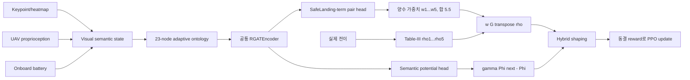

# Ontology/R-GAT 상태 적응형 보상 가중치

[문서 안내](README.md) · [기존 3개 파이프라인](THREE_PIPELINE_COMPARISON.md) ·
[Shin baseline](SHIN2026_BASELINE.md)

## 연구 질문

새 제안 방식은 하나의 23-node R-GAT encoder가 두 출력을 함께 학습한다. 첫 head는
현재 estimator-free semantic graph에 따라 **Shin Table-III 5개 성분의 상대 가중치**를
출력하고, 두 번째 head는 시야상실·재포착을 직접 표현하는 scalar potential `Phi(G)`를
출력한다. 5성분에 visibility 항이 없어 가중치만 바꿔서는 FOV loss를 교정할 수 없다는
실험 결함을 해결한 구조다. 실제 Isaac/PX4 rollout으로 PPO 전에 학습하고 동결한다.



기존 `onto_no_se`/`onto_rgat_potential_pbrs_no_se`의
`gamma Phi(G_t+1)-Phi(G_t)`는 삭제하지 않았다. 기존 18-node graph와 scalar
potential artifact도 그대로 유지되며 독립 비교 arm으로 실행한다.

## 실행 모드

| 모드 | 상태 추정 | Active perception | 비종료 보상 |
|---|---:|---:|---|
| `shin_se_fixed` | 있음 | 있음 | 고정 Table-III 5항 + active |
| `shin_se_rgat_weight` | 있음 | 있음 | R-GAT 적응 5항 + semantic PBRS + 기존 active |
| `no_se_fixed` | 없음 | 없음 | 고정 Table-III 5항 |
| `onto_rgat_adaptive_weight_no_se` | 없음 | 없음 | R-GAT 적응 5항 + semantic PBRS |
| `onto_rgat_potential_pbrs_no_se` | 없음 | 없음 | 기존 scalar-potential PBRS |

이전 ID `shin_se`, `no_se`, `onto_no_se`, `shin2026`, `manual_no_active`도 계속
지원한다. 구조 ablation `mlp_adaptive_weight_no_se`,
`gat_adaptive_weight_no_se`, `rgat_adaptive_weight_no_se`는 동일 데이터, 입력,
가중치 제약, loss와 PPO 설정을 사용해야 하며 architecture별로 별도 artifact/run을
만든다.

## 정확한 5개 보상 성분

전이 `t-1 -> t`에서 `d_xy,t=||(Delta x_t,Delta y_t)||_2`로 둔다.

```text
rho1 = clip(d_xy,t-1 - d_xy,t, -1, 1)
rho2 = clip(|Delta z_t-1| - |Delta z_t|, -1, 1) / max(d_xy,t, 1)
rho3 = -max(v_z,t + 0.5, 0)
rho4 = -Delta z_t                 if Delta z_t > 0, else 0
rho5 = -|omega_z,t|
w0   = [1, 1, 0.5, 1, 2], sum(w0) = 5.5
```

`v_z,t`는 전이 결과 시점의 UAV body-frame vertical velocity다. 기존 dispatch가
이전 시점 속도를 넘기던 오류도 같은 정의로 수정했다. 위치·자세·속도 gate를 모두
통과한 안전 접촉은 `+10`, unsafe contact와 crash,
excessive drift, 현재 시스템의 battery-depleted terminal은 `-10`이며 terminal
reward가 5성분/active 항을 대체한다. PBRS의 정책 불변성 계약을 위해 terminal
전이에서는 `Phi(G_terminal)=0`인 absorbing-state correction `-lambda Phi(G_t)`를
유지한다.

Active-perception은 기존 state-estimation arm에서만 유지한다.

```text
r_active = -0.1 clip(L_est,t - 0.01, 0, 1)
```

확장용 여섯 번째 성분 `rho6=-clip(L_est,t-tau,0,1), w6=0.1`의 설정 자리는
남겼지만 제안 no-SE 모드는 항상 5개 성분만 사용한다. `alpha`, `beta`, `tau`는
R-GAT이 학습하지 않는다.

## 보수적 가중치 변환

R-GAT head의 logit `z_k`를 바로 가중치로 쓰지 않는다.

```text
W0 = 5.5
p0,k = w0,k / W0
p_tilde,k = p0,k exp(kappa tanh(z_k))
            / sum_j p0,j exp(kappa tanh(z_j))
p_k = epsilon p0,k + (1-epsilon) p_tilde,k
w_k = W0 p_k
```

기본값은 `kappa=ln(2)`, `epsilon=0.2`다. 따라서 모든 가중치는 양수이고 합은
항상 5.5이며, logit이 모두 0이면 baseline 가중치와 정확히 같다. 이는 5개 물리
목표 중 하나를 완전히 제거하거나 전체 reward scale이 크게 변하는 것을 막는다.

## 그래프와 모델

기존 PBRS graph 18개 노드는 변경하지 않는다. 적응 가중치 graph만 다음 5개 노드를
추가해 23개 노드를 사용한다.

- `LateralProgress`
- `VerticalProgress`
- `VerticalSpeedSafety`
- `UndershootRisk`
- `YawStability`

`SafeLanding`은 기존 goal node를 재사용한다. 공통 `RGATEncoder`의 두 관계
attention layer 뒤에서 `AdaptiveRewardWeightHead`가 `SafeLanding` 임베딩과 각
보상항 노드 임베딩을 쌍으로 묶어 5개 logit을 만든다.
`AdaptiveSemanticPotentialHead`는 `SafeLanding`과 graph mean embedding으로 bounded
scalar `Phi(G)`를 만든다. 두 head는 같은 frozen encoder를 공유하므로 별도 inference
model을 중첩하지 않는다.

Attention은 message aggregation 중요도이고 reward weight는 head 출력이다. 둘은
서로 다른 값이며 로그와 그림도 별도로 표시한다.

## 데이터셋과 누출 방지

필수 transition/episode 필드는 다음과 같다.

| 범주 | 필드 |
|---|---|
| 순서 | `episode_id`, `time_index`, `seed`, `scenario`, `phase` |
| 모델 입력 | graph feature, edge, relation |
| 전이 목적 | raw/normalized `rho1...rho5` |
| outcome 전용 | success, failure type, terminal reason |
| 물리 평가 | touchdown error/vspeed/roll/pitch, duration, disturbance |

Outcome 전용 필드는 graph tensor를 구성하는 API에 전달되지 않는다. Split은 frame이
아니라 `(episode_id, scenario)` 전체 단위로 수행하며 success/failure를 층화한다.
가능한 경우 train과 validation 양쪽에 두 terminal class를 모두 남긴다. Manifest는
`outcome_fields_are_graph_inputs=false`, schema version, 데이터 hash와 source behavior
policy를 기록한다.

수집 정책은 학습된 fixed no-SE policy, image-plane visual servo/recovery, 성공용
PD teacher, near-miss noise, bounded adverse-landing teacher와 random exploration을
섞고 random-walk/circle/zigzag/vertical-heave 조건을 순환한다. 최소 성공 3회,
실패 3회, unsafe contact·collision·near miss 위험 실패 2회와 validation 양 class가
생길 때까지 명시적 hard cap 안에서 수집한다.
합성 terminal outcome은 허용하지 않는다.

## 정규화와 비교 모드

기본 정규화는 다음과 같다.

```text
bar_rho_k = clip(rho_k / c_k, -1, 1)
c = [1, 1, 1.5, 3, pi/2]
```

물리 bound를 우선하고, 데이터 quantile을 쓸 때는 training split만으로 `c_k`를
계산한다. Fixed/adaptive 비교가 정규화를 사용할 때는 같은 함수와 같은 통계를 써야
한다. `exact_paper_raw=true`는 정규화를 우회해 원 논문 수식을 비교한다. 이 옵션은
reward scale과 최적화 조건을 바꾸므로 결과 표에 반드시 기록한다.

## 오프라인 목적함수

Episode `i`의 점수는 다음과 같다.

```text
J_i = sum_t gamma^t w(G_i,t)^T bar_rho_i,t / sum_t gamma^t
P(success_i) = sigmoid(a J_i + b)
```

`a,b`도 오프라인 단계에서 학습한다. 전체 목적은 다음 항의 가중합이다.

- outcome BCE
- 성공 episode가 실패 episode보다 높은 점수를 갖게 하는 pairwise ranking
- 성공-성공 중 touchdown error, `|vz|`, `|roll|`, `|pitch|`, landing time에서
  명확히 Pareto 지배하는 pair만 쓰는 ranking
- `||p(G)-p0||^2` baseline prior
- 같은 episode의 인접 시점만 쓰는 temporal smoothness
- NearPad/high descent, large offset/safe altitude, high-yaw proxy에 대한 ontology hinge
- graph 상태에 따른 안전한 contextual-weight prior
- discounted terminal utility에 대한 semantic-potential Huber loss
- 관측 품질이 좋아질 때 `Phi`가 증가하도록 하는 인접 상태 monotonic loss

모호한 성공 pair와 실패-실패 pair는 제외하며 선정 통계를 artifact에 기록한다.
Ranking 차이는 `ranking_temperature`로 나누며 기본값은 1.0이다. Ontology
constraint는 명세대로 violation의 제곱 hinge를 사용하고, smoothness는 같은
episode의 인접한 정규화 가중치 비율 `p_t` 사이에서만 계산한다.
현재 7-D proprioception에는 yaw-rate 센서 채널이 없어 high-yaw 조건은 image-plane
motion과 attitude stability의 보수적 proxy다. 실제 yaw command나 `rho5`를 graph
입력으로 넣지 않아 action-to-weight 누출을 막는다. 이 proxy는 실험 보고 시 한계로
명시해야 한다.

매 epoch마다 held-out episode의 outcome BCE와 potential loss를 계산하고 최저
validation objective checkpoint를 복원한다. Validation accuracy, 상태별 가중치 변동
계수와 potential/관측품질 방향성이 설정 기준을 통과하지 못하면 artifact를 저장하지
않는다. 따라서 validation accuracy 0이거나 사실상 고정 가중치인 R-GAT이 PPO에
조용히 투입될 수 없다.

## PPO 동결 계약

Artifact load 시 다음을 모두 검사한다.

- schema/config/data/model hash 일치
- 모든 R-GAT 파라미터 `requires_grad=False`
- `eval()` 유지
- deterministic 반복 출력
- artifact quality gate 통과
- PPO optimizer에 reward model 파라미터가 없음
- 각 PPO update 뒤 model hash 불변

Checkpoint는 임시 파일을 완성한 뒤 원자적으로 교체한다. 불완전하거나 형식이 다른
artifact는 재개하지 않고 명시적으로 거부한다.

Launcher는 `prepare_adaptive_reward_artifact(...)`로 checkpoint를 만들고
`FrozenAdaptiveRewardWeights(path, expected_config_hash=...)`로만 PPO에 로드한다.
사용자가 직접 학습 가능한 module을 PPO에 전달하는 경로는 없다. 기본 파일은
`results/adaptive_reward_weight/<mode>/rgat/adaptive_reward_weights.pt`이고 같은
위치의 `.manifest.json`이 사람이 읽을 수 있는 계약/지표 사본이다.

Simulator의 실제 상대 위치와 terminal outcome은 component 계산과 offline loss에만
쓰이는 **privileged training reward information**이며 actor observation에는 들어가지
않는다. 그래프/R-GAT도 PPO의 보상 생성과 연구 진단에만 필요하다. PPO 학습이 끝난
뒤 배포하는 actor checkpoint는 camera와 onboard proprioception만 사용하므로 배포
경로에는 ontology graph 또는 R-GAT reward model 의존성이 없다.

## 로깅과 평가

`models/<pipeline>/<pipeline>_reward_steps.jsonl`은 설정 간격마다 다음을 기록한다.

- raw/normalized `rho1...rho5`
- `w1...w5`, 성분별 `w_k rho_k`, shaping 합
- terminal/active/final reward와 `Phi`, `Phi_next`, semantic PBRS 항
- success/failure, phase, scenario, disturbance
- R-GAT inference latency와 relation attention

`figures/adaptive_reward/`에는 episode/phase/outcome/disturbance별 가중치, 누적 기여도,
fixed-adaptive 비교와 별도 attention 그림을 생성한다. 성능 평가는 reward return이 아닌
landing success, touchdown error/vspeed/roll/pitch, collision/drift, FOV loss, landing
time, sample efficiency, disturbance degradation, latency와 parameter 수를 쓴다. 여러
독립 seed의 평균, 표준편차와 95% CI를 함께 보고한다.

| 결과 경로 | 내용 |
|---|---|
| `rgat/adaptive_reward_rollouts.npz` | graph topology, raw/normalized 5성분, episode/물리 outcome |
| `rgat/adaptive_reward_rollouts.manifest.json` | split·normalization·source·schema·hash |
| `rgat/adaptive_reward_weights.pt` | 동결 encoder + 5-logit head + semantic potential head |
| `rgat/adaptive_reward_weights.manifest.json` | loss, pair/rule 통계, seed, model/data hash |
| `models/<mode>/<mode>_reward_steps.jsonl` | timestep 보상·가중치·attention·지연 로그 |
| `evaluation/paired_summary.csv` | mode/scenario 평균·표준편차·95% CI |
| `evaluation/disturbance_degradation.csv` | nominal 대비 외란 성능 저하 |
| `figures/adaptive_reward/` | 적응 가중치와 attention 분리 그림 |

## 실행

저장소 루트의 단일 entry point를 유지한다.

```bash
./run.sh --mode quick \
  --config Ontology_RGAT_UAV_RL_ISAAC_PX4/config/experiments/adaptive_reward_weight_comparison.yaml \
  --experiment adaptive_reward_weight_comparison
```

장시간 publication run은 `--mode full`로 바꾸되 episode 수를 명시하고, architecture
ablation은 config의 `architecture`와 선택 pipeline을 각각 맞춰 별도 결과 디렉터리에
실행한다. 단위/CPU smoke 검증은 simulator를 시작하지 않는다.

```bash
cd Ontology_RGAT_UAV_RL_ISAAC_PX4
pytest -q tests/test_adaptive_reward_weighting.py
```
