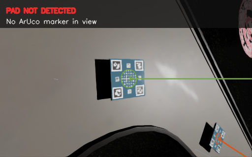
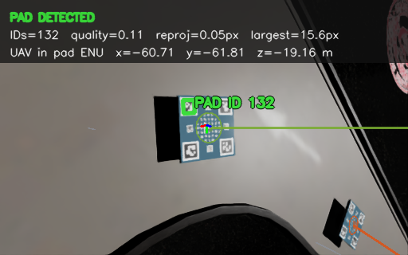
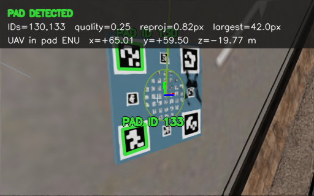

# LEGACY / ABLATION ONLY: Hybrid Ontology R-GAT Reward

> **Legacy.** 이 문서는 ArUco 검출 기반 프로파일(`config/system.yaml`, `vision.mode: aruco`)에서 수행한 adaptive-weight
> ablation을 기록한다. 주 2-pipeline 실험은 6-keypoint fiducial 표적과 기하
> FOV 정의를 쓰며 ArUco에 의존하지 않는다. `docs/TWO_PIPELINE_COMPARISON.md`를 보라.

> Adaptive reward weighting과 semantic PBRS는 현재 제안법이 아니다. 현재 제안법은
> [Ontology-R-GAT 미래 FOV-loss 보상](ONTOLOGY_RGAT_FOV_RISK.md)이다.

[문서 안내](README.md) · [시스템 개요](SYSTEM_OVERVIEW.md) ·
[비교 설계](THREE_PIPELINE_COMPARISON.md)

## 핵심 아이디어

Shin의 5개 shaping 성분은 위치·하강·yaw 행동을 표현하지만 FOV loss와 재포착을
직접 표현하지 않는다. 제안 모델은 하나의 shared R-GAT encoder에 두 head를 둔다.

1. **Adaptive-weight head**: 현재 semantic graph에서 5개 성분의 상대 중요도를 결정
2. **Semantic-potential head**: 관측성·회복·안전 접근을 scalar potential로 표현

두 출력은 실제 Isaac/PX4 trajectory로 PPO 전에 학습하며 PPO 동안 동결한다.

## 입력 정보경계

R-GAT은 actor가 이용할 수 있는 정보에서만 의미 상태를 만든다.

$$
G_t=g_\mathrm{sem}(K_t,H_t,u_t,b_t,G_{t-1}),
$$

여기서 $K_t,H_t$는 keypoint/heatmap, $u_t$는 UAV 자체 속도·자세, $b_t$는 onboard
battery reserve다. 다음 정보는 graph 입력에서 제외한다.

- simulator의 패드 상대 위치·속도
- state-estimator 출력
- privileged critic 입력
- terminal outcome label
- future frame 또는 evaluation metric

Outcome과 실제 상대상태는 reward-design supervision과 평가에만 사용한다.

## 12-D semantic feature

모든 feature는 $[0,1]$로 제한한다.

| 그룹 | Feature | 의미 |
|---|---|---|
| 현재 영상 | keypoint confidence, visible fraction | marker 검출 신뢰도와 가시 비율 |
| 영상 기하 | image alignment, apparent scale | 영상 중심 정렬과 접근 정도 |
| 영상 변화 | image-plane motion safety, scale-rate safety | 급격한 이동·확대 억제 |
| 시간 기억 | visibility memory, reacquisition trend | 일시 시야상실 유지와 재포착 개선 |
| 비행 안전 | vertical-motion safety, attitude stability | 하강 속도와 roll/pitch 안정성 |
| 자원·위험 | battery risk, visual-loss risk | 잔량 부족과 연속 시야상실 시간 |

Heatmap soft-argmax는 항상 좌표를 내므로, 유효 keypoint가 2개 미만이면 그 좌표를 새
측정으로 사용하지 않는다. 마지막 신뢰 가능한 centroid만 memory로 유지하고 alignment,
scale, motion safety를 불리한 값으로 설정한다.

## 23-node ontology

### Semantic/goal node 18개

`KeypointConfidence`, `VisibleKeypointFraction`, `ImageAlignment`, `ApparentScale`,
`ImagePlaneMotion`, `ScaleRate`, `VisibilityMemory`, `ReacquisitionTrend`,
`VerticalMotionSafety`, `AttitudeStability`, `BatteryRisk`, `VisualLossRisk`,
`PerceptionQuality`, `ApproachState`, `ApproachStability`, `RecoveryState`,
`DescentSafety`, `SafeLanding`.

### Reward concept node 5개

`LateralProgress`, `VerticalProgress`, `VerticalSpeedSafety`, `UndershootRisk`,
`YawStability`.

Relation은 `indicates`, `supports`, `constrains`, `self` 네 종류다. R-GAT은 relation별
message와 attention을 구분해 $H_t\in\mathbb{R}^{23\times24}$를 생성한다.

## 상태 적응 보상 가중치

기준 weight와 총합은

$$
w^0=(1,1,0.5,1,2),\qquad W=\sum_iw_i^0=5.5
$$

다. $p_i^0=w_i^0/W$와 R-GAT logit $z_i(G_t)$를 이용해

$$
\tilde p_i(G_t)=
\frac{p_i^0\exp\{\kappa\tanh z_i(G_t)\}}
{\sum_jp_j^0\exp\{\kappa\tanh z_j(G_t)\}},
$$

$$
w_i(G_t)=W\left[\varepsilon p_i^0+(1-\varepsilon)\tilde p_i(G_t)\right]
$$

로 제한한다. 기본값은 $\kappa=\ln2$, $\varepsilon=0.2$다. 이 구조는 다음을 보장한다.

$$
w_i(G_t)>0,\qquad \sum_iw_i(G_t)=5.5.
$$

## Semantic potential

Potential head는 `SafeLanding` node embedding과 graph mean embedding을 결합한다.

$$
\Phi(G_t)=2\tanh\left(f_\phi([h_t^{\mathrm{goal}},\bar h_t])\right).
$$

PBRS 항은

$$
r_t^{\mathrm{sem}}=0.75
\left[0.99\Phi(G_{t+1})-\Phi(G_t)\right]
$$

이다. Terminal 전이에서는 다음 graph를 absorbing state로 두어
$\Phi(G_{t+1})=0$으로 만든다.

## 최종 reward

정규화한 Shin 성분을 $\bar\rho_t$라 하면

$$
r_t=
\begin{cases}
r_t^{\mathrm{task}}+r_t^{\mathrm{sem}}, & \text{terminal},\\[1mm]
w(G_t)^\top\bar\rho_t+r_t^{\mathrm{sem}}, & \text{그 외}.
\end{cases}
$$

제안 no-SE arm에는 $L^{\mathrm{est}}$나 active-perception reward가 존재하지 않는다.

## Reward-design dataset

실제 live transition마다 다음을 저장한다.

- graph tensor와 relation topology version
- raw $\rho_t$와 정규화 $\bar\rho_t$
- episode/scenario/time index
- terminal class와 안전 착륙 metric
- visual loss/reacquisition 진단값
- source policy, seed, config와 encoder hash

Dataset은 `(episode, scenario)` 단위로 train/validation을 분리하며, 충분한 표본이 있으면
양쪽 split에 성공과 실패가 모두 포함되도록 층화한다. 최소 class 계약은 성공 3,
실패 3, 위험 실패 2 episode다.

## RViz 태그 인식 합성 영상

아래 영상은 Isaac Sim 카메라가 발행한
`/landing_pair_2/uav/perception/landing_camera/annotated`를 RViz에서 표시하는 것과
동일한 합성 결과다. 원시 actor 영상에 넣는 정보가 아니라, 운영자 진단용 토픽에만
ArUco 윤곽, marker ID, 검출 quality와 reprojection error를 덧그린다.

| 시야 상실 | 태그 재포착 | 접촉 직전 접근 |
|---|---|---|
|  |  |  |
| `PAD NOT DETECTED`: marker가 영상에 있어도 유효 ArUco가 없는 상태 | `PAD DETECTED`: ID 132를 다시 검출한 직후 | 복수 ID와 reprojection error를 유지한 근접 장면 |

왼쪽과 가운데는 실제 보상 설계 수집 비행의 같은 pair·seed 80046에서 연속으로
캡처했다. 오른쪽은 바로 앞 성공 비행 seed 80045의 근접 프레임이다. 세 이미지는
태그 인식 상태를 설명하기 위한 실제 live capture이며, 제안 PPO의 성능 증거로
사용하지 않는다. 성능 비교에는 별도의 paired evaluation만 사용한다.

## 오프라인 학습 목적함수

Episode $e$의 길이 편향을 제거한 discounted shaping score는

$$
J_e=
\frac{\sum_{t=0}^{T_e-1}\gamma^t
w(G_{e,t})^\top\bar\rho_{e,t}}
{\sum_{t=0}^{T_e-1}\gamma^t}.
$$

전체 loss는

$$
\begin{aligned}
\mathcal L={}&
\lambda_{\mathrm{out}}\mathcal L_{\mathrm{BCE}}
+\lambda_{\mathrm{rank}}\mathcal L_{\mathrm{rank}}
+\lambda_{\mathrm{prior}}\mathcal L_{\mathrm{prior}}\\
&+\lambda_{\mathrm{smooth}}\mathcal L_{\mathrm{smooth}}
+\lambda_{\mathrm{onto}}\mathcal L_{\mathrm{ontology}}
+\lambda_{\mathrm{ctx}}\mathcal L_{\mathrm{context}}\\
&+\lambda_{\Phi}\mathcal L_{\mathrm{potential}}
+\lambda_{\mathrm{obs}}\mathcal L_{\mathrm{monotonic}}.
\end{aligned}
$$

- Outcome BCE: $J_e$가 성공/실패를 구분하도록 학습
- Ranking: 성공 episode가 실패보다 높은 score를 갖도록 학습
- Prior/bound: 기준 weight 근처의 양수 simplex 유지
- Smoothness: 같은 episode의 인접 state에서 weight 급변 억제
- Ontology/context: 시각·하강 조건과 reward concept의 방향성 부여
- Potential: 할인된 terminal utility의 Huber 회귀
- Monotonic: 관측 품질이 좋아질 때 potential이 같은 방향으로 변하도록 제약

Validation objective가 가장 낮은 epoch를 복원한다.

## 품질 gate와 동결

Artifact는 다음 기준을 모두 통과해야 한다.

| 지표 | 기준 |
|---|---:|
| Validation outcome accuracy | $\ge0.50$ |
| Mean weight coefficient of variation | $\ge0.003$ |
| Potential observability monotonic compliance | $\ge0.55$ |

저장 artifact에는 model/dataset/config hash, graph version, split 통계, 정상화 scale,
학습 loss와 품질 지표를 포함한다. PPO가 시작되면 다음을 검사한다.

1. 모든 R-GAT parameter의 `requires_grad=False`
2. PPO optimizer에 R-GAT parameter가 없음
3. PPO update 전후 model digest가 동일함
4. Online graph schema와 artifact schema가 동일함

## 구조 ablation

동일 dataset과 loss에서 encoder만 `MLP`, `GAT`, `R-GAT`으로 교체한다. 이를 통해
성능 향상이 parameter 수나 비관계형 nonlinear mapping이 아니라 relation-aware
message passing에서 오는지 확인한다.
