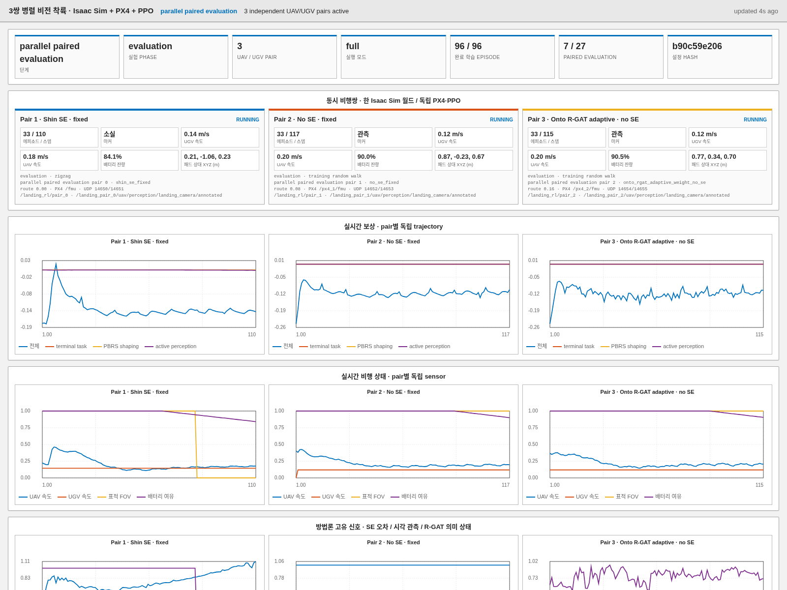

# 운영 안내

[문서 안내](README.md) · [시스템 개요](SYSTEM_OVERVIEW.md) ·
[아키텍처](ARCHITECTURE.md) · [실제 기체 안전](HARDWARE_SAFETY.md)

이 runbook은 기본 3개 파이프라인 통제 실험을 다룬다. Legacy cooperative-urban
명령과 output path는 마지막에 별도로 설명한다.

## 표준 실행

Git 저장소 루트에서 실행한다.

```bash
./run.sh
```

마감용 쉬운 조건의 핵심 3-arm preview는 다음 명령을 사용한다.

```bash
./run.sh --seminar-fast
```

Preview는 `config/experiments/seminar_fast_comparison.yaml`과
`config/seminar-fast-system.yaml`을 사용한다. 성공한 실제 PD 교사 시연만 공통 BC
warm start에 포함한다. 교사는 움직이는 UGV를 확실히 추종하도록 action label 생성에만
training-only simulator 상대상태를 사용하지만, 저장되는 actor 입력과 최종 정책에는
camera embedding과 UAV proprioception만 남는다. 이 추가 supervision은 세 arm이
동일하게 공유하며 preliminary 결과에만 사용한다. SE arm의 auxiliary head
supervision과 평가/terminal 판정에도 training-only truth가 남는다.
시연, reward-design, PPO, paired evaluation interaction 수는 manifest와
`tables/sample_efficiency.csv`에 각각 기록된다. 중단 후 같은 명령을 실행하면 시연
artifact, pipeline checkpoint와 완료 평가 row를 재개한다.

착륙 성공은 raw `pad_contact`가 아니다. 접촉, 패드 중심 위치, 수직속도, 패드 상대
수평속도, roll/pitch tilt, 각속도의 여섯 gate를 모두 통과해야 한다. 접촉했지만 gate를
위반하면 `status=unsafe_pad_contact`, `paper_success=0`, terminal reward `-10`이다.
Dashboard의 최근 착륙 판정과 training/evaluation CSV에서 gate별 결과를 확인할 수 있다.

루트 wrapper가 기준 launcher다. 인수가 없으면 다음을 추가한다.

```text
--mode full
--total-train-episodes 800
--eval-episodes 5
--rgat-data-episodes 40
```

`shin_se` estimator warm-up 8회가 끝나면 나머지 PPO 비행 792회를 pipeline당
264회씩 나눈다. 최소 semantic dataset에 terminal class 하나만 있거나 성공한
recovery가 부족하면 실제 수집을 40회에서 최대 120회까지 연장한다. 평가는 pipeline
3개 × scenario 7종 × paired seed 5개, 총 105회다.

```bash
./run.sh --mode quick --headless
./run.sh --mode full --pipelines shin_se no_se onto_no_se
./run.sh --mode full --training-replicate 2 \
  --train-episodes 40960 --rgat-data-episodes 400
```

두 번째 launcher를 시작하지 않는다. 루트 script가
`/tmp/ontology_rgat_flight_pipeline.lock`을 보유하며 경쟁 process는 runtime이나
result를 건드리기 전에 exit code 73으로 끝난다. 오류에 표시된 PID와 command는
추측한 stale 값이 아니라 기존 owner다. Crash한 owner의 lock은 자동 해제된다.

## 상태를 바꾸지 않는 health check

학습 중 다음 명령을 사용할 수 있으며 vehicle을 reset하지 않는다.

```bash
cd Ontology_RGAT_UAV_RL_ISAAC_PX4
./scripts/stack_status.sh
curl -fsS http://127.0.0.1:8770/api/state
ps -eo pid,etime,state,%cpu,%mem,cmd | \
  grep -E '[r]un_three_pipeline|[l]anding_world|[r]os2_gateway|[M]icroXRCEAgent'
```

기본 runtime의 정상 신호는 다음과 같다.

- DDS가 UDP 8888에 bind됨
- Gateway가 UDP 14650에 bind됨
- 명시적으로 끄지 않았다면 dashboard가 TCP 8770에 bind됨
- `landing_world.py`, PX4, gateway, learner process가 살아 있음
- `/fmu/out/vehicle_odometry` rate가 변함
- 비행 중 dashboard의 `active episode` 또는 `live episode step`이 변함
- 완료 episode마다 pipeline checkpoint/history timestamp가 갱신됨

Committed episode 수는 완전한 episode, optimizer update, checkpoint write, history
write가 모두 끝난 뒤에만 변한다. Rendered S5의 simulated episode 30 s는 wall time
30 s보다 오래 걸릴 수 있다. 그동안 `active episode`와 `live episode step`을 보고,
committed count 하나만 멈췄다고 stall로 판단하지 않는다.



2026-09-12 진행 중인 실제 telemetry이며 최종 success-rate 결과가 아니다.

## 시작 process의 소유권

Runner는 다음 순서로 시작한다.

| Component | 준비 완료 조건 | 기본 endpoint |
|---|---|---|
| Micro XRCE-DDS Agent | UDP socket bind | 8888/UDP |
| Isaac Sim + Pegasus + PX4 | PX4 log에 `Ready for takeoff` | Pegasus가 PX4 link 소유 |
| ROS 2 gateway | UDP socket bind + DDS discovery grace | 14650/UDP |
| Dashboard | local HTTP bind | 8770/TCP |
| RViz 2 | graphical mode에서 process 시작 | `/landing_rl` topic |

이미 호환 process가 있으면 인수하고 teardown에서 중단하지 않는다. 현재 runner가
시작한 process만 소유하며 `--keep-stack`이 없으면 run 종료 때 중단한다. Recovery도
소유 stack만 재시작하며 직접 시작한 simulator를 종료하지 않는다.

정상 완료 뒤 simulator, RViz와 dashboard가 닫히는 기본 동작을 원하지 않으면
`../run.sh --seminar-fast --stay-open`을 사용한다. 이 모드는 모든 결과 파일을 먼저
commit한 다음 UI와 flight stack을 유지하며, owned stack이 죽으면 자동 재시작한다.
`Ctrl-C`를 누르면 기존 cleanup 경로로 안전하게 종료한다. `--keep-stack`은 runner가
종료된 뒤 외부 stack만 남기는 별도 옵션으로 dashboard/RViz 유지 옵션이 아니다.

Runtime log는 다음과 같다.

```text
/tmp/ontology_rgat_stack/agent.log
/tmp/ontology_rgat_stack/isaac.log
/tmp/ontology_rgat_stack/gateway.log
```

## 대시보드와 RViz

<http://127.0.0.1:8770/>을 연다. 기본 화면은 다음을 표시한다.

- Stage와 phase
- 현재 pipeline과 state-estimation 상태
- Committed training total, active episode, live step
- Paired-evaluation 진행도와 scenario
- Target visibility, UAV/UGV 속도, battery energy/reserve
- Optimizer phase, effective learning rate, curriculum, UGV motion scale,
  UAV action envelope
- 해당 단계가 시작된 뒤 reward-design flight/sample/class 수와 R-GAT 진단
- 기본 learning curve인 moving landing success
- 명확히 진단값으로 표시한 episode return

Pipeline별 chip은 같다고 가정한 target을 만들지 않고 실제 committed count를
표시한다. 전체 denominator에는 `shin_se` 전용 warm-up이 있으므로 정직하게 3으로
나눌 수 없다.

`--headless` 또는 `--no-rviz`가 없으면 RViz가 자동으로 열린다. Vehicle, UGV/deck,
도로 route, trail, terminal marker와 annotated landing camera를 표시한다. Camera
화면이 비어 있으면 image topic이 없다는 뜻이고, `PAD NOT DETECTED`는 image는 있지만
board solve가 실패했다는 뜻이다.

8770이 이미 사용 중이면 metric 수집은 계속하지만 live dashboard가 꺼졌다고
출력한다. 기존 owner를 중단하거나 다른 port를 쓴다.

```bash
./run.sh --dashboard-port 8771
```

## 초기화와 진입 hover

측정 episode는 실제 PX4 control handover가 끝난 뒤에만 시작한다.

1. Isaac이 platform motion, camera/environment state와 battery seed를 적용한다.
2. 지상 UAV는 deck에 다시 앉히고 공중 UAV는 teleport하지 않는다.
3. Estimator 시작과 initial climb 동안 UGV는 정지한다.
4. Gateway가 pad-relative entry target을 world-frame PX4 position setpoint로 계속 변환한다.
5. PX4가 arm하고 camera-centred hover까지 비행한다.
6. Client는 entry-position tolerance, 최대 속도 0.40 m/s, 최근 2.0 s 내 marker
   detection을 1.0 s 연속 만족하도록 요구한다.
7. 첫 policy action이 control source를 `goto`에서 action setpoint로 바꾸고 UGV
   motion과 측정 battery budget을 시작한다.

공중 UAV teleport는 의도적으로 금지한다. PX4 EKF가 불연속을 적분하면 이후
observation이 물리적으로 무의미해진다. Entry gate 실패는 setup failure이지 training
sample이 아니다.

PPO episode 사이에는 optimization 동안 gateway가 끝나지 않은 공중 vehicle을 제한된
position에 hold한다. 다음 reset 전에 action deadman 때문에 PX4가 landing mode로
떨어지는 것을 막는다.

## Checkpoint 및 재시도 동작

완전한 recurrent episode마다 다음을 atomic commit한다.

- Model weight
- Adam state
- Curriculum state
- 완료 episode 번호
- Configuration hash와 pipeline contract
- 필요한 경우 reward-design hash
- Training history CSV

호환 state는 재개한다. 호환되지 않는 checkpoint는 history와 함께
`*.incompatible-<old-hash>.pt`로 바꾸고 새 설정으로 학습한다. 정보 경계를 넘어
조용히 transfer하지 않는다.

`collect_episode_resilient`가 retry하는 infrastructure failure는 다음뿐이다.

- Learner/gateway timeout
- 실제로 진행을 멈춘 simulator clock
- Gateway가 분류한 순수 PX4 Offboard heartbeat loss

Partial trajectory를 버리고 소유 stack을 재시작해 설정된 횟수 안에서 같은 seed를
다시 쓴다. Paired-seed bias를 막기 위한 동작이다. 다른 PX4 failsafe, estimator,
marker, geometry, policy-health 또는 terminal failure는 infrastructure recovery로
취급하지 않는다.

## 오류 진단

| 증상 | 의미와 조치 |
|---|---|
| `another ... pipeline is already active` | Lock이 live owner를 보호한다. 표시된 PID를 확인하고 경쟁 launcher를 시작하지 않는다. |
| 완료 count가 멈춰 보임 | `active episode`, `live episode step`, process state와 odometry를 확인한다. Rendered flight는 episode 종료 때만 commit된다. |
| Dashboard가 `debug`/return만 표시 | 현재 코드 실행 후 browser를 새로고침한다. 기본 chart는 training success이고 return은 진단값이다. 인수한 이전 process는 재시작 전까지 수정 HTML을 불러올 수 없다. |
| `cannot bind 127.0.0.1:8770` | 다른 dashboard가 port를 소유한다. `ss -ltnp`로 PID를 찾거나 `--dashboard-port`를 쓴다. |
| `PX4 did not hold the entry pose` | 표시된 offset, speed, marker quality와 gateway/PX4 log를 본다. S5 profile은 측정된 hover limit cycle을 0.40 m/s까지 허용하고 최근 detection을 2 s 기억한다. |
| `PX4 estimator state is not valid yet` | PX4 local position/velocity validity 또는 freshness가 false다. 우회하지 말고 startup/odometry rate와 PX4 preflight message를 본다. |
| `PX4 simulated time advanced only ...` | 작고 음수가 아닌 advance는 실제 simulator stall이다. 현재 bridge는 이전 코드가 큰 음수 stall로 오인한 XRCE time-domain jump도 재고정한다. |
| `OFFBOARD_HEARTBEAT_LOSS` | Gateway가 순수 setpoint-link 중단을 SITL에서 recoverable로 분류한다. 다른 failsafe 원인이 함께 있으면 hard failure다. |
| `R-GAT training` 중 UGV/UAV가 움직이지 않음 | R-GAT optimization은 offline이므로 비행하지 않는다. `onto_no_se` PPO/evaluation에서 다시 움직인다. |
| Target이 반복해서 안 보임 | Annotated camera topic, board texture, camera mount, entry pose를 확인한다. Board에는 전체 하강용 far/mid/micro tag가 있다. |
| `no /fmu/out/*` | DDS UDP 8888, PX4 uXRCE client, 일치하는 `px4_msgs`, Fast DDS RMW, `CYCLONEDDS_URI`가 없는지 확인한다. |
| Gateway state에 최신 field가 없음 | ASCII ROS workspace에 오래된 source copy가 있다. Stack을 멈추고 `./scripts/sync_gateway.sh` 후 재시작한다. |
| `Preflight Fail: Battery unhealthy` | PX4 SITL internal battery와 실험 pack을 구분한다. SITL은 관련 없는 internal pack만 clamp하며 3S 3500 mAh 실험 model은 계속 방전돼 R-GAT에 입력된다. |
| Deck에 도달했는데 success 없음 | Pad-contact topic/source와 touchdown physical limit을 확인한다. 높이만으로 success가 되지 않는다. |
| Training health gate 중단 | 설정 window가 no success, 과도한 FOV/RMSE/battery failure, 낮은 reacquisition, unsafe blind descent 또는 active reward 포화를 찾았다. Message가 실패 gate를 열거하며 남은 budget의 무의미한 rollout을 막는다. |

직접 probe 명령은 다음과 같다.

```bash
RMW_IMPLEMENTATION=rmw_fastrtps_cpp ros2 topic hz /fmu/out/vehicle_odometry
RMW_IMPLEMENTATION=rmw_fastrtps_cpp ros2 topic hz \
  /landing_uav0/perception/landing_camera/annotated
python3 tools/protocol_probe.py state
tail -n 100 /tmp/ontology_rgat_stack/gateway.log
tail -n 100 /tmp/ontology_rgat_stack/isaac.log
```

## 기본 output path

기본 run은 `results/three_pipeline/full/`을 쓴다.

| Path | 생성 시점 |
|---|---|
| `manifest.json` | stack 시작 전, 완료까지 계속 갱신 |
| `evaluation/paired_plan.csv` | 학습 전 |
| `models/shared/keypoint_encoder.pt` | encoder 준비 후 |
| `models/<pipeline>/<pipeline>.pt` | committed training episode마다 |
| `models/<pipeline>/<pipeline>_training.csv` | committed training episode마다 |
| `training/<pipeline>.csv` | 해당 pipeline의 요청 학습 완료 후 |
| `rgat/semantic_rollouts.npz` | reward-design flight 완료마다 |
| `rgat/semantic_rollout_episodes.csv` | reward-design 비행별 outcome |
| `rgat/rgat_model.pt` | direct R-GAT fitting/동결 후 |
| `evaluation/per_episode.csv` | evaluation pair 완료마다 |
| 생성 CSV/Markdown/figure | report 생성 후 |

Replicate 1, 2는 `full/replicate_1/`, `full/replicate_2/`에 쓴다. Report generator가
이 디렉터리를 찾아 `full/combined/`에 hierarchical aggregate를 쓴다.

```bash
python3 python/generate_three_pipeline_report.py \
  --results-dir results/three_pipeline/full
```

보고 결과에는 manifest, config, Git commit, checkpoint hash, software version, GPU,
wall-clock time과 raw per-episode record를 함께 보관한다.

## 수동 시작 및 유지관리

단일 명령 runner 사용을 권장한다. Component 진단에만 다음을 쓴다.

```bash
./scripts/run_dds_agent.sh
ISAACSIM_PATH=/absolute/path/to/isaacsim \
  ./scripts/run_isaac.sh config/shin2026-system.yaml
./scripts/run_gateway.sh --config config/shin2026-system.yaml \
  --target sitl --allow-arm
./scripts/run_rviz.sh
```

ROS gateway source가 바뀌면 한글 저장소 path 때문에 live ROS 2 package가 여전히
ASCII workspace의 이전 copy일 수 있다. Stack을 중단한 상태에서만 동기화한다.

```bash
./scripts/sync_gateway.sh --check
./scripts/sync_gateway.sh
```

Offline code contract 검사는 다음과 같다.

```bash
./scripts/check_workspace.sh
./scripts/check_learner_protocol.sh
./scripts/check_ros2_loopback.sh   # ROS/PX4 bootstrap 이후
```

## 이전 cooperative 실험

`scripts/run_metasejong_pipeline.sh`는 별도로 보존한 실험이다. 23-channel policy,
14-node/38-edge ontology, 증류된 고정 reward weight 8개, legacy `results/` 아래 output
layout과 이전 figure는 `onto_no_se`를 설명하지 않는다. `--methods` 또는 `--reward`가
있는 루트 호출은 호환성을 위해 legacy reward-arm runner로 보낸다.

기본 실험과 legacy 실험 사이에 checkpoint, result table 또는 success 주장을 복사하지 않는다.
