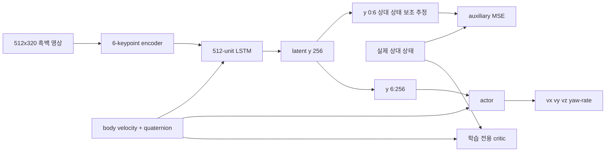

# Shin et al. (2026) 논문-코드 baseline

[문서 안내](README.md) · [3개 파이프라인 통제 비교](THREE_PIPELINE_COMPARISON.md) ·
[데이터 흐름 감사](DEPENDENCY_DATAFLOW_AUDIT.md)

기준 논문: W. Shin et al., *Vision-Based Autonomous Drone Landing on Moving
Platforms With Uncertain Motion via Deep Reinforcement Learning*, IEEE Robotics
and Automation Letters, vol. 11, no. 5, 2026, DOI `10.1109/LRA.2026.3674011`.

이 저장소는 논문의 방법론적 interface를 Isaac Sim/Pegasus/PX4 안에서 구현한다.
Bit-exact 재현은 아니다. 기본 연구 질문은 더 좁다. 하나의 통제 구현에서 논문에
기반한 explicit-estimation pipeline, estimator-free temporal PPO, estimator-free
ontology/R-GAT reward shaping을 비교한다.

## 재현한 논문 interface

기본 benchmark는 논문에 보고된 다음 요소를 유지한다.

- 512×320 grayscale image와 UAV body velocity/quaternion observation
- Forward axis에서 아래로 60° 기울고 horizontal FOV가 90°인 camera
- 6-keypoint visual interface와 512-D image embedding
- 512-unit LSTM, 256-D latent와 상대 상태 추정값 6개
- `shin_se`의 relative position/velocity auxiliary MSE supervision
- UAV proprioception과 relative truth를 받는 asymmetric critic
- 0.1 s control interval의 heading-frame velocity/yaw-rate command
- Episode당 control step 300개
- Full curriculum에서 initial relative altitude 2–8 m, lateral offset -3–3 m,
  platform yaw misalignment -60–60°. 단, 초기 camera FOV 안에 platform이 있어야 함
- Table-III progress/velocity/undershoot/yaw-rate shaping
- `shin_se`의 estimation-error active-perception term
- `+10/-10` terminal task outcome과 80-level curriculum

Typed `ActorObservation` 경계로 actor observation을 표현한다. UGV pose/velocity,
wheel odometry, V2V, GNSS, 계산된 marker pose, relative-state truth와 simulator
truth는 여기에 추가할 수 없다.

## 기본 코드 대응



| Pipeline | 논문 baseline과의 관계 |
|---|---|
| `shin_se` | Auxiliary head/loss와 active-perception reward를 사용한다. |
| `no_se` | Temporal model capacity를 유지하면서 head, loss, warm-up과 active term을 제거한다. |
| `onto_no_se` | Estimator-free actor를 유지하고 별도의 direct semantic R-GAT PBRS reward path를 추가한다. |

모든 actor는 `y[6:256] + 7-D proprioception`을 사용한다. Supervision을 받는 값 6개는
actor에 추가하지 않으므로 의도한 latent-supervision 설계와 일치한다.

## Shin 보상 구현

Table-III 구현은 다음 항으로 구성된다.

- Clipping한 lateral progress, weight 1.0
- `max(d_xy, 1)`로 나눈 clipping vertical progress, weight 1.0
- Vertical-speed hinge, weight 0.5
- Undershoot indicator, weight 1.0
- Absolute yaw-rate penalty, weight 2.0

`shin_se`에는 논문의 active-perception 식도 적용한다.

```text
r_active = -alpha * clip(beta * (L_est,next - tau), 0, 1)
alpha = 0.1, beta = 1.0, tau = 0.01
```

`no_se`는 estimator-dependent term 없이 같은 물리 Table-III reward를 쓴다.
`onto_no_se`는 estimator signal을 재사용하지 않고 sparse task reward와 비교 문서에
설명한 동결 direct semantic potential을 쓴다.

## 의도적으로 변경한 부분

| 주제 | 저장소의 선택 | 이유/보고 요구사항 |
|---|---|---|
| Simulator | Isaac Sim 5.1 + Pegasus + PX4 SITL | 논문은 AerialGym을 사용하므로 backend가 동일한 결과가 아니다. |
| Low-level controller | PX4 velocity controller | 논문의 정확한 geometric controller가 공개되지 않았다. 제한값은 pipeline 공통이다. |
| Keypoint network | target-absent frame을 포함한 합성 초기화, 명시적 6-keypoint visibility head, 실제 Isaac board-plane fine-tuning, held-out validation 후 PPO 전에 동결 | PACMAN 호환 weight/code가 공개되지 않았다. 이 artifact를 PACMAN이라고 표시하면 안 된다. |
| Landing target | Multi-scale ArUco board | 알려진 landing geometry를 근사하고 원거리부터 근거리까지 보이게 설계했다. |
| Scene | Meta-Sejong S5/Gwanggaeto 도로 폐곡선 | 모든 pipeline에 공통인 campus adaptation이다. |
| Platform 속도 | 0.25–0.60 m/s 추출, carrier 상한 1.0 m/s | 곡선 도로 profile에서 논문의 0–8 m/s 범위를 주장하지 않는다. |
| Episode 시작 | PX4가 비행해 도달하는 camera-centred hover | 공중 teleport는 EKF를 손상시킨다. |
| 초기 exploration | `log_std=-1.2`, actor output gain 0.03 | Acceleration slew limit로 command를 제한하면서 거의 정지한 초기 policy를 피한다. |
| 초기 curriculum | UAV envelope 50%, UGV motion 35%에서 시작. Success/FOV/common physical-RMSE gate로 상승 | Passive/parked dataset을 피하고, 모든 arm에서 같은 기준으로 학습 정체 중 난이도 상승을 막는다. |
| Table-II randomization | Seeded PX4-relative gain 분산, Isaac force/torque와 handover state, 실제 camera appearance | Low-level controller가 PX4이므로 geometric-controller gain을 상대 범위로 mapping한다. |
| Battery | Seeded 9–55 hover-second reserve를 가진 실제 용량 3S 3500 mAh model | 30 s episode에서 energy state를 측정 가능하게 하되 더 작은 가상 pack을 만들지 않는다. |

45-tag board는 success region 안에 far tag 0.32 m 4개, transition tag 0.12 m 4개,
touchdown tag 0.04 m 37개를 둔다. Dictionary는 `DICT_4X4_100`이다.

## 초기 설정 및 제어권 전달 변경

낮은 curriculum에서는 UAV entry가 정지 camera-centred hover에서 전체 Table-I
initial-condition draw 방향으로 점차 변한다. Reward-design과 `c=1` paired evaluation을
포함한 모든 level에서 horizontal sample을 보수적인 camera-footprint subset 안으로
당기고 handover 전에 실제 detector가 visibility를 확인해야 한다. Target은 `c=0`에서도
0.0875–0.21 m/s로 이미 움직이며 수백 episode 동안 정지하지 않는다. Paired evaluation도
동일한 initial-visibility 조건에서 `c=1`을 사용한다.

첫 latent output 6개는 제한 없는 normalized coordinate이며 물리 `[m, m/s]` 단위로
decode한다. Auxiliary 및 active-perception loss는 6축 MSE 전에 `[3,3,8,3,3,2]`로
나눈다. Actor 전용 `y[6:256]` channel은 `tanh` 범위를 유지한다. 이로써 이전 ±1
물리 단위 한계를 없애고 논문의 active reward가 항상 clipping되는 현상을 막는다.

Full mode의 `shin_se` warm-up 비행 8회 동안 제한된 초기 policy distribution에서
action을 sampling한다. 이전의 과격한 exploration variance로 되돌아가지 않으면서
image와 vehicle state를 모두 자극한다. Warm-up seed 범위는 분리하며 PPO와 따로 센다.

Handover에는 명령한 pad-relative entry에서 1초 stable hold, 최대 속도 0.40 m/s,
최근 2초 안의 marker detection이 필요하다. Setup threshold 0.40 m/s는 rendering된
S5 scene에서 측정한 Pegasus/PX4 hover limit cycle을 반영하며 landing-success
threshold가 아니다.

## 평가 scenario

실행 가능한 paired plan은 다음 7종이다.

1. Training random walk
2. Straight platform motion
3. Linear acceleration wave
4. Circle
5. Zigzag
6. U-turn
7. Vertical heave/boat motion

논문은 maneuver 이름을 제시하지만 모든 trajectory 식을 공개하지 않았다. 여기의
구현은 기록된 근사다. 모든 pipeline은 같은 scenario seed를 사용한다. Method 간
reward return이 아니라 physical success와 touchdown/FOV metric을 보고한다.

## 실행 횟수

Experiment YAML은 publication-reference 선택값으로 pipeline당 PPO 40,960 episode,
초기 R-GAT-design 비행 400회와 독립 model seed 42/1042/2042를 보존한다. 논문이 모든
PPO budget과 optimization hyperparameter를 완전히 명시하지 않았으므로 저장소의
선택값이다.

저장소 루트의 기본 `./run.sh`는 마감용 preview로 이 값을 override한다. Pipeline당
PPO 비행 264회와 `shin_se` warm-up 8회, 즉 학습 비행 총 800회다. Reward-design과
evaluation 비행은 추가 비용이며 별도로 보고한다.

## 재현성 계약

기본 run마다 다음을 기록한다.

- Experiment/system config path와 결합 hash
- 불변 pipeline spec
- Model initialization 및 training/evaluation seed 범위
- PPO, estimator warm-up과 reward-design interaction 수
- Keypoint/source-policy/R-GAT checkpoint digest
- Semantic dataset schema, class, episode, sample, environment step 수
- 물리 per-episode 결과와 paired plan
- 실행 상태와 생성 report 위치

완료된 실제 Isaac/Pegasus/PX4 비행만 benchmark 근거로 쓸 수 있다. CPU smoke test,
합성 keypoint pretraining, dashboard screenshot과 불완전 run history는 구현 근거일 뿐이다.

## 이전 reward-arm 참고

`--methods` 또는 `--reward`를 포함한 루트 명령은 이전 5-arm runner(`shin2026`,
`sparse`, `manual_no_active`, `ontoreward`, `ontoreward_plus_active`)로 연결된다.
Profile에 따라 estimate-based controlled ontology 또는 cooperative 14-node
distilled-reward system을 사용한다. 이전 버전 호환을 위해 유지하지만 기본
`onto_no_se` direct-R-GAT 방법으로 제시하면 안 된다.
