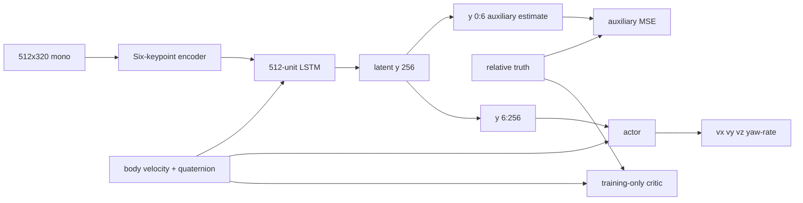

# Shin et al. (2026) paper-to-code baseline

[Documentation map](README.md) · [Controlled comparison](THREE_PIPELINE_COMPARISON.md) ·
[Data-flow audit](DEPENDENCY_DATAFLOW_AUDIT.md)

Reference paper: W. Shin et al., *Vision-Based Autonomous Drone Landing on
Moving Platforms With Uncertain Motion via Deep Reinforcement Learning*, IEEE
Robotics and Automation Letters, vol. 11, no. 5, 2026, DOI
`10.1109/LRA.2026.3674011`.

This repository implements the paper's methodological interface inside
Isaac Sim/Pegasus/PX4. It is not a bit-exact reproduction. The default research
question is narrower: under one controlled implementation, compare the
paper-motivated explicit-estimation pipeline with estimator-free temporal PPO
and estimator-free ontology/R-GAT reward shaping.

## Paper interface reproduced

The primary benchmark retains these reported elements:

- a 512×320 grayscale image and UAV body velocity/quaternion observation;
- a camera pitched 60° downward from the forward axis with 90° horizontal
  FOV;
- a six-keypoint visual interface and 512-D image embedding;
- a 512-unit LSTM, 256-D latent, and six relative-state estimate values;
- auxiliary MSE supervision on relative position/velocity for `shin_se`;
- an asymmetric critic that receives UAV proprioception plus relative truth;
- heading-frame velocity and yaw-rate commands at 0.1 s control intervals;
- 300 control steps per episode;
- initial relative altitude 2–8 m, lateral offsets -3–3 m, and platform yaw
  misalignment -60–60° at full curriculum;
- Table-III progress/velocity/undershoot/yaw-rate shaping;
- the estimation-error active-perception term for `shin_se`;
- `+10/-10` terminal task outcomes and an 80-level curriculum.

The actor observation is represented by the typed `ActorObservation` boundary.
UGV pose/velocity, wheel odometry, V2V, GNSS, solved marker pose, relative-state
truth, and simulator truth cannot be appended to it.

## Primary code mapping



| Pipeline | Relation to the paper baseline |
|---|---|
| `shin_se` | Uses the auxiliary head/loss and active-perception reward. |
| `no_se` | Removes the head, loss, warm-up, and active term while preserving temporal model capacity. |
| `onto_no_se` | Keeps the estimator-free actor and adds a separate direct semantic R-GAT PBRS reward path. |

All actors use `y[6:256] + 7-D proprioception`. The six supervised values are
not appended to the actor, matching the intended latent-supervision design.

## Shin reward implementation

The Table-III implementation contains:

- clipped lateral progress, weight 1.0;
- clipped vertical progress divided by `max(d_xy, 1)`, weight 1.0;
- vertical-speed hinge, weight 0.5;
- undershoot indicator, weight 1.0;
- absolute yaw-rate penalty, weight 2.0.

`shin_se` additionally applies the paper's active-perception form:

```text
r_active = -alpha * clip(beta * (L_est,next - tau), 0, 1)
alpha = 0.1, beta = 1.0, tau = 0.01
```

`no_se` uses the same physical Table-III reward without this estimator-dependent
term. `onto_no_se` does not reuse either estimator signal; it uses sparse task
reward plus the frozen direct semantic potential described in the comparison
document.

## Intentional adaptations

| Topic | Repository choice | Reason/reporting requirement |
|---|---|---|
| simulator | Isaac Sim 5.1 + Pegasus + PX4 SITL | The paper uses AerialGym; results are not backend-identical. |
| low-level controller | PX4 velocity controller | The exact paper geometric controller is not public. Limits are common across pipelines. |
| keypoint network | synthetic initialization, live-Isaac board-plane fine-tuning, held-out validation, then frozen before PPO | PACMAN-compatible weights/code are not public; never label this artifact PACMAN. |
| landing target | multi-scale ArUco board | Approximation of the paper's known landing geometry, designed for far-to-near visibility. |
| scene | Meta-Sejong S5/Gwanggaeto road loop | Campus adaptation shared by every pipeline. |
| platform speed | 0.25–0.60 m/s draw, 1.0 m/s carrier ceiling | The paper's 0–8 m/s envelope is not claimed for this curved-road profile. |
| episode start | PX4-flown camera-centred hover | Airborne teleport would corrupt the EKF. |
| initial exploration | `log_std=-1.2`, actor output gain 0.03 | Avoid a nearly halted initial policy while acceleration slew limits bound commands. |
| early curriculum | UAV envelope starts at 50%; UGV motion at 35%; advancement is success/FOV/common physical-RMSE-gated | Avoid a passive/parked dataset and prevent difficulty rising while learning is stalled without changing criteria between arms. |
| Table-II randomization | seeded PX4-relative gain spread, Isaac force/torque and handover state, live camera appearance | Maps geometric-controller gains by relative range because the low-level controller is PX4. |
| battery | physical-capacity 3S 3500 mAh model with 9–55 hover-second seeded reserve | Makes energy state measurable within a 30 s episode; does not invent a smaller pack. |

The 45-tag board has four 0.32 m far tags, four 0.12 m transition tags, and
37 0.04 m touchdown tags within the success region. The dictionary is
`DICT_4X4_100`.

## Setup and handover adaptation

At low curriculum, the UAV entry blends from a stationary camera-centred hover
to the full Table-I initial-condition draw. The target already moves at
0.0875–0.21 m/s at `c=0` rather than remaining parked for hundreds of episodes.
Paired evaluation uses `c=1`.

The first six latent outputs are unbounded normalized coordinates decoded into
physical `[m, m/s]` units. The auxiliary and active-perception losses divide by
`[3,3,8,3,3,2]` before the six-axis MSE; the actor-only `y[6:256]` channels
remain `tanh` bounded. This removes the former ±1 physical-unit ceiling and
keeps the paper's active reward out of constant clipping.

During the eight full-mode `shin_se` warm-up flights, actions are sampled from
the bounded initial policy distribution. This excites both images and vehicle
state without returning to the earlier violent exploration variance. The
warm-up has a disjoint seed range and is counted separately from PPO.

Handover requires a one-second stable hold at the commanded pad-relative entry,
speed at most 0.40 m/s, and a marker detected within the preceding two seconds.
The 0.40 m/s setup threshold reflects the measured Pegasus/PX4 hover limit
cycle in the rendered S5 scene; it is not the landing-success threshold.

## Evaluation scenarios

The executable paired plan contains:

1. training random walk;
2. straight platform motion;
3. linear acceleration wave;
4. circle;
5. zigzag;
6. U-turn;
7. vertical heave/boat motion.

The paper names its maneuvers but does not publish every trajectory equation;
the implementations here are recorded approximations. All pipelines receive
identical scenario seeds. Report physical success and touchdown/FOV metrics,
not cross-method reward return.

## Budgets

The experiment YAML preserves a publication-reference choice of 40,960 PPO
episodes per pipeline, 400 initial R-GAT-design flights, and independent model
seeds 42/1042/2042. These are repository choices because the paper does not
fully specify all PPO budgets and optimization hyperparameters.

The repository-root bare `./run.sh` deliberately overrides this with the
deadline preview: 264 PPO flights per pipeline plus eight `shin_se` warm-up
flights, totaling 800 training flights. Reward-design and evaluation flights
are additional and reported separately.

## Reproducibility contract

Every primary run records:

- experiment and system config paths plus a combined hash;
- immutable pipeline specs;
- model initialization and training/evaluation seed ranges;
- PPO, estimator-warm-up, and reward-design interaction counts;
- keypoint/source-policy/R-GAT checkpoint digests;
- semantic dataset schema, classes, episodes, samples, and environment steps;
- physical per-episode results and paired plan;
- execution status and generated report locations.

Only complete real Isaac/Pegasus/PX4 flights may be used as benchmark evidence.
CPU smoke tests, synthetic keypoint pretraining, dashboard screenshots, and
incomplete run histories are implementation evidence only.

## Legacy reward-arm note

Root commands containing `--methods` or `--reward` still route to the former
five-arm runner (`shin2026`, `sparse`, `manual_no_active`, `ontoreward`, and
`ontoreward_plus_active`). That path uses an estimate-based controlled ontology
and/or the cooperative 14-node distilled-reward system depending on its
profile. It is maintained for backward compatibility and must not be presented
as the primary `onto_no_se` direct-R-GAT method.
