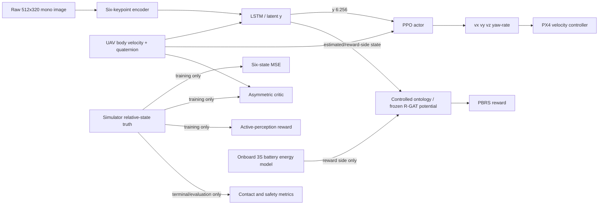

# Shin et al. (2026) benchmark profile

This profile evaluates reward design while holding the perception, estimation,
PPO, critic, action, controller, curriculum, initialization, and evaluation
interfaces fixed. It is a methodological-interface reproduction, not a
bit-exact reproduction of Shin et al. (2026), DOI
`10.1109/LRA.2026.3674011`.

## Information flow



`ActorObservation` has exactly three named inputs: image, UAV body-frame
velocity, and UAV attitude quaternion. It cannot contain pad pose/velocity,
GNSS, wheel odometry, V2V telemetry, trajectory parameters, or simulator
truth. Semantic state remains reward-side in the primary experiment. Battery
reserve is likewise reward-side: it never enters the deployed actor, so all
five reward arms retain the paper-compatible observation boundary.

## Directly reproduced from the paper

- Initial altitude 2–8 m, lateral offsets −3–3 m, yaw misalignment −60–60°,
  initial yaw rate 0°/s, and the per-step speed/yaw-rate perturbation interfaces
  from Table I. The road-safe speed override is documented below.
- 512×320 grayscale camera, 90° horizontal FOV, 60° downward pitch; actor
  proprioception is three body-velocity and four quaternion values.
- Six-keypoint interface, 512-dimensional image embedding, 512-dimensional
  LSTM hidden state, 256-dimensional latent, and the first six latent values as
  body-frame relative position and velocity estimates.
- Auxiliary loss `mean((s_rel - s_rel_hat)^2)` over the six state values.
- Asymmetric critic observation `[u_t, s_rel_truth]`; the critic is absent at
  deployment.
- Four actions: body-heading-frame velocity and yaw rate; 0.1 s control period
  and 300-step horizon.
- Table-III shaping equations and weights: clipped lateral progress (1.0),
  clipped vertical progress divided by `max(d_xy, 1)` (1.0), vertical-speed
  hinge (0.5), undershoot indicator (1.0), and absolute yaw-rate penalty (2.0).
- Section III-C active reward
  `-alpha * clip(beta * (L_est[t+1] - tau), 0, 1)`, with alpha 0.1, beta 1,
  and tau 0.01; +10 contact success and −10 crash/excessive-drift terminals.
- Table-II randomization ranges, including controller gains, force/torque,
  initial velocity/rates, textures, scale, brightness, RGB scale, and lighting.
- Curriculum scalar `c` in `[0,1]`, 80 levels, updated every 512 episodes.

## Intentional adaptations and unpublished choices

- The paper uses AerialGym; this repository retains Isaac Sim, Pegasus, and
  PX4 SITL. PX4's velocity controller replaces the paper's geometric
  velocity-to-body-rate controller. The command limits/rate limits are common
  to all methods. The configured full envelope is 2.0/2.0/1.0 m/s body-heading
  velocity, 1.5/1.5/1.0 m/s² acceleration, 60°/s yaw rate, and 90°/s² yaw
  acceleration.
- No official PACMAN-compatible code and weights are bundled. Before the live
  stack starts, the independent encoder is now supervised on synthetic
  projections of six fixed hexagonal pad landmarks over the configured
  multi-scale board. Its six heatmaps pool six local descriptors into the
  512-dimensional image embedding, and the resulting artifact is frozen for
  PPO. It is still never labeled PACMAN. The current simulated board is also
  an ArUco approximation, not Park et al.'s exact hexagonal target. The S5 road profile uses
  `DICT_4X4_100`: four 0.32 m approach tags, four 0.12 m transition tags and
  37 0.04 m touchdown tags covering the 0.35 m success disk.
- The paper's Table-I platform range is 0–8 m/s. The default Sejong S5
  visualization/empirical profile is deliberately limited to a 0.25–0.60 m/s
  draw and a 1.0 m/s carrier ceiling so the RANGER MINI follows the curved
  campus road at a realistic low speed. This override is shared by every
  reward arm and must be reported with results; it is not an 8 m/s claim.
- Autonomous SITL deliberately disables RC-stick input, exempts OFFBOARD from
  RC-link loss, allows a 5 s OFFBOARD heartbeat grace period and selects Hold
  as the true link-loss action. These PX4 parameters are applied by a temporary
  wrapper around PX4's stock rcS on every simulator boot; they do not change the policy,
  observation, reward or paired evaluation conditions.
- PX4 position control uses the measured Pegasus-Iris hover thrust (0.58), the
  common 2 m/s horizontal and 1 m/s vertical command limits, and the same
  acceleration limits as the outer velocity-command slew limiter. These are
  common setup/controller choices because the paper does not specify PX4 gains.
- Camera frame rate is 30 Hz because the paper does not report it.
- PPO discount, learning rates, minibatch sizes, decision-head widths,
  training length, and checkpoint rule are not specified in the paper and must
  be reported from the experiment configuration. The recurrent policy starts
  at `log_std=-1.5` (standard deviation 0.223 per normalized action) to avoid
  violent random commands from an untrained policy.
- Table-III lateral/vertical shaping is calculated from the un-tilded
  simulator relative state during training. Only the active-perception term
  uses the next recurrent-estimator MSE, matching the paper's separation of
  physical progress and estimation reliability. No truth enters the actor.
- The paper gives `c` and the update interval but not its promotion rule. The
  supplied schedule advances linearly and serializes its state. UAV commands
  and UGV motion use separate lower bounds: the UAV envelope and road-speed
  draw are both scaled by `0.35 + 0.65c`, while initial-condition geometry uses
  `c` directly. Thus the target moves at 0.0875--0.21 m/s even at `c=0`,
  instead of remaining parked for 512 episodes. At `c=0`, the reset entry is
  a stationary camera-centred hover approximately `[-2.51, 0, 4.5]` m behind
  the pad. This puts the pad on the 60-degree camera's optical axis instead of
  at the short-axis image boundary. The entry continuously blends to the exact
  Table-I draw at `c=1`. Paired evaluation always uses
  `c=1`, and all five reward arms receive exactly the same envelope.
- During estimator-only warm-up, actions are sampled from the deliberately
  narrow initial policy distribution rather than fixed at its mean. The
  position-backed PX4 setpoint and 35% envelope keep this excitation bounded,
  while avoiding a static image/state dataset. If the learner misses its SITL
  action deadline, the gateway atomically replaces stale velocity with a
  current-position hover and continues the OFFBOARD heartbeat; hardware keeps
  the ordinary PX4 link-loss behavior.
- Policy handover requires the pad-relative speed to stay below 0.15 m/s for
  1.0 s. PX4's delayed landed flag is ignored while simulator truth places an
  armed vehicle clearly above the deck, preventing a stable hover from being
  mislabeled as an off-pad ground contact.
- FLU/ENU-to-paper body-frame sign conversions are explicit in
  `benchmarks/px4_adapter.py`.

## Reward modes and fairness

`shin2026`, `sparse`, `manual_no_active`, `ontoreward`, and
`ontoreward_plus_active` share a single actor schema and paired seed plan.
OntoReward uses

`r = r_task + lambda * (gamma * Phi(s_next) - Phi(s))`,

sets terminal potential to zero, requires shaping gamma to equal PPO gamma,
and refuses a non-frozen reward design. The primary controlled ontology may
use estimated relative motion and onboard quantities on the reward side. Its
five cost nodes are lateral error, altitude error, relative horizontal speed,
relative vertical speed, and battery risk; all feed `SafeLanding`. The
legacy wind/energy/GNSS ontology remains a separate extended experiment.
`FrozenControlledPotential` also rejects the legacy urban artifact and accepts
only an immutable `controlled_landing` artifact with explicit
`rgat_distillation` provenance.

## One-command execution and implementation status

The live pipeline starts or adopts DDS, Isaac Sim, Pegasus/PX4, and the ROS
gateway, then executes these dependent stages:

1. train or resume the recurrent `shin2026` PPO policy;
2. fly that trained policy on a disjoint seed range in Isaac/Pegasus/PX4;
3. train R-GAT on the resulting estimator features and contact outcomes, then
   distill and freeze the controlled potential;
4. train the requested OntoReward/ablation policies;
5. run the paired evaluation plan and produce checkpoints, per-episode data,
   confidence intervals, tables, and figures.

It also serves `http://127.0.0.1:8770/` while running. That dashboard uses a
MATLAB-figure visual language and exposes the actor information boundary,
method progress, actual R-GAT flight/sample/contact counts, estimator/PPO
diagnostics, live reward components, curriculum, visibility, and paired
scenario outcomes. The curriculum view includes both platform difficulty and
the current UAV action-envelope scale:

```bash
../run.sh                         # seminar deadline run, 800 training episodes total
../run.sh --mode quick --headless # smaller integration run
```

The outer `run.sh` keeps full-fidelity flight dynamics but applies a seminar
budget: 800 training episodes total across selected methods, 40 empirical
R-GAT-data flights, and five paired evaluation seeds per scenario and method.
For the default two methods that is 400 training episodes each and 70 evaluation
flights. This preview budget is not publication-scale statistical evidence.
Pass explicit `--train-episodes`, `--eval-episodes`, and
`--rgat-data-episodes` values to replace the deadline defaults. The 80-level
curriculum is fitted to the shortened per-method count (an interval of five for
400 episodes), and a compatible checkpoint is migrated to the corresponding
level instead of being restarted. This remains a long-running real-time
flight-stack experiment. `--use-running-stack` adopts a compatible active stack,
and `--keep-stack` leaves a newly started stack alive.
The dashboard port can be changed with `--dashboard-port`; `--no-dashboard`
turns off only the HTTP view, not metric collection or result files.

The R-GAT dataset is an explicit OntoReward design choice because Shin et al.
do not define an ontology or its training set. Quick/full mode collects 8/400
held-out flights by default; `--rgat-data-episodes N` overrides that count. For
each sampled control step, its graph contains four bounded costs computed from
the recurrent visual estimator's six-state prediction and one battery-risk cost
computed from onboard energy reserve. Its target is the
actual terminal pad-contact outcome (`+1` or `-1`) discounted back to that step.
Simulator truth is therefore used for the allowed terminal label, never as an
R-GAT input. Battery depletion is a common terminal failure for all reward
arms. Training refuses data without both successful and failed episodes
instead of fabricating a missing class.

The SITL experiment pack uses the configured 3S 3500 mAh (139.9 kJ nominal)
specification, a 1.5 kg vehicle, four 0.13 m rotors, 0.45 combined hover
efficiency, and a 12 W avionics load. The gateway integrates PX4's normalized
thrust setpoint through a momentum-theory electrical-power model, exposing
remaining joules, used joules, state of charge, hover seconds, and normalized
landing reserve at every control step. A full pack changes too little during
one 30 s episode to teach a useful dependency, so the reproducible initial
state is seeded to 9--55 hover seconds remaining. This is a near-depleted state
of the real-capacity pack, not a reduced-capacity fictional cell. PX4 SITL's
separate built-in 60 s battery is clamped full only to prevent commander
failsafes; it is never used as the experimental energy signal.

The frozen synthetic keypoint artifact, dataset, sidecar manifest, episode
metrics, and reward artifact are written
under `results/shin2026/<mode>/data` and `models`. They record the experiment
configuration hash, source-policy checkpoint hash, sample/episode/contact
counts, and dataset digest. Only `ontology_rgat.controlled_rollouts/2` data and
`ontology_rgat.controlled_reward/3` reward artifacts are loadable; old schemas
without battery are rejected. R-GAT uses a segment-maximum-subtracted softmax and a lower learning
rate, stops immediately on non-finite losses or gradients, and JSON output
disallows NaN. Validation holds out complete flight episodes, so adjacent
frames from one trajectory cannot leak across the train/validation boundary.

The paper names its six test maneuvers but does not publish their equations, so
those generators are recorded as approximations. Table-II samples are
deterministic, but controller-gain, force/torque, and visual-appearance
application to PX4/Isaac remains incomplete. Resolve that limitation before
claiming a complete Table-II or bit-exact reproduction.

## Reproducibility and outputs

Every run writes a resolved configuration hash, method list, scenario counts,
paired seed plan, R-GAT data provenance, and source-policy lineage. Record the
Git commit, Isaac Sim/Pegasus/PX4/PyTorch versions, GPU, wall-clock training
duration, and frozen reward-design ID with published results.
`run_shin2026_benchmark.py --input-results` produces all specified CSVs, paired
bootstrap confidence intervals, plots, and a Markdown publication table. It
never fabricates missing flight results.

CPU interface smoke test:

```bash
./scripts/run_metasejong_pipeline.sh --experiment shin2026 --reward shin2026 --mode quick --smoke-test
./scripts/run_metasejong_pipeline.sh --experiment shin2026 --reward ontoreward --mode quick --smoke-test
```

Paired plan and evaluation of collected per-episode data:

```bash
python python/run_shin2026_benchmark.py --methods shin2026 ontoreward --mode full --paired-seeds --plan-only
python python/run_shin2026_benchmark.py --methods shin2026 ontoreward --mode full --paired-seeds --input-results results/shin2026/per_episode.csv
```

The utility runner's smoke mode is not a simulator flight and its values must
not be reported as benchmark results. Use `run_shin2026_benchmark.sh` for live
training and benchmarking; use `run_shin2026_benchmark.py` only for CPU smoke,
planning, or re-analysis.
