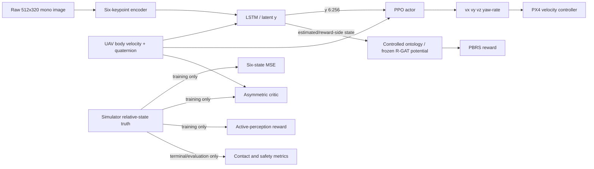

# Shin et al. (2026) benchmark profile

This profile evaluates reward design while holding the perception, estimation,
PPO, critic, action, controller, curriculum, initialization, and evaluation
interfaces fixed. It is a methodological-interface reproduction, not a
bit-exact reproduction of Shin et al. (2026), DOI
`10.1109/LRA.2026.3674011`.

## Information flow



`ActorObservation` has exactly three named inputs: image, UAV body-frame
velocity, and UAV attitude quaternion. It cannot contain pad pose/velocity,
GNSS, wheel odometry, V2V telemetry, trajectory parameters, or simulator
truth. Semantic state remains reward-side in the primary experiment.

## Directly reproduced from the paper

- Initial altitude 2–8 m, lateral offsets −3–3 m, yaw misalignment −60–60°,
  platform speed 0–8 m/s, initial yaw rate 0°/s, per-step speed perturbation
  −0.5–0.5 m/s, and yaw-rate perturbation −3–3°/s (Table I).
- 512×320 grayscale camera, 90° horizontal FOV, 60° downward pitch; actor
  proprioception is three body-velocity and four quaternion values.
- Six-keypoint interface, 512-dimensional image embedding, 512-dimensional
  LSTM hidden state, 256-dimensional latent, and the first six latent values as
  body-frame relative position and velocity estimates.
- Auxiliary loss `mean((s_rel - s_rel_hat)^2)` over the six state values.
- Asymmetric critic observation `[u_t, s_rel_truth]`; the critic is absent at
  deployment.
- Four actions: body-heading-frame velocity and yaw rate; 0.1 s control period
  and 300-step horizon.
- Table-III shaping equations and weights: clipped lateral progress (1.0),
  clipped vertical progress divided by `max(d_xy, 1)` (1.0), vertical-speed
  hinge (0.5), undershoot indicator (1.0), and absolute yaw-rate penalty (2.0).
- Section III-C active reward
  `-alpha * clip(beta * (L_est[t+1] - tau), 0, 1)`, with alpha 0.1, beta 1,
  and tau 0.01; +10 contact success and −10 crash/excessive-drift terminals.
- Table-II randomization ranges, including controller gains, force/torque,
  initial velocity/rates, textures, scale, brightness, RGB scale, and lighting.
- Curriculum scalar `c` in `[0,1]`, 80 levels, updated every 512 episodes.

## Intentional adaptations and unpublished choices

- The paper uses AerialGym; this repository retains Isaac Sim, Pegasus, and
  PX4 SITL. PX4's velocity controller replaces the paper's geometric
  velocity-to-body-rate controller. The command limits/rate limits are common
  to all methods.
- No official PACMAN-compatible code and weights are bundled. The included
  six-keypoint CNN is an independently implemented approximation and is never
  labeled PACMAN. The current simulated board is also an ArUco approximation,
  not Park et al.'s exact hexagonal target.
- Camera frame rate is 30 Hz because the paper does not report it.
- PPO discount, learning rates, minibatch sizes, decision-head widths,
  training length, and checkpoint rule are not specified in the paper and must
  be reported from the experiment configuration.
- The paper gives `c` and the update interval but not its promotion rule. The
  supplied schedule advances linearly and serializes its state.
- FLU/ENU-to-paper body-frame sign conversions are explicit in
  `benchmarks/px4_adapter.py`.

## Reward modes and fairness

`shin2026`, `sparse`, `manual_no_active`, `ontoreward`, and
`ontoreward_plus_active` share a single actor schema and paired seed plan.
OntoReward uses

`r = r_task + lambda * (gamma * Phi(s_next) - Phi(s))`,

sets terminal potential to zero, requires shaping gamma to equal PPO gamma,
and refuses a non-frozen reward design. The primary controlled ontology may
use estimated relative motion and onboard quantities on the reward side. The
legacy wind/energy/GNSS ontology remains a separate extended experiment.
`FrozenControlledPotential` also rejects the legacy urban artifact and accepts
only an immutable `controlled_landing` artifact with explicit
`rgat_distillation` provenance.

## Implementation status and remaining execution work

The repository currently supplies and tests the benchmark contracts, raw-image
transport, recurrent actor/estimator/asymmetric critic, PPO objective, reward
modes, velocity command path, exact reset/random-walk distributions, curriculum
state, paired plans, statistics, and report generation. The CPU smoke mode
executes forward, loss, backward, and optimizer steps for the shared recurrent
backbone.

It does **not** yet connect these components into a live Isaac/PX4 rollout and
checkpoint-training loop. Table-II samples are implemented deterministically,
but controller-gain, force/torque, and appearance samples are not yet applied
to PX4/Isaac at episode reset. The scenario-specific trajectory generators for
linear-acceleration wave, zigzag, U-turn, and vertical heave are also not yet
wired. Consequently, the supplied CLI plans paired runs and summarizes genuine
episode records; it does not claim to have trained policies or flown the paper's
evaluation suite. These are blocking items before publishing benchmark results.

## Reproducibility and outputs

Every run writes a resolved configuration hash, method list, scenario counts,
and paired seed plan. Record the Git commit, Isaac Sim/Pegasus/PX4/PyTorch
versions, GPU, wall-clock training duration, and frozen reward-design ID with
published results. `run_shin2026_benchmark.py --input-results` produces all
specified CSVs, paired bootstrap confidence intervals, plots, and a Markdown
publication table. It never fabricates missing flight results.

CPU interface smoke test:

```bash
./scripts/run_metasejong_pipeline.sh --experiment shin2026 --reward shin2026 --mode quick --smoke-test
./scripts/run_metasejong_pipeline.sh --experiment shin2026 --reward ontoreward --mode quick --smoke-test
```

Paired plan and evaluation of collected per-episode data:

```bash
python python/run_shin2026_benchmark.py --methods shin2026 ontoreward --mode full --paired-seeds --plan-only
python python/run_shin2026_benchmark.py --methods shin2026 ontoreward --mode full --paired-seeds --input-results results/shin2026/per_episode.csv
```

The runner's smoke mode is not a simulator flight and its values must not be
reported as benchmark results. Invoking it without `--smoke-test`,
`--plan-only`, or `--input-results` currently writes the plan and explains that
episode collection is still required.
