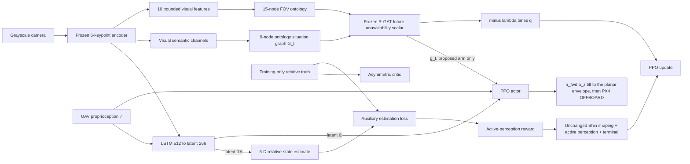

# 시스템 개요

Isaac Sim/Pegasus가 물리·카메라·UGV·접촉·배터리를, PX4 SITL이 저수준 비행제어를
담당한다. 두 learner는 같은 6-keypoint encoder, LSTM과 6-D 상대상태 추정기,
PPO actor, asymmetric critic을 사용한다. Actor 관측은 영상과 UAV proprioception이고
critic truth는 학습 value 함수와 보조 지도학습에만 들어간다.

두 arm은 **같은 보상**을 쓴다. `shin_se_onto_rgat_state`는 같은 시각 의미채널에서
9-node 온톨로지 상황 그래프 `G_t`를 만들고, PPO가 함께 학습하는 R-GAT으로
부호화한 `g_t`를 actor와 critic 입력에 이어붙인다 — 그것이 유일한 차이다.
비학습 대조군 `pn_guidance_v1`은 같은 encoder 출력만 읽는 사가탈 평면 비례항법
유도이며 같은 액션을 낸다.

세 arm 모두 축소된 평면 3채널 액션 `[a_fwd, a_z, tilt]`으로 비행한다. 횡방향
속도와 요레이트는 실험의 제약이며 제어가 아니다
([평면 엔벨로프](PLANAR_ENVELOPE.md)).

은퇴한 보상항 방법(`shin_se_onto_rgat_recovery`, `-λ_fov q_θ(G_t)`)은 자기 id로
남아 있고 지금도 실행할 수 있다.

## 경계

* Simulator truth, 6-D 상대상태 추정, critic state는 `VIS`/`GRAPH` 경계를 넘지 않는다.
* 기하 패드 중심 가시성은 R-GAT의 *label*이므로 online graph 입력에서도 차단된다.
  넣으면 추론이 조회로 바뀐다.
* Critic truth는 배포 policy wrapper의 API에 존재하지 않는다.

두 경계 모두 이름 기반 거부로 실행 시점에 강제되며, 자세한 내용은
[아키텍처와 정보경계](ARCHITECTURE.md)에 있다.
