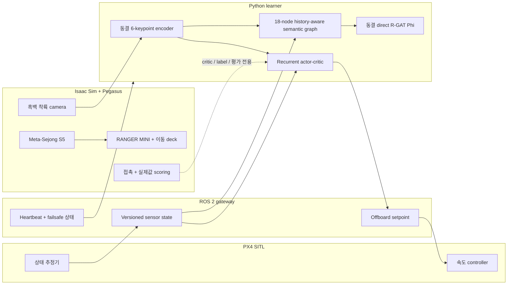

# 시스템 개요

[문서 안내](README.md) · [3개 파이프라인 통제 비교](THREE_PIPELINE_COMPARISON.md) ·
[운영](OPERATIONS.md) · [아키텍처](ARCHITECTURE.md)

이 문서는 기본 `shin_se / no_se / onto_no_se` 실험의 source map이다. 정확한
설정값은 `config/`, 실행 동작은 `python/ontology_rgat/`, `isaac_sim/`, ROS
gateway와 `scripts/`에 있다.

## 종단 간 시스템



Isaac은 배경, physics, 이동 carrier, camera, contact, seeded environment state와
scoring truth를 담당한다. Pegasus는 Isaac rotor dynamics를 PX4에 연결한다. PX4는
상태 추정과 비행 제어를 담당한다. ROS 2가 telemetry와 setpoint를 운반한다. Python
learner는 대체 rigid-body model을 적분하지 않는다.

## 정보 경계

배포 actor 입력은 다음뿐이다.

```text
image: 512 x 320 grayscale
proprioception: body velocity [3] + attitude quaternion [4]
```

공통 encoder는 keypoint 6개와 512-D embedding을 만들고 512-unit LSTM은 256-D
latent를 만든다. Actor는 `y[6:256] + proprioception`을 받아 제한된 heading-frame
command 4개를 출력한다. `shin_se`만 `y[0:6]`으로 auxiliary six-state estimate를
학습하지만 이 예측값 6개는 actor 입력이 아니다.

Asymmetric critic은 학습 중 `[proprioception(7), relative_truth(6)]`을 사용할 수
있다. 그 밖의 simulator truth 사용은 reset acknowledgement, terminal outcome
label과 reward-independent evaluation으로 제한된다. Actor 입력이나 기본 semantic
graph에는 직렬화되지 않는다.

## 통제된 세 파이프라인

| Pipeline | 의도한 실험 요인 |
|---|---|
| `shin_se` | auxiliary state estimation과 estimation-error active-perception reward |
| `no_se` | estimator, auxiliary loss와 active term을 제거한 동일 temporal policy |
| `onto_no_se` | sparse task reward와 동결 direct R-GAT PBRS를 쓰는 동일 estimator-free policy |

Model capacity, 초기 weight, PPO 설정, camera, controller, curriculum, action limit,
training seed와 evaluation seed는 공통이다. `python/ontology_rgat/pipelines/spec.py`의
pipeline spec은 불변이며 학습 전에
`config/experiments/three_pipeline_comparison.yaml`과 일치하는지 검사한다.

## 직접 semantic R-GAT

기본 graph 구성은 다음과 같다.

- Observation node 12개: confidence, visible-keypoint fraction, alignment, scale,
  image motion, scale rate, visibility memory, reacquisition trend,
  vertical-motion safety, attitude stability, battery risk, visual-loss risk
- Intermediate node 5개: perception quality, approach state, approach stability,
  recovery state, descent safety
- Readout node 1개: `SafeLanding`
- Semantic directed edge 17개 + self-loop 18개
- Relation 4종: `indicates`, `supports`, `constrains`, `self`
- Node당 channel 24개: value, complement, role flag, 18-D node identity

Reward-design behavior source는 학습된 `no_se` actor에 결정론적 image-plane servo
보정, 명시적 climb/hold recovery와 제한된 탐색을 결합한다. 각 sample에는 실제
terminal contact outcome을 label로 붙이고 episode 안에서 역방향 discount한다.
Success, failure와 성공한 loss→reacquisition→landing example이 생길 때까지 수집하며,
label을 조작하는 대신 명시적 hard cap에서 중단한다.

폭 24 R-GAT layer 2개가 target을 회귀한다. Direct bounded output은
`onto_no_se` PPO 전에 동결한다.

```text
Phi(G) in [-1, 1]
r = r_sparse + lambda * (gamma * Phi(G_next) - Phi(G))
gamma_design = gamma_PBRS = gamma_PPO = 0.99
Phi(absorbing_terminal) = 0
```

Attention과 counterfactual response는 해석용 진단값이지 인과관계 주장 근거가 아니다.

불리한 counterfactual family 3종도 학습을 제약한다. Perception 저하, recovery
evidence 저하, battery margin 고갈이 `Phi`를 증가시키면 안 된다. Compliance를
artifact에 저장하고 PPO 전에 gate한다. 유한 visual history가 observation aliasing을
줄이지만 완전한 POMDP belief state라고 주장하지 않는다.

## 실행 순서

| 단계 | 작업 | 영구 checkpoint |
|---:|---|---|
| 1 | config, 정보 경계, budget, paired seed plan 검증 | `manifest.json`, `evaluation/paired_plan.csv` |
| 2 | 6-keypoint encoder 합성 초기화 | `models/shared/keypoint_encoder.pt` |
| 3 | DDS, Isaac/Pegasus/PX4, gateway, dashboard, RViz 시작 또는 인수 | `/tmp/ontology_rgat_stack/`의 log |
| 4 | label이 있는 실제 Isaac frame으로 encoder fine-tuning/validation 후 동결 | `models/shared/keypoint_isaac_calibration.npz` |
| 5 | `shin_se`, `no_se` 학습/재개 | `models/<id>/<id>.pt`와 history CSV |
| 6 | estimator-free semantic 비행 수집 | `rgat/semantic_rollouts.npz` 및 manifest/CSV |
| 7 | direct R-GAT 학습 및 동결 | `rgat/rgat_model.pt` |
| 8 | `onto_no_se` 학습/재개 | recurrent PPO checkpoint/history |
| 9 | scenario 7종의 paired physical evaluation | `evaluation/per_episode.csv` |
| 10 | confidence interval, learning curve, table, decision output 생성 | report와 figure 파일 |

완료된 episode/optimizer update마다 atomic write한다. 재시작 시 호환 checkpoint와
완료 evaluation pair를 재개한다. 호환되지 않는 설정은 조용히 불러오지 않고 이전
hash와 함께 보관한다.

## 기본 환경

기본 system profile은 Meta-Sejong S5(`gwanggaeto`)다. RANGER MINI는
`S5_CarRoad_002` 표면에서 뽑은 37-point, 99.70 m 폐곡선을 따른다. 속도는
0.25–0.60 m/s에서 추출하고 carrier 상한은 1.0 m/s다. Route 감사 결과는 보수적
deck clearance 1.00 m, 최대 높이 오차 0.001 m다.


Landing board는 0.32 m, 0.12 m, 0.04 m ArUco tag를 결합해 원거리 접근부터 근접
touchdown까지 최소 한 개의 완전한 tag가 보이게 설계했다. 실험 battery는 실제 용량
3S 3500 mAh model이며 seeded 9–55 hover-second reserve로 초기화한다. PX4 SITL의
별도 internal battery는 관련 없는 commander failsafe를 막기 위해서만 full로 유지한다.

## 모니터링과 복구

<http://127.0.0.1:8770/> dashboard는 stage, phase, pipeline, committed episode,
active episode, live step, visibility, motion, energy, curriculum, success와 진단용
return을 표시한다. RViz 2는 `/landing_rl` vehicle, route, camera, outcome topic과
함께 열린다.


순수 infrastructure interruption만 제한적으로 재시도한다. Gateway timeout,
simulated-clock stall 또는 gateway가 분류한 Offboard heartbeat loss에서는 partial
trajectory를 버리고 이 launcher가 소유한 stack만 재시작해 같은 seed를 다시 쓴다.
Estimator validity, entry geometry, marker visibility, policy health와 terminal failure는
그대로 노출하며 infrastructure retry로 바꾸지 않는다.

## 평가지표와 주장 범위

Pipeline마다 최적화 reward가 다르므로 reward return은 진단에만 쓴다. 비교에는
landing/strict success, crash, touchdown lateral error, relative/vertical velocity,
tilt, angular rate, FOV loss, longest visual loss, landing time이라는 물리 metric을
사용한다. Report에는 paired bootstrap interval, learning-curve AUC, threshold
crossing과 분리된 PPO/warm-up/reward-design interaction cost를 포함한다.

설정된 acceptance gate는 다음과 같다.

| Gate | 기준 |
|---|---|
| Reward 효과 | nominal landing success `>= 0.60` |
| R-GAT 일관성 | condition 간 success 표준편차 `<= 0.15`, worst case `>= 0.35`, validation MSE `<= 0.35` |

`overall_pass`는 둘 다 만족해야 한다. 기본 800-flight seminar run도 같은 report
schema를 채울 수 있지만 preview 규모로 표시해야 하며 publication-scale 결과로
제시하면 안 된다.

## 기본 실험과 이전 호환 실험

Legacy cooperative urban profile은 23-channel actor observation, 14-node/38-edge
ontology와 R-GAT에서 증류한 고정 coefficient 8개를 쓴다.
`scripts/run_metasejong_pipeline.sh`로 실행한다. Model, figure, result path는 기본
18-node direct R-GAT 비교와 의도적으로 호환되지 않는다. Legacy figure 목록은
[문서 안내](README.md)를 참고한다.
