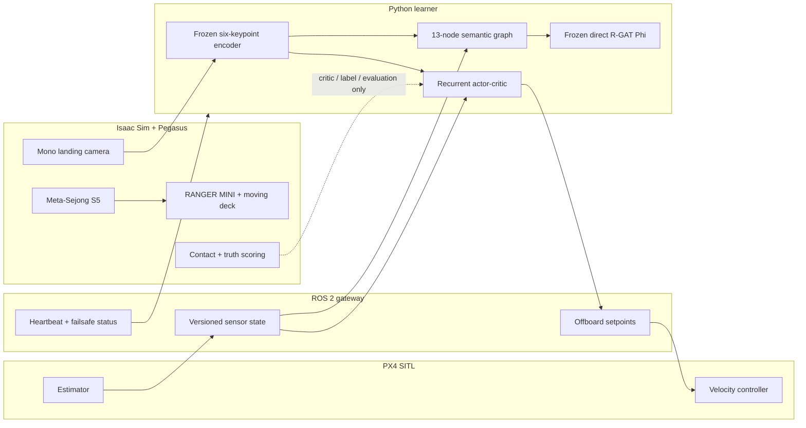

# System overview

[Documentation map](README.md) · [Controlled comparison](THREE_PIPELINE_COMPARISON.md) ·
[Operations](OPERATIONS.md) · [Architecture](ARCHITECTURE.md)

This is the source map for the primary `shin_se / no_se / onto_no_se`
experiment. Exact values live in `config/`; executable behavior lives in
`python/ontology_rgat/`, `isaac_sim/`, the ROS gateway, and `scripts/`.

## End-to-end system



Isaac owns scenery, physics, the moving carrier, camera, contacts, seeded
environment state, and scoring truth. Pegasus connects Isaac rotor dynamics to
PX4. PX4 owns state estimation and flight control. ROS 2 carries telemetry and
setpoints. The Python learner never integrates a substitute rigid-body model.

## Information boundary

The deployed actor receives only:

```text
image: 512 x 320 grayscale
proprioception: body velocity [3] + attitude quaternion [4]
```

The shared encoder produces six keypoints and a 512-D embedding; a 512-unit
LSTM produces a 256-D latent. The actor consumes `y[6:256] + proprioception` and
outputs four bounded heading-frame commands. `shin_se` alone learns an
auxiliary six-state estimate from `y[0:6]`; those six predictions are not actor
inputs.

The asymmetric critic may use `[proprioception(7), relative_truth(6)]` during
training. Simulator truth is otherwise limited to reset acknowledgement,
terminal outcome labels, and reward-independent evaluation. It is not
serialized into actor input or the primary semantic graph.

## Three controlled pipelines

| Pipeline | Intended experimental factor |
|---|---|
| `shin_se` | auxiliary state estimation and estimation-error active-perception reward |
| `no_se` | same temporal policy without estimator, auxiliary loss, or active term |
| `onto_no_se` | same estimator-free policy with sparse task reward plus frozen direct R-GAT PBRS |

Model capacity, initial weights, PPO configuration, camera, controller,
curriculum, action limits, training seeds, and evaluation seeds are held common.
The pipeline specs in `python/ontology_rgat/pipelines/spec.py` are immutable and
validated against `config/experiments/three_pipeline_comparison.yaml` before
training begins.

## Direct semantic R-GAT

The primary graph contains:

- 8 observation nodes: confidence, alignment, scale, image motion, scale rate,
  vertical-motion safety, attitude stability, and battery risk;
- 4 intermediate nodes: perception quality, approach state, approach
  stability, and descent safety;
- 1 readout node: `SafeLanding`;
- 12 semantic directed edges plus 13 self-loops;
- 4 relations: `indicates`, `supports`, `constrains`, and `self`;
- 19 channels per node: value, complement, role flags, and 13-D node identity.

The reward-design behavior source is the trained `no_se` actor combined with
deterministic image-plane servo corrections and bounded exploration. Each
sample is labeled from its real terminal contact outcome, discounted backward
through that episode. Collection continues beyond the configured minimum only
when necessary to obtain both success and failure classes, and stops at an
explicit hard cap rather than fabricating a label.

Two 24-wide R-GAT layers regress the target. The direct bounded output is
frozen before `onto_no_se` PPO:

```text
Phi(G) in [-1, 1]
r = r_sparse + lambda * (gamma * Phi(G_next) - Phi(G))
gamma_design = gamma_PBRS = gamma_PPO = 0.99
Phi(absorbing_terminal) = 0
```

Attention and counterfactual response are interpretation diagnostics, not
causal claims.

## Runtime order

| Stage | Work | Persistent checkpoint |
|---:|---|---|
| 1 | validate config, information boundaries, budgets, and paired seed plan | `manifest.json`, `evaluation/paired_plan.csv` |
| 2 | prepare/freeze six-keypoint encoder | `models/shared/keypoint_encoder.pt` |
| 3 | start/adopt DDS, Isaac/Pegasus/PX4, gateway, dashboard, and RViz | logs in `/tmp/ontology_rgat_stack/` |
| 4 | train/resume `shin_se` and `no_se` | `models/<id>/<id>.pt` and history CSV |
| 5 | collect estimator-free semantic flights | `rgat/semantic_rollouts.npz` plus manifest/CSV |
| 6 | train and freeze direct R-GAT | `rgat/rgat_model.pt` |
| 7 | train/resume `onto_no_se` | recurrent PPO checkpoint/history |
| 8 | paired physical evaluation across seven scenarios | `evaluation/per_episode.csv` |
| 9 | generate confidence intervals, learning curves, tables, and decision output | report and figure files |

Each complete episode/optimizer update is written atomically. On restart,
compatible checkpoints and completed evaluation pairs are resumed. An
incompatible configuration is archived with its old hash instead of being
silently loaded.

## Default environment

The primary system profile is Meta-Sejong S5 (`gwanggaeto`). The RANGER MINI
follows a 37-point, 99.70 m closed route sampled from the `S5_CarRoad_002`
surface. Its speed draw is 0.25–0.60 m/s; the carrier ceiling is 1.0 m/s. The
route audit reports 1.00 m of conservative deck clearance and 0.001 m maximum
height error.


The landing board combines 0.32 m, 0.12 m, and 0.04 m ArUco tags so at least
one complete tag can remain visible from far approach through close touchdown.
The experimental battery is a 3S 3500 mAh physical-capacity model initialized
with a seeded 9–55 hover-second reserve. PX4 SITL's separate internal battery is
kept full only to prevent an unrelated commander failsafe.

## Monitoring and recovery

The dashboard at <http://127.0.0.1:8770/> reports stage, phase, pipeline,
committed episodes, active episode, live step, visibility, motion, energy,
curriculum, success, and diagnostic return. RViz 2 opens with `/landing_rl`
vehicle, route, camera, and outcome topics.


Pure infrastructure interruptions are retried narrowly: gateway timeout,
simulated-clock stall, or gateway-classified Offboard heartbeat loss discards
the partial trajectory, restarts a stack only if this launcher owns it, and
retries the same seed. Estimator validity, entry geometry, marker visibility,
policy health, and terminal failures remain visible and are not converted into
infrastructure retries.

## Metrics and claims

Reward return is diagnostic only because the pipelines optimize different
rewards. The comparison uses physical metrics: landing/strict success, crash,
touchdown lateral error, relative and vertical velocity, tilt, angular rate,
FOV loss, longest visual loss, and landing time. Reports include paired
bootstrap intervals, learning-curve AUC, threshold crossing, and separate
PPO/warm-up/reward-design interaction costs.

The configured acceptance gates are:

| Gate | Criterion |
|---|---|
| Reward effectiveness | nominal landing success `>= 0.60` |
| R-GAT consistency | cross-condition success std `<= 0.15`, worst case `>= 0.35`, validation MSE `<= 0.35` |

`overall_pass` requires both. The default 800-flight seminar run may populate
the same report schema, but it is labeled preview-scale and should not be
presented as the publication-scale result.

## Primary versus legacy

The legacy cooperative urban profile uses a 23-channel actor observation,
14-node/38-edge ontology, and eight fixed coefficients distilled from R-GAT.
It runs through `scripts/run_metasejong_pipeline.sh`. Its models, figures, and
result paths are intentionally incompatible with the primary 13-node direct
R-GAT comparison. See [Documentation map](README.md) for the list of legacy
figures.
