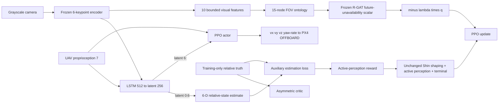

# 시스템 개요

Isaac Sim/Pegasus가 물리·카메라·UGV·접촉·배터리를, PX4 SITL이 저수준 비행제어를
담당한다. 두 learner는 같은 6-keypoint encoder, LSTM과 6-D 상대상태 추정기,
PPO actor, asymmetric critic을 사용한다. Actor 관측은 영상과 UAV proprioception이고
critic truth는 학습 value 함수와 보조 지도학습에만 들어간다.

`shin_se_fixed`는 Shin 보상 전체를 그대로 쓴다. `shin_se_onto_rgat_recovery`는
동일한 forward/loss/reward를 실행한 뒤, 시각 전용 graph에서 동결 R-GAT의 미래 FOV
비가용 시간 비율 `q_θ(G_t)`를 계산해 `-λ_fov q_θ(G_t)`를 한 번 더한다.

## 경계

* Simulator truth, 6-D 상대상태 추정, critic state는 `VIS`/`GRAPH` 경계를 넘지 않는다.
* 기하 패드 중심 가시성은 R-GAT의 *label*이므로 online graph 입력에서도 차단된다.
  넣으면 추론이 조회로 바뀐다.
* Critic truth는 배포 policy wrapper의 API에 존재하지 않는다.

두 경계 모두 이름 기반 거부로 실행 시점에 강제되며, 자세한 내용은
[아키텍처와 정보경계](ARCHITECTURE.md)에 있다.
