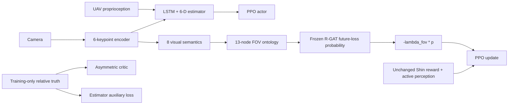

# 시스템 개요

Isaac Sim/Pegasus가 물리·카메라·UGV를, PX4 SITL이 저수준 비행제어를 담당한다.
두 learner는 같은 6-keypoint encoder, LSTM/6-D state estimator, PPO actor와 asymmetric
critic을 사용한다. Actor observation은 영상과 UAV proprioception이며 critic truth는
학습 value 함수에만 제공된다.

`shin_se_fixed`는 기존 Shin 보상 전체를 사용한다. `shin_se_onto_rgat_fov`도 같은
forward/loss/reward를 실행한 후 visual-only graph에서 동결 R-GAT 확률을 계산해
`-lambda_fov * probability`를 한 번 더한다.

Simulator truth, relative-state estimate와 critic state는 `VIS`/`GRAPH` 경계를 넘지 않는다.
