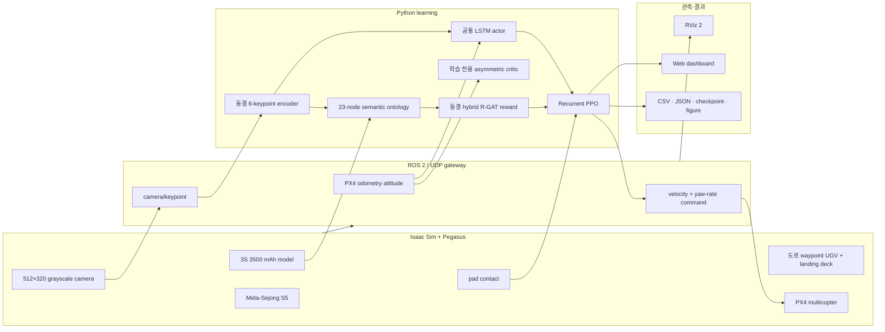
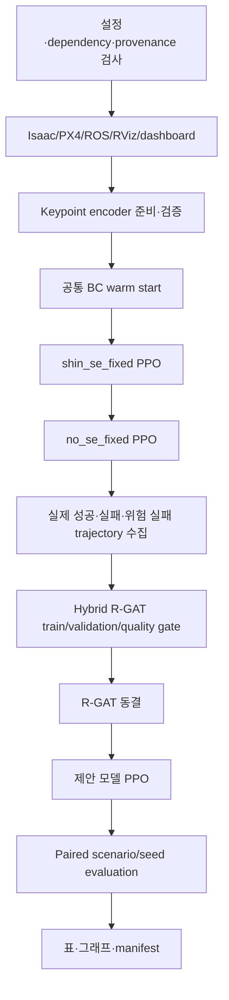

# 시스템 개요

[문서 안내](README.md) · [제안 알고리즘](ONTOLOGY_RGAT_ADAPTIVE_REWARD_WEIGHTING.md) ·
[비교 설계](THREE_PIPELINE_COMPARISON.md) · [운영](OPERATIONS.md)

## 목적

한 개의 공통 Isaac/PX4 비행 환경에서 다음 질문을 검증한다.

> 명시적으로 상대 위치·속도를 회귀하지 않아도, 영상 기반 ontology와 관계형 attention으로
> 학습한 reward가 이동 패드의 관측성을 유지하며 안전 착륙 정책을 학습시킬 수 있는가?

## 강화학습 계약

- Environment: Isaac Sim/Pegasus, PX4 SITL, 도로 주행 UGV와 접촉·센서·배터리
- Agent: 동결 keypoint encoder, LSTM, PPO actor와 학습 전용 critic
- State: simulator 내부의 완전한 동역학 상태
- Observation: $o_t=[I_t,u_t]$, 영상과 UAV 자체 속도·자세만 actor에 제공
- Action: $a_t=[v_x,v_y,v_z,\omega_z]$
- Reward: 고정 Shin shaping 또는 제안 hybrid R-GAT shaping

## 종단 간 구성

## 공통 actor와 critic

세 arm은 동일한 actor를 사용한다.

$$
I_t \xrightarrow{\text{keypoint encoder}} l_t,
\qquad
(l_t,u_t,h_{t-1})\xrightarrow{\mathrm{LSTM}}y_t\in\mathbb{R}^{256}.
$$

Actor는 $[y_{t,6:256},u_t]$를 받아 tanh-squashed Gaussian action을 출력한다.
`shin_se_fixed`만 $y_{t,0:6}$에 상대상태 보조손실을 적용한다. 이 6개 값은 세 arm의
actor 입력에서 동일하게 제외된다.

Critic은 학습 중 value variance를 줄이기 위해

$$
o_t^{\mathrm{priv}}=[u_t,s_t^{\mathrm{rel}}]\in\mathbb{R}^{13}
$$

을 사용한다. 실제 상대상태는 actor, ontology, R-GAT 입력에 연결되지 않는다.

## 제안 reward 흐름

1. Keypoint/heatmap과 최근 visual history에서 12-D semantic feature를 계산한다.
2. 18개 의미/목표 node와 5개 reward concept node로 graph를 구성한다.
3. 4개 relation type을 구분하는 R-GAT이 node embedding을 만든다.
4. Weight head가 양수이고 합이 5.5인 5개 상태 적응 coefficient를 출력한다.
5. Potential head가 FOV loss/reacquisition과 안전 접근을 나타내는 $\Phi(G_t)$를 출력한다.
6. R-GAT을 동결한 상태에서 PPO reward를 계산한다.

## 실행 단계

세미나 profile의 BC와 감쇠형 imitation anchor는 세 arm에 동일하게 적용하므로 비교
요인이 아니다. Reward-design 비행과 PPO 비행 수는 결과표에서 분리해서 보고한다.

## 안전 착륙

성공은 pad contact 하나가 아니라 위치, 수직속도, 상대수평속도, tilt, 각속도를 모두
만족한 접촉이다. 접촉 후 반동을 제외하기 위해 kinematic gate는 직전 비접촉 샘플을
사용한다.

## 결과 선택

`<pipeline>.pt`는 정확한 재개를 위한 최신 optimizer/model 상태다.
`<pipeline>.best.pt`는 reward 값과 독립된 다음 안전성 score로 선택한 배포 후보다.

- 안전 착륙과 정상 접촉
- unsafe contact와 crash
- touchdown lateral error와 relative speed
- FOV loss와 low-visibility descent

Arm 간 최종 비교는 paired physical metric으로 수행하며, 서로 정의가 다른 episode
return을 직접 순위로 사용하지 않는다.
