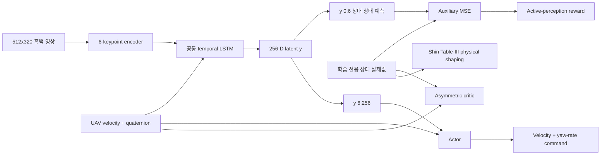
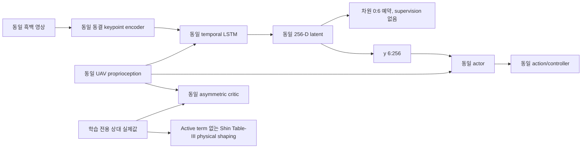
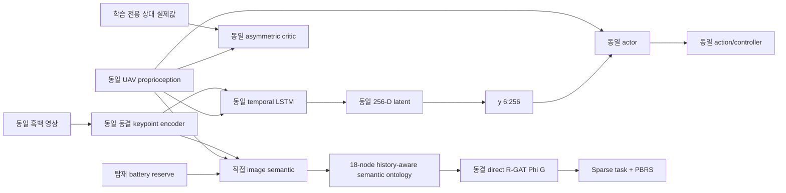

# 3개 파이프라인 통제 비교

[문서 안내](README.md) · [시스템 개요](SYSTEM_OVERVIEW.md) ·
[운영](OPERATIONS.md) · [논문 baseline](SHIN2026_BASELINE.md)

이 실험은 ontology 구조의 direct R-GAT potential이 명시적 metric relative-state
supervision을 대체할 수 있는지 시험한다. Shin et al. (2026)의 방법론을 통제해
구현했지만 bit-exact 재현은 아니다. Flight stack은
[SHIN2026_BASELINE.md](SHIN2026_BASELINE.md)에 기록한 Isaac Sim, Pegasus, PX4
adaptation을 그대로 사용한다.


Screenshot은 2026-09-12 진행 중인 run에서 얻었다. Monitoring 계약을 보여 주는
자료이지 최종 성능 결과가 아니다.

## 정보 흐름

### A. `shin_se`: 상태 추정 supervision을 받는 latent 표현



Actor는 추정값 6개를 직접 받지 않는다. MSE가 shared representation을 supervise하고
actor는 `y[..., 6:256]`과 UAV proprioception만 받는다.

### B. `no_se`: 명시적 상태 추정이 없는 temporal visual RL



`no_se`는 temporal memory를 유지하지만 relative-state auxiliary head를 만들지 않고,
estimator warm-up, estimation MSE, active-perception term을 모두 제거한다.

### C. `onto_no_se`: 직접 semantic R-GAT PBRS를 쓰는 temporal visual RL



Metric relative-state head와 loss가 없다. Simulator truth는 asymmetric critic,
reset/terminal logic, terminal dataset label과 evaluation metric에만 허용한다.
Semantic graph API에는 들어갈 수 없다.

## Semantic 관측과 ontology

Graph feature는 모두 `[0,1]` 범위이며 keypoint network 또는 UAV 탑재 signal에서 온다.

| Observation node | 의미와 정규화 |
|---|---|
| `KeypointConfidence` | 1 - normalized heatmap entropy |
| `VisibleKeypointFraction` | entropy-confidence gate를 통과한 keypoint heatmap 비율 |
| `ImageAlignment` | 1 - image 중심에서 centroid까지 거리 / `sqrt(2)` |
| `ApparentScale` | keypoint RMS radius / `0.75`, clipping |
| `ImagePlaneMotion` | 안전도 `1 - centroid_speed/4`, clipping |
| `ScaleRate` | 안전도 `1 - abs(scale_rate)/2`, clipping |
| `VisibilityMemory` | 최근 유효 visibility를 1.5 s에 걸쳐 지수 감쇠 |
| `ReacquisitionTrend` | 양의 confidence 회복량을 `[0,1]`로 clipping |
| `VerticalMotionSafety` | `exp(-abs(UAV_vz)/0.6)` |
| `AttitudeStability` | `exp(-tilt/radians(22))` |
| `BatteryRisk` | 1 - clipping한 onboard landing reserve |
| `VisualLossRisk` | 연속 low-confidence 시간 / 2 s, clipping |

Intermediate node는 `PerceptionQuality`, `ApproachState`, `ApproachStability`,
`RecoveryState`, `DescentSafety`이고 readout node는 `SafeLanding`이다.
Relation은 다음과 같다.

- `indicates`: observation → semantic intermediate
- `supports`: 유리한 intermediate → downstream safety concept
- `constrains`: `BatteryRisk` → `SafeLanding`
- `self`: R-GAT update를 위한 node당 self-loop 1개

실행 topology는 node 18개, semantic directed edge 17개, self-loop 18개, 총 directed
edge 35개, relation 4종, node당 feature 24개다. 폭 24 relational-attention layer
2개와 두 번째 layer를 감싸는 residual이 bounded `SafeLanding` readout을 만든다.
이 수치는 기본 비교에 해당한다. 보존된 cooperative legacy graph는 14-node/38-edge로
서로 바꿔 쓸 수 없다.

Attention과 counterfactual effect는 해석 signal일 뿐 supervised relation-importance
label이 아니다.

## R-GAT 목표값과 PBRS

Reward-design behavior source는 estimator-free다. 학습된 `no_se` policy에
image-plane servo correction, confidence loss 시 명시적 climb/hold recovery,
제한된 noise와 무작위 exploration을 결정론적으로 섞는다. 설정한 minimum 이후에도
두 terminal class와 지정 수의 성공한 loss→reacquisition→landing episode가 생길
때까지 실제 trajectory를 추가 수집하거나 명시적 hard cap에서 끝낸다. 합성 outcome은
삽입하지 않는다. Train/validation은 전체 episode 단위로 분할한다.

Terminal outcome `S_i`가 착륙이면 `+1`, 실패면 `-1`이고 trajectory 길이를 `T_i`,
step을 `t`라고 할 때 target은 다음과 같다.

```text
y_i,t = gamma_design ** (T_i - t - 1) * S_i
L_R-GAT = mean((Phi_theta(G_i,t) - y_i,t) ** 2)
          + eta * mean(Phi_theta(G_i,t) ** 2)
```

약한 output regularizer는 `eta=1e-4`이며 validation에는 regularization을 제외한
MSE를 보고한다.

Loss에는 불리한 semantic counterfactual도 적용한다. 현재 perception, 최근
visibility/reacquisition evidence, battery margin을 나쁘게 만들어도 `Phi`가 올라가면
안 된다. 동결 artifact는 compliance를 기록하며 threshold 아래면 거부된다.

학습된 R-GAT은 동결한다. Linear weight로 증류하지 않고 direct output을 기본
potential로 사용한다.

```text
r_t = r_sparse + lambda * (gamma * Phi(G_t+1) - Phi(G_t))
```

`gamma_design == gamma_PBRS == gamma_PPO`다. Terminal/absorbing next state에서는
`Phi(G_t+1)=0`이고 PPO가 동결 R-GAT을 update할 수 없다.

Graph는 유한 visual history를 담지만 완전한 Bayesian belief state는 아니다. 동일
gamma, terminal-zero potential과 동결은 의도한 MDP PBRS 계약을 보존하지만 underlying
POMDP에서 정확한 policy invariance는 주장하지 않는다. 대신 FOV loss, reacquisition,
recovery climb, unsafe blind descent, post-reacquisition landing metric으로 경험적
주장을 시험한다.

## 공통으로 유지하는 환경

기본 full/quick profile은 Meta-Sejong Gwanggaeto/S5 scene이다. RANGER MINI가
1.5×1.5 m deck를 싣고 37-point, 99.70 m 폐곡선을 seeded 0.25–0.60 m/s로 움직인다.
A/B/C 모두 같은 route, platform motion, camera, multi-scale ArUco board, PX4 limit과
battery draw를 쓴다. 측정 대상 episode는 detector가 확인한 pad observation에서
시작한다. Policy handover 뒤 FOV loss는 terminal이 아니므로 temporal tracking 및
recovery 동작을 학습하고 측정할 수 있다.


논문은 platform 0–8 m/s 범위를 보고한다. 더 낮은 campus 곡선 도로 속도는 명시적인
공통 adaptation이며 논문의 최대 속도 case를 재현했다는 주장이 아니다.

## 공정성 및 metric

하나의 experiment config와 shared seed plan이 camera, encoder weight,
LSTM/latent/actor dimension, critic, PPO hyperparameter, action, controller,
simulator, curriculum, randomization, budget, scenario를 통제한다. Manifest는 공통
field와 실행 가능한 pipeline spec을 기록한다. Shin warm-up은 분리한 seed 범위를
사용하며 이후 PPO episode `k`는 A/B/C에서 같은 environment seed를 사용한다.

Reward가 다르므로 episode return은 debugging용으로 기록할 뿐 pipeline 순위에 쓰지
않는다. 기본 table은 physical success, strict success, crash, touchdown lateral
error, touchdown vertical/relative velocity, tilt, angular rate, FOV loss, longest
visual loss, landing time을 사용한다. Report에는 paired bootstrap interval,
success learning curve, AUC, 고정 success threshold와 PPO-only/전체 interaction
cost를 포함한다. `N_reward_design`은 `N_PPO`와 별도로 보고하고
`N_total = N_reward_design + N_PPO`다. Shin 전용 estimator warm-up과 environment-step
비용도 별도로 보고하며 각 method의 total-interaction curve에 포함한다.

## 명령어

저장소 루트에서 seminar budget 전체 pipeline은 정확히 다음 명령이다.

```bash
./run.sh
```

지원하는 다른 명령은 다음과 같다.

```bash
# Unit/integration 계약 검사. 비행 결과를 만들지 않는다.
cd Ontology_RGAT_UAV_RL_ISAAC_PX4 && pytest -q

# 작은 실제 Isaac/PX4 통합 실험
./run.sh --mode quick --headless

# Publication-scale 명시 설정. 매우 오래 걸린다.
./run.sh --mode full --train-episodes 40960 --rgat-data-episodes 400

# 독립 publication training replicate. 설정 seed 42/1042/2042
./run.sh --mode full --training-replicate 0 --train-episodes 40960 --rgat-data-episodes 400
./run.sh --mode full --training-replicate 1 --train-episodes 40960 --rgat-data-episodes 400
./run.sh --mode full --training-replicate 2 --train-episodes 40960 --rgat-data-episodes 400

# 완료된 실제 record에서 report 재생성
# full/replicate_1, full/replicate_2 등을 자동 검색하고
# full/combined 아래에 hierarchical combined analysis를 쓴다.
python Ontology_RGAT_UAV_RL_ISAAC_PX4/python/generate_three_pipeline_report.py \
  --results-dir Ontology_RGAT_UAV_RL_ISAAC_PX4/results/three_pipeline/full
```

기본 `run.sh`는 deadline preview budget을 쓴다. Pipeline당 PPO episode 264회,
Shin 전용 warm-up 8회로 학습 비행 총 800회, estimator-free reward-design trajectory
최소 40회, scenario당 paired evaluation seed 5개(평가 비행 105회)다. Reward-design과
evaluation 비행은 800회 training budget 밖이며 별도 보고한다. 이는 seminar
evidence이지 publication-scale evidence가 아니다.

## 실행 연속성

루트 `run.sh` 하나만 shared control stack을 소유할 수 있다. 호환되는 recurrent,
optimizer, curriculum, semantic-data, evaluation artifact는 재개한다. Gateway timeout,
실제 simulated-clock stall 또는 gateway가 분류한 순수 Offboard-heartbeat 중단은
불완전 trajectory를 버리고 runner가 소유한 stack만 재시작한 뒤 같은 seed를 재시도한다.
이로써 paired-seed 계약을 지킨다. Perception/geometry, estimator, policy-health,
terminal failure는 hard failure로 남겨 retry가 실험을 편향시키지 못하게 한다.

## 이전 한계를 위한 보호 장치

- Seminar용 40 trajectory는 minimum이다. 단일 class 데이터면 실제 수집을 최대
  120 trajectory까지 자동 연장한다. 두 outcome을 얻지 못하고 hard cap에 도달하면
  label을 조작하지 않고 안전하게 중단한다.
- 독립 run은 `--training-replicate`로 선택한 별도 resumable simulator job이다.
  Report generator가 이를 찾아 결합하며 raw within-seed difference를 보존하고
  training-replicate-then-episode hierarchical bootstrap을 사용한다.

## 코드로 제거할 수 없는 외부 한계

- Shin et al.의 PACMAN weight와 정확한 geometric controller는 공개되지 않았다.
  저장소는 합성 초기화 후 실제 Isaac으로 검증한 keypoint 근사와 PX4 velocity
  interface를 쓴다.
- 실제 Isaac/PX4 run을 완료해야만 통계 출력에 의미가 있다. Unit/smoke fixture는
  publication table에 절대 기록하지 않는다.
