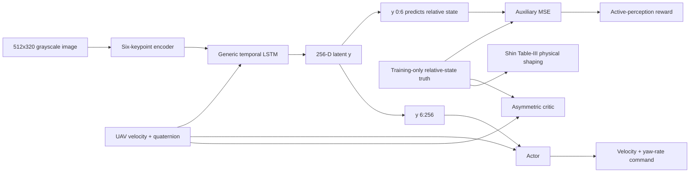
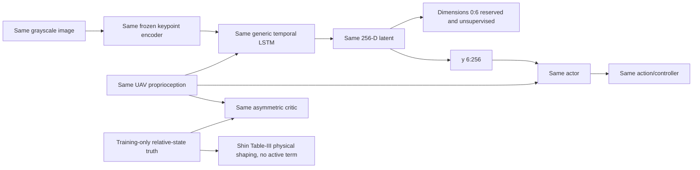
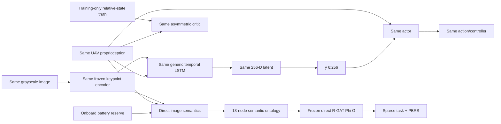

# Controlled three-pipeline comparison

This experiment tests whether an ontology-structured direct R-GAT potential
can replace explicit metric relative-state supervision. It is a controlled
methodological implementation of Shin et al. (2026), not a bit-exact
reproduction. Isaac Sim, Pegasus and PX4 remain the flight stack adaptations
documented in [SHIN2026_BASELINE.md](SHIN2026_BASELINE.md).

## Information flow

### A. `shin_se`: state-estimation-supervised latent representation



The actor never receives the six predicted values directly. Their MSE
supervises the shared representation, while the actor receives only
`y[..., 6:256]` and UAV proprioception.

### B. `no_se`: temporal visual RL without explicit state estimation



`no_se` keeps temporal memory. It creates no relative-state auxiliary head,
performs no estimator warm-up, and has no estimation MSE or active-perception
term.

### C. `onto_no_se`: temporal visual RL with direct semantic R-GAT PBRS



There is no metric relative-state head or loss. Simulator truth is allowed for
the asymmetric critic, reset/terminal logic, terminal dataset label and
evaluation metrics only. It cannot enter the semantic graph API.

## Semantic observations and ontology

All graph features are bounded in `[0,1]` and come from the keypoint network or
onboard UAV signals:

| Observation node | Meaning and normalization |
|---|---|
| `KeypointConfidence` | one minus normalized heatmap entropy |
| `ImageAlignment` | one minus centroid distance from image center divided by `sqrt(2)` |
| `ApparentScale` | keypoint RMS radius divided by `0.75`, clipped |
| `ImagePlaneMotion` | safety `1 - centroid_speed/4`, clipped |
| `ScaleRate` | safety `1 - abs(scale_rate)/2`, clipped |
| `VerticalMotionSafety` | `exp(-abs(UAV_vz)/0.6)` |
| `AttitudeStability` | `exp(-tilt/radians(22))` |
| `BatteryRisk` | one minus clipped onboard landing reserve |

Intermediate nodes are `PerceptionQuality`, `ApproachState`,
`ApproachStability`, and `DescentSafety`; the readout node is `SafeLanding`.
Relations are:

- `indicates`: observation to semantic intermediate;
- `supports`: favorable intermediate to downstream safety concept;
- `constrains`: `BatteryRisk` to `SafeLanding`;
- `self`: one self-loop per node for R-GAT updates.

Attention and counterfactual effects are interpretation signals only. They are
not supervised relation-importance labels.

## R-GAT target and PBRS

The reward-design behavior source is estimator-free: the trained
`no_se` policy is mixed deterministically with image-plane servo corrections,
bounded noise and bounded random exploration. The dataset refuses a single
terminal class and splits training/validation by whole episode.

For terminal outcome `S_i` (`+1` landing, `-1` failure), trajectory length
`T_i`, and step `t`, the target is

```text
y_i,t = gamma_design ** (T_i - t - 1) * S_i
L_R-GAT = mean((Phi_theta(G_i,t) - y_i,t) ** 2)
          + eta * mean(Phi_theta(G_i,t) ** 2)
```

The configured weak output regularizer is `eta=1e-4`; validation reports the
unregularized MSE.

The trained R-GAT is frozen. Its direct output, not distilled linear weights,
is the primary potential:

```text
r_t = r_sparse + lambda * (gamma * Phi(G_t+1) - Phi(G_t))
```

`gamma_design == gamma_PBRS == gamma_PPO`. For terminal/absorbing next states,
`Phi(G_t+1)=0`. PPO cannot update the frozen R-GAT.

## Fairness and metrics

One experiment config and shared seed plan control camera, encoder weights,
LSTM/latent/actor dimensions, critic, PPO hyperparameters, actions, controller,
simulator, curriculum, randomization, budgets and scenarios. The manifest
records the common fields and executable pipeline specs. Shin warm-up uses a
disjoint seed range; after warm-up, PPO episode `k` uses the same environment
seed in A, B and C.

Episode return is logged for debugging but never ranks pipelines because the
rewards differ. Primary tables use physical success, strict success, crash,
touchdown lateral error, touchdown vertical/relative velocity, tilt, angular
rate, FOV loss, longest visual loss and landing time. Reports include paired
bootstrap intervals, success learning curves, AUC, fixed success thresholds,
and both PPO-only and total interaction cost. `N_reward_design` is reported
separately from `N_PPO`, and `N_total = N_reward_design + N_PPO`. The
Shin-only estimator warm-up and its environment-step cost are also reported
separately and included in each method's total-interaction curve.

## Commands

From the repository root, the complete seminar-budget pipeline is exactly:

```bash
./run.sh
```

Other supported commands are:

```bash
# Unit/integration contracts; no flight results are fabricated
cd Ontology_RGAT_UAV_RL_ISAAC_PX4 && pytest -q

# Small real Isaac/PX4 integration experiment
./run.sh --mode quick --headless

# Explicit publication-scale configuration (large and long-running)
./run.sh --mode full --train-episodes 40960 --rgat-data-episodes 400

# Independent publication training replicates (configured seeds 42/1042/2042)
./run.sh --mode full --training-replicate 0 --train-episodes 40960 --rgat-data-episodes 400
./run.sh --mode full --training-replicate 1 --train-episodes 40960 --rgat-data-episodes 400
./run.sh --mode full --training-replicate 2 --train-episodes 40960 --rgat-data-episodes 400

# Regenerate reports from completed real records
python Ontology_RGAT_UAV_RL_ISAAC_PX4/python/generate_three_pipeline_report.py \
  --results-dir Ontology_RGAT_UAV_RL_ISAAC_PX4/results/three_pipeline/full
```

The bare `run.sh` uses the deadline preview budget: 264 PPO episodes per
pipeline plus eight Shin-only warm-up flights (800 training flights total), 40
estimator-free reward-design trajectories and five
paired evaluation seeds per scenario. This is seminar evidence, not
publication-scale evidence.

## Remaining limitations

- PACMAN weights and the exact geometric controller from Shin et al. are not
  public; the repository uses the documented synthetic-pretrained keypoint
  approximation and PX4 velocity interface.
- A 40-trajectory seminar reward-design dataset may fail the required
  two-class gate. The system stops and requests more real trajectories rather
  than synthesizing outcomes.
- Multiple independent training seeds are separate resumable full runs selected
  with `--training-replicate`; cross-replicate hierarchical aggregation is not
  yet automated by the report generator.
- Statistical output is meaningful only after the real Isaac/PX4 run finishes.
  Unit/smoke fixtures are never written to publication tables.
